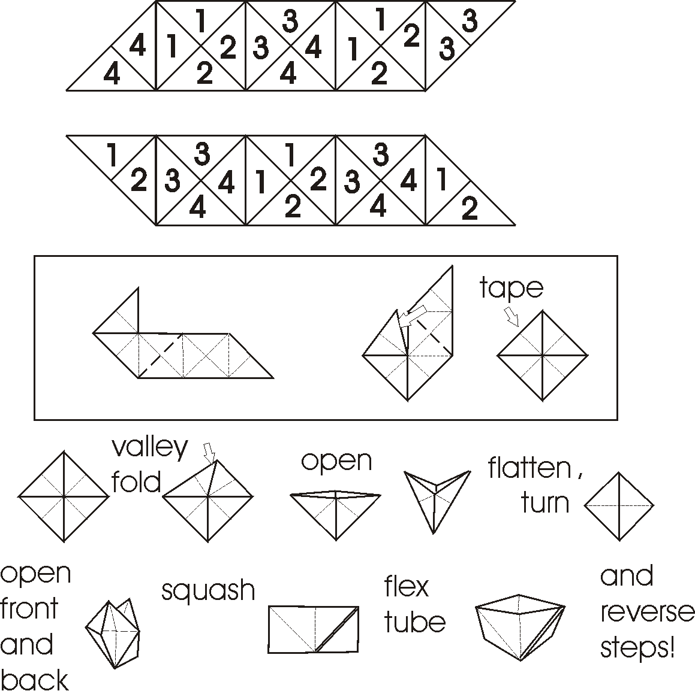

# Flexagon Lovers Newsgroup 2007

## Hello & Original Flexagon Templates
April 11, 2007

### Robin Moseley

I am new to this group and have only recently discovered its
existence.
Flexagons have been an interest to me for as long as I can remember.
Glancing through the member list I recognized several names. I was
surprised one day to come across Les Pook's book about two years
ago and
bought it at a bookstore at the University of Illinois in Chicago.
It is
a great book and the only one like it for flexagons. I really enjoyed
reading it. I have also been familiar with Dave Mitchell's origami.
Several other names look familiar as well. What a surprise to see all
of you in this rather obscure Yahoo forum.

Just to make an initial contribution to the group, I invite all to
check
out and download a few of my original flexagon templates. I have
posted
them at www.flexagon.net. As many of
you, I
have created a lot of other templates over the years, but not as user
friendly as the ones on my website. I would like to hear if anyone
finds these to be useful. I made them as rather math techy designs for
exploring the properties of flexagons and face permutations.

This topic of flexagons has a surprising depth to it and clearly
one of
the reasons for the continued and many years of interest!

I am glad to find this group and will very much enjoy reading all the
postings.

### Ann Schwartz

Nice flexagon site! I like the fact that you include templates for the
often ignored tetrahexaflexagon and the pentahexaflexagon. You might
want to check out Message 240. In it, Bruce McLean provides a site
that has a template for the nonahexaflexagon.

Do you have templates for the interesting patterns--the M. C. Escher
design, for instance--featured at the top of your home page. I
couldn't find them on your site.

### Robin Moseley

I have many flexagon patterns cluttering up my hard disk, but not in
very user friendly formats with directions. By creating the
flexagon.net website, my thought was to post some of them little by
little as I clean them up and create some directions. In this way I
will move my laptop clutter to the website. I actually have a
nonahexaflexagon template that I created a few years ago with
interesting fractal faces. I like to use fractal faces as many times
the various face arrangements on the flexagon will have surprising and
interesting patterns.

One technique I use for flexagons with a lot of faces like the
nonahexaflexagon is to create the flexagon with lightweight paper and
create the hexagon faces in Photoshop and print them separately. I
then cut out the face triangles and paste them to the flexagon. If
the flexagon is made large, like 4-5 inches in diameter, the resulting
flexagon will flex quite smoothly, even though it has a lot of faces.
Sometimes I also create the initial template with a few millimeters
of space between the triangles to allow for the hinges and thicker
pats of the more complex flexagons.


----
## point flexagons
April 15, 2007

### Scott Sherman

Like many people on this group, my introduction to flexagons was from Martin Gardner.  I had played around with them long ago, but recently I was trying some generalizations of flexagons made out of triangles when I came up with a class of flexagons I hadn’t seen described elsewhere.  They flex around a pair of points instead of sets of edges.

If you look at the strip of triangles you use for making a standard hexaflexagon, you’ll see it’s made up of three copies of the same pattern.  If you start with four or more copies instead, you’ll get something that looks a bit like a flower.  Using a pinch flex, you’ll find it has similar behavior to a hexaflexagon but doesn’t lie flat, though there are other types of flexes you can perform on them.  If you just use two copies of the pattern, you get what I call a pyramid flexagon for reasons that are obvious once you make one.  Unless you make it out of rubber so you can fold it inside out (or trim off enough of the tips so you can do this with paper), the same face is always on the outside as you flex it, though the inside face changes.

So what happens if you just use a single copy of the strip?  If you use the three triangle pattern from a trihexaflexagon, you’ll end up with a completely inflexible Möbius strip.  This may be interesting as Möbius strips go, but it’s not a very exciting flexagon.  But then I wondered if it could be turned inside out like a pyramid flexagon if you worked at it a bit.  I found that if you trimmed off enough of the tips of the triangles, you could.  In theory, if you continue this all the way till the hinges are points instead of edges, it flexes smoothly.  Any single copy of a hexaflexagon strip can be turned into a flexagon that flexes across a pair of points instead of a set of edges.  Interestingly, a map of which sides are accessible from the various sides may be different than the corresponding hexaflexagon as you can see if you try a 6-sided version.

Because the hinges are points, I call these "point flexagons" to distinguish them from the standard edge flexagons.  You can also create point flexagons from squares, pentagons or any other convex polygon.  I’ve put a few you can try up on http://loki3.com/flex/point-flexagon.html.  This still leaves lots of room for exploration.  Combining point flexagons with some of Les Pook’s observations on convex polygon flexagons from Flexagons Inside Out seems like it could keep someone busy for awhile.

It looks to me like a point flexagon is the simplest way to get the dynamic behavior of a flexagon, in the sense that it requires the fewest number of pats and hinges.  The net for an edge flexagon typically contains two or more duplicates of a given pattern.  A point flexagon can start from a single copy of that pattern with the points snipped off.  A point flexagon with the same behavior as a trihexaflexagon takes only 3 triangles and 3 hinges instead of 9 and 9.  Additionally, since it’s easier to see the inner workings of a point flexagon, you can gain interesting insight into how flexagons work.

### Les Pook


Nice to see your posting on point flexagons, which are a new family of flexagons. I've made up all your examples, but had a slight problem with the one captioned 'And here's a net for...'. Clicking on the thumbnail brought up the wrong larger net, and the smaller figures on the thumbnail are only just legible on my monitor. The assembled flexagons all worked well, and I was able to flex them around the state diagrams.

I'm now working on the underlying mathematics with a view to precise definition of the relationships between point flexagons and edge flexagons

### Scott Sherman

Thanks for the catch, Les.  I fixed the link so you should be able to get the correct net now.  And also thanks for Flexagons Inside Out.  I've had a lot of fun with your book.

I'll be curious to hear what you learn as you delve into how they compare to regular edge flexagons.  One thing that surprised me was how the state diagram of the 6-sided triangle point flexagon differed from the hexahexaflexagon.  There's more connectivity in the point flexagon version.

Another interesting find was that different numberings of the same arrangement of polygons can yield point flexagons with different state diagrams.  For example, I gave two nets for an 8-sided square point flexagon made from zig-zagging squares.  But there are other numberings of the same arrangement of squares that have different state diagrams than those two.  Others include:
```
   1/2, 3/2, 3/4, 8/7, 8/1, 7/6, 4/5, 6/5
   1/2, 3/2, 3/4, 8/7, 6/7, 1/8, 4/5, 6/5
   1/2, 3/2, 7/8, 7/6, 8/1, 5/4, 3/4, 6/5
   1/2, 7/6, 3/4, 1/8, 5/6, 3/2, 7/8, 5/4
```
...where 1/2 means "1" goes on the front face and "2" on the back and the faces are listed in the order they occur in the strip.  It's left as an exercise for the reader to draw the graphs and demonstrate they're all different :).

Does anyone know of any edge flexagons that behave this way?  Where you just change the numbering (and hence how they're folded) and get a fundamentally different graph?

### Les Pook

Scott, I can now get the correct net, I'm glad you like Flexagons Inside Out. I had a lot of fun writing it.

The reason why the point flexagon version of the hexahexaflexagon has more connectivity is that it has extra degrees of freedom. A point hinge must have at least two degrees of freedom for flexing of a point flexagon to be possible, whereas one degree of freedom suffices for a hinge of an edge flexagon. I demonstrated the extra connectivity by constructing a skeletal hexahexaflexagon using three copies of the net for the 6-sided point triangle flexagon. This flexes normally, as a hexahexaflexagon, using the short dotted lines on the connecting strips as hinges, but there are flaps that can be turned over using a pair of point hinges, as in the point flexagon, resulting in additional connectivity. The skeletal hexahexaflexagon is unstable. I used paper clips to hold the pats together, rearranging the clips as needed to allow each flex.

It can be shown that it is always possible to construct an edge flexagon that corresponds to a given point flexagon, but state diagrams may differ. For example, extending the dotted hinge lines in the net for the 6-sided triangle flexagons, to form equilateral triangles, leads to one third of the net for the hexahexaflexagon. This type of construction, with due attention to detail, is possible for any point flexagon. The converse is not true. In particular, there are no point flexagons that correspond to compound flexagons

There are edge flexagons with the same arrangement of polygons, but with different numberings and state diagrams. In my book, this is true for the nets shown in Fig 6.1, p. 55 and Fig 6.25, p. 73. I have come across other examples, but don't have details to hand.

### Scott Sherman

"skeletal hexahexaflexagon" - I like that.  I've also tried some point flexagons that look more like normal flexagons and aren't simply stacks of pats and it can lead to some interesting behavior.

Each time I start from a numbering that gives me a single vertex hinge in a point flexagon, the corresponding edge flexagon has extra degrees of freedom, like Ann Schwartz's dodecaflexagon, with extra flaps and the ability to mix up the faces.  (Or check out Robin Moseley's 3 sided version of the dodecaflexagon - http://www.flexagon.net/index.php?option=com_content&task=view&id=16&Itemid=30)

I've got examples of point flexagons that don't have a corresponding edge flexagon.  You can make an 8-sided zigzagging square point flexagon using the numbering 1/2, 7/6, 3/4, 1/8, 5/6, 3/2, 7/8, 5/4, but not an edge flexagon.  What's interesting about that numbering is that it has no adjacent pairs of like numbers.  With all the nets I've seen, you always start by folding adjacent pats together.  This is reflected in having adjacent pairs of numbers.  But with the above numbering, there aren't any, making folding interesting.  If you try it, it helps to know that it's numbered in the order the faces will appear in the stack, so once it's folded you'll end up with 1/2, 2/3, 3/4, 4/5, 5/6, 6/7, 7/8, 8/1.  Trying to fold the corresponding edge net is quite a challenge and doesn't lead to a workable flexagon as far as I can tell, though I believe the folding is theoretically possible.  Or with a nonahexaflexagon, try the numbering 1/2, 9/8, 6/7, 5/4, 2/3, 1/9, 7/8, 6/5, 3/4.

I would've thought you could get a point flexagon from any edge flexagon, but I hadn't yet tried a compound flexagon.

### Scott Sherman

I just tried the skeletal hexahexaflexagon.  No wonder you used paper clips.  But it flexes in interesting ways.  I set it on a table in a hexagonal star pattern and tried flexing it from there.

So then I tried instead using two copies of the net for the 3-sided and 6-sided point triangle flexagon and that makes for a structure that’s a bit easier to work with.  One thing I’ve tried to decide is whether it feels more natural to work with it in two side-by-side stacks, with the same number on the top and bottom, or to have it in four stacks, with different numbers on top and bottom.  It’s easier to work with and more stable using two stacks.  You can then do simple flexes where you fold it 360 degrees around a pair of hinges.  Or you can flex it across a pair of hinges 180 degrees then fold it back in half the other direction which allows you to reach different faces using the 360 degree flex.  Flexing it from the four stack position is a bit more challenging.  It helps if you try the 3-sided version before playing with the 6-sided version

### Scott Sherman

The correspondence between point and edge flexagons isn’t as direct as I was expecting.  You can’t necessarily create a single stack point flexagon from an edge flexagon or vice versa.  A zigzagging strip of squares illustrates both cases.  A numbering of 1/2, 7/6, 3/4, 1/8, 5/6, 3/2, 7/8, 5/4 works for a point flexagon but not an edge flexagon.  A numbering of 1/2, 1/3, 2/4, 3/4 works for an edge flexagon (duplicated twice) but not for a single stack point flexagon.  The strips for compound flexagons need more than a single copy to complete their pattern so these can’t be used for single stack point flexagons either.  (You can always trivially make a multi-stack point flexagon by simply snipping off all the points to turn the edge hinges into points, but this creates something that’s very unstable and hard to flex.)

### Les Pook

Scott

I'm not sure how the point square flexagon with face numbering 1/2, 7/6, 3/4, 1/8, 5/6, 3/2, 7/8, 5/4 should be assembled. Can you elucidate please. I'd like to get it working since it appears to be a counter example to my assertion that it is always possible to make an edge flexagon corresponding to a given point flexagon.

### Scott Sherman

Yes, that’s a tricky folding.  Typically you create a flexagon by folding adjacent faces together, hence the adjacent pairs of numbers that always appear in an unfolded strip.  But this numbering has no adjacent numbers.

Something that helps in folding is to know that I’ve numbered the faces in the order they’ll appear in the final stack.  So you’ll have 1 on the outside, 2 on the back of the top pat, 2 facing it on the next pat, 3 on its backside, etc.  Fold the strip in the order the pats occur.  So start with the 1/2 pat then fold the 7/6 pat under it.  The next one is 3/4, so fold it between the first two pats.  1/8 goes at the bottom of the stack so the 1’s will be on the outside when you’re done.  Next tuck 5/6 between the 3/4 and 7/6.  Continue by tucking each pat into the appropriate spot in the stack.  It may be a bit tricky sticking the final pat into its proper place, but when you finish all the hinges should be properly nested and everything quite snug.

The state diagram for this one is simply a loop.  From each face you can only get to the faces immediately before and after it in the stack.  Analogous numberings exist for triangles, pentagons and higher order polygons.

I’ve tried these numberings on edge flexagons and they seem to be almost impossible to fold and result in a very tightly bound stack rather than a working flexagon.

### Les Pook

Scott

Thanks, I got the point flexagon working first go, and agree that there is no edge flexagon equivalent. My statement that it is always possible to construct an edge flexagon corresponding to a given point flexagon therefore needs qualifying to read.

'In face numbering schemes in which pairs of leaves with the same face number are folded together during assembly it is always possible to construct an edge flexagon that corresponds to a given point flexagon made from identical polygons, but the dynamic properties may differ.'


----
## multiple numbers
April 24, 2007

### Scott Sherman

Recently I was wondering if you could fold the same strip different ways to create flexagons with different behavior.  I found that the answer is yes.  Has anyone seen this before?

One example uses a strip of 16 zigzagging squares.  There are several ways to fold this into an 8 sided tetraflexagon.  Here are some numberings that lead to different state diagrams:

* 1/2, 3/2, 3/4, 8/7, 8/1, 7/6, 4/5, 6/5
* 1/2, 3/2, 3/4, 8/7, 6/7, 1/8, 4/5, 6/5
* 1/2, 8/7, 8/1, 5/4, 6/7, 6/5, 2/3, 4/3
* 1/2, 3/2, 7/8, 7/6, 8/1, 5/4, 3/4, 6/5
* 1/2, 3/2, 8/1, 5/4, 3/4, 8/7, 5/6, 7/6

…where 1/2 means put 1 on the front of the polygon and 2 on the back.  Repeat the sequence on the two sets of 8 squares.

Another example starts from a zigzagging strip of 20 pentagons.  Here are a few of the numberings that lead to different behavior.

* 1/2, 3/2, 9/10, 1/10, 7/8, 9/8, 5/6, 7/6, 3/4, 5/4
* 1/2, 3/2, 3/4, 5/4, 9/10, 1/10, 7/8, 9/8, 5/6, 7/6
* 1/2, 3/2, 9/10, 1/10, 5/6, 7/6, 8/9, 8/7, 3/4, 5/4
* 1/2, 3/2, 3/4, 9/8, 9/10, 1/10, 7/8, 5/4, 5/6, 7/6

I’ve put a few nets, the corresponding state diagrams and some more instructions up on http://loki3.com/flex/multi.html.  They’re interesting flexagons to explore.

I also found an alternate way to number the straight strip you use to make a standard 12 sided hexaflexagon.  The canonical numbering is 4/7, 1/7, 2/8, 4/8, 5/9, 3/9, 1/10, 5/10, 6/11, 2/11, 3/12, 6/12.  But if you instead number it 1/2, 1/12, 5/6, 5/4, 7/8, 7/6, 3/4, 10/9, 8/9, 3/2, 11/12, 11/10, the Tuckerman traverse at one point marches you through 10 of the 12 faces before you have to switch corners.

An interesting question is what’s the smallest strip you can do this with?  Are there alternate numberings for hexaflexagons with fewer than 12 faces?


----
## DIAGRAM of (hexa)FLEXAGON
April 26, 2007

### ptriple345

I am way behind, only just lately got thru to this group,
after trying a long time. So some ideas may be funny.

I have the math counting theory down pretty good, and
am producing writings to explain it, some for journals,
but hopefully a popular style book.

During flexagon analysis, I discovered a new kind of
traverse, with simpler relations to the diagram.
I will come back and describe SPIN, SPIN CYCLE soon.

take an unlabeled (no rooting or orientation) regular
N-gon as a circuit graph, and divide the interior into
N-2 triangles with N-3 diagonals.

There is ONE flexagon (abstractly) for each of these.
Thus (temporary cyclic labeling 1,2,3,4,5,6 of corners)
we can A. connect 1,3,5 in a triangle, B. zig-zag
1,3,6,4, or C. fan-out join 1 to 3,4,5.

With rooting, diagrams A, B, C have 2, 6, 6 distinguishable
variants, sum = 14 (Catalan number).
(to be cont.)


----
## Dodecaflexagons (the 12-gon family)
April 26, 2007

### Robin Moseley

I found the articles by Ann Schwartz on the 12-gon quite interesting.  I decided to explore the "Junior" members of this flexagon family.  I found that the 3-faced version of the 12-gon has some, but not all the features of the 6-faced 12-gon.  It does flex into the propeller shape.  In fact it is a rather facinating flexagon with excellent face design possibilities.  I created an easy to cut and glue template for this flexagon with graduated colored triangles and with all triangles lettered and numbered for easy recognition of the face permutations.  Feel free to download from my website under the dodecaflexagon menu item:

www.flexagon. net

The letters and numbers on the triangles show clearly that some of the faces you might think are identical are really not identical; the triangles are shifted around, such as the face with the three arcs of As in my template.  When the triangles with the 60 degree angles are in the center the numbers can go clockwise around the center and the outside triangles go counterclockwise.   The template results in a nice 5 inch flexagon.

This tri-dodecaflexagon spurred me on to create a tetra-dodecaflexago n.   A template for this one can also be downloaded from my website.  I created this 4-faced template with some original fractal faces and also numbered  triangles, but not as bold as I did for the 3-faced one.  Photos of some of the faces for both the 3 and 4 faced dodecaflexagons are also on my website.   The tetra-dodecaflexago n introduces the "Rogue faces" described by Ann Schwartz.  There are also as a variety of propeller faces and many other interesting patterns.   I am now experimenting with the 5-faced and 6-faced dodecaflexagon variations.   I would love to hear from anyone that builds one of these from my templates.


----
## Alternate face numberings
April 26, 2007

### Les Pook

I have had a look through my collection of hexaflaexagons, and the smallest number of faces for which alternate numberings of a net are possible is 7. This of course excludes the trivial case of the two mirror image forms of hexaflexagons.

### Scott Sherman

It’s interesting that 7 faces is the smallest hexaflexagon that has alternate numberings from the same strip.  Square flexagons seem to allow variety much quicker.  There are a couple strips for a 4 faced square flexagon that have two different numberings.  A zigzagging strip can be numbered 1/2, 3/2, 3/4, 1/4 or 1/2, 3/2, 4/1, 4/3.  Rather surprisingly, both those numberings also work on a strip that zigs and zags every three squares instead of every other square.  And there’s a 5 faced square flexagon strip where you can do three alternate numberings.

### Robin Moseley

Yes, I find this interesting as well. Les appears to be correct, 7
faces is the first hexaflexagon that has an alternate numbering. 9 and
10 faced hexaflexagons have an even greater variety of alternate state
diagrams and numbering. There have been tables created for the number
of variations of Hexaflexagons by number of faces. Has anyone ever
studied or worked out the number of alternate numberings and state
diagrams based on the number of faces for Hexaflexagons or any other
flexagon family?

BTW - I made a few of Scott's point flexagons and found them curious.
These add some new depth to flexagon possibilities.

### Robin Moseley

Ok, I will reply to my own question. Actually the various theory
articles cover this question for the hexaflexagons. Here is an
interesting table:

```
faces patterns variations max variations/pattern
3 1 1 1
4 1 1 1
5 1 1 1
6 3 3 1
7 3 4 2
8 7 12 3
9 8 27 6
10 17 82 12
...
```

I do not know how the last column grows. It might be interesting to
work out a few more of these numbers to see if there is a pattern.

I am not sure if anyone has calculated such a table for other
flexagons such as the square ones that Scott mentioned. I would be
very interested to see such a table (& theory) for the 12-gons. I
cannot find that anyone has done this.

For the seven faced hexaflexagon, I have a template that folds up both
ways and where I have created designs for the face triangles such that
you can see how the triangles shift around for one variation when
flexing the other variation. I will post in a day or two to my
website. It is a fascinating flexagon and both variations fold and
flex quite smoothly.


----
## Tri-dodecaflexagons
May 2, 2007

### Robin Moseley

As a correction to my last post, the Tri-dodecaflexagons also have the
"Rogue triangles". They do not play as interesting a role as in the
dodecaflexagons with more faces, but they are there in their
primordial state. I have a new Tri-dodecaflexagon template on my
website (www.flexagon. net) where each of the three faces have fractal
patterns. The result is very nice and this template prints very
accurate triangles. The model will fold up perfectly and looks sharp.
I updated my other tri-dodecaflexagon with more accurate geometry as well.

### Scott Sherman

Very nice.  It's so easy to get lost in the 6 sided version it's useful to have a 3 sided one to play with to learn from.


----
## Flexagons inside out - Errata
May 5, 2007

### Les Pook

Since it was published in 2003, a few errors have come to light in my book 'Flexagons inside out'. These have either been brought to my attention by fellow flexigators, or I have found them when rereading the book. Corrections are listed below.

p. 1, line 14. Insert ', or ring of polygons,' between 'polygon' and 'which'.

p. 56, Fig 6.2. Replace '2(1)' by '1(2)', '3(2)' by '2(3)', '4(3)' by '3(4)' and '1(4)' by '4(1)'.

p. 56, line 1. Replace 'three main positions' by 'two main positions'.

p. 74, caption to Fig 6.27. Replace 'flexagons' by 'flexagon'.

p. 78, para 2. Replace the paragraph by 'There do not appear to be any flexagons in which both clockwise and anticlockwise Roman numerals are associated with the same face centre letter, hence the maximum possible number of arrangements of a face appears to be four. At first sight box flexes appear to provide the change of parity needed for the maximum to be eight, but this does not happen.'

p. 87, line 6. Insert 'with two sectors' after 'one type'.

p.123, line 32. Insert '(Conrad and Hartline 1963)' after 'the others'.

p.166, line 5. Replace 'Mathematician' by 'Mathemagician' .

Several people have enquired about possible face numbering errors in the nets, but none of these have been confirmed. I double checked the nets at the page proof stage by copying from the proofs, making up all the flexagons, and then flexing them to make sure that they behaved as described in the text. They did.


----
## Dodecaflexagons
May 5, 2007

### Les Pook

The [attached interim report](12-gon2.pdf) on dodecaflexagons summarises the results of my investigations into their dynamic properties. It complemnets some other revent postings.

### Robin Moseley

Les,
Your interim dodecaflexagon report has a lot of interesting detail in
it. The more I learn of the properties of this flexagon, the more I
like it. I'm glad you described the six-way flex. This is very
unique to this flexagon and really adds to its appeal. Even the
Junior 12-gon will six way flex. It is surprising how much more
dynamic behavior the Junior 12-gon has vs. the tri-hexaflexagon.

Great report! I look forward to reading your further studies on this.


----
## decaflexagon
May 6, 2007

### Scott Sherman

If you like the dodecaflexagon, you’ll also like the decaflexagon.  It has 10 triangles per side and folds into a pentagon.  You can use a hexaflexagon style pinch flex with 5-fold symmetry.  You can also fold it in half and unfold various flaps which will then allow you to flex it in different ways, similar to some of the dodecagon flexes.  And also like the dodecagon, you can create lots of different shapes and can easily end up mixing up the faces.  This class of flexagon can start feeling a bit like a Rubik’s cube when you’ve messed it up and you’re trying to figure out how to get back to the starting position.

I’ve posted nets for the 3 and 6 sided versions – http://loki3.com/flex/triangle/deca-3.png and http://loki3.com/flex/triangle/deca-6.png.  Start by cutting out the patterns and pre-creasing the edges.  For the 3 sided net, fold adjacent 3’s on top of each other and tape together the tabs.  For the 6 sided net, fold together adjacent 4’s, 5’s and 6’s.  Then fold together adjacent 1’s and tape together the tabs.  I’d recommend making it easy to disconnect and refold when you get lost.


----
## Penta-dodeca flexagons
May 9, 2007

### Robin Moseley

The penta-dodeca flexagons have some new twists.  I have created a net for the five sided version of the dodeca flexagon.   This turns out to be a fascinating and more complex version of the three and four sided versions   If you want an easy way to make one for yourself, download my template at www.flexagon. net from the dodecaflexagon tab.

The "Rogue" triangles appear on front and back faces for more options when flexing and they also open to new faces by shifting one set or both of them clockwise and/or counterclockwise.   If you fold up my template as I describe, you will find all five sets of colors/letters will each appear on one or more faces in various configurations when flexing.  A first challenge is to find the face with all Ds where all 12 Ds circle the center with the 30 degree angles in the center.  It is not easy at first to find this face, but I assure you it is there to be found via standard 3-corner pinch flexes and shifting of rogue triangles.

A lot of interesting faces can be obtained by three corner pinch flexes and shifting of the rogue triangles on front back or both.  I suggest that faces created in this way are the proper or standard faces of this flexagon.  If you make good creases with the three corner pinch folds after it is first assembled, the penta-dodeca will flex quite well and not get tangled up.  Many additional faces can be obtained by nonstandard flexing.  This will take you into uncharted waters for sure.   The shifting of triangle numbers (eg A1-A12) on the faces is not as orderly as with the three and four faced 12-gons.

Scott – Thank you for the suggestion of investigating the decaflexagons.  I made some simple ones a few years ago, but I need to go back and try these again.


----
## nonaflexagon
May 10, 2007

### Scott Sherman

I’ve got an interesting new set of flexagons (well, new to me at least).  These have 9 triangles meeting in the center so I’ll refer to them as the nonaflexagons (though some purists might prefer enneaflexagon instead).  This shouldn’t be mistaken for the recently discussed nonahexaflexagon which has 9 sides with 6 triangles meeting in the center.  This is of the rare breed of odd ordered flexagons.  Most other flexagons I’ve seen, like the hexaflexagon, have an even number of polygons meeting in the middle (though Les Pook’s book has a few with only odd symmetry).

To flex it, use a pinch flex with 3-fold symmetry, very similar to what you do with a hexaflexagon.  But when you open it up, you’ll have transformed the 9-sided polygon into a hexagon with a triangular hole in the middle.  I’ve posted several nets at http://loki3.com/flex/nona.html.

One of the variants folds into a hexagon, masquerading as a hexaflexagon.  The first flex also gives you a hexagon, though it’s now more obvious this isn’t a hexaflexagon.  The second flex gives you a sort of pinwheel shape, where one side doesn’t lie flat.  The third flex brings you back to the beginning.  An interesting note on this net is that I used 9 triangles and 3 quadrilaterals for aesthetic reason.  Flexagons typically consist of mirrored copies of a single polygon.  I could’ve done the same for this one.

With the other variants, you start out with a 9-sided polygon and the first flex gives you a hexagon with a triangular hole in the middle.  The pinch flex mixes up the faces, with leaves traveling in triplets rather than in packs of 9 as you might expect.  In fact, it seems to mix up faces so thoroughly that it takes a long time to thoroughly explore this flexagon.  I expect this would make a nice kaleidoscope if someone were to color the sides in interesting ways.

I spent a little while trying to work out the state diagram for the bigger version I posted (sides A-K), but there are so many combinations it looks like this would take quite awhile.  The net I used provides the equivalent of 8 sides, which should be pretty simple to map, but it’s not.  I didn’t find any cycles (other than the trivial case) when traversing it with the pinch flex.  Each path I went down came to an end and I had to turn around and go back.  If anyone has enough patience to try to map this out, I’d be curious to know if that’s really the case.


----
## Catching up...
May 10, 2007

### Ann Schwartz

"All hopping through the frothy waves,
And scrambling to the shore."
--continuing Les's quote

Finally catching up on these messages after frantically approving them.

Les, thank you for your corrections to FLEXAGONS INSIDE OUT.

Also, could you post your article on the dodecaflexagon in the Files section of this site. If
that's not possible, could you email it to me. I had trouble opening it for some reason. I have
an article on the dodeca pending with a publisher and am curious to see if you made some of
the same discoveries.

### Les Pook

I understand that at least one member was unable to open the attachment containing my interim report on dodecaflexagons. The report has now been uploaded to the Files section of the Flexagon Lovers site, and I can download it from there


----
## Interleaved point flexagons
May 9, 2007

### Les Pook

**Interleaved Point Flexagons**

```
And thick and fast they came at last,
And more, and more, and more.
Lewis Carroll (Charles Dodgson), Through the Looking Glass.
```


Scott Sherman’s interleaved square point flexagon, with the face numbering sequence 1/2, 7/6, 3/4, 1/8, 5/6, 3/2, 7/8, 5/4, can be regarded as a modified form of one of an infinite sequence of interleaved point flexagons made from zigzag strips of regular convex polygons. Face numbering sequences for the first four flexagons in the sequence are listed below. When a polygon has an even number of sides the flexagon can be modified by halving the number of sides, as indicated by the polygon types enclosed in brackets. The flexagon made from squares (Scott’s flexagon) is the simplest possible interleaved square point flexagon. The key to constructing the sequence of flexagons is that for a polygon with n sides there must be a corresponding star polygon with Schläfli symbol (n/3).

**Face numbering sequences for interleaved point flexagons, Schläfli symbols of form (n/3).**

Strip of 7 heptagons      1/2, 4/5, 7/1, 3/4, 6/7, 2/3, 5/6

Strip of 8 octagons (squares)    1/2, 7/6, 3/4, 1/8, 5/6, 3/2, 7/8, 5/4

Strip of 10 decagons (pentagons)          1/2, 5/4, 7/8, 1/10, 3/4, 7/6, 9/10, 3/2, 5/6, 9/8

Strip of 11 11-gons      1/2, 5/4, 7/8, 11/10, 2/3, 6/5, 8/9, 1/11, 3/4, 7/6, 9/10

The sequence of interleaved point flexagons is actually doubly infinite in that the denominator in the Schläfli symbol can have values from 2 upwards. For Schläfli symbols of the form (n/2) the first five flexagons in the corresponding sequence are listed below. The above statement about polygons with an even number of sides can be generalised to state that when n has factors, at least one of which is greater than 2, polygons can be replaced by polygons with a smaller number of sides, the number being a factor of n greater than 2. This is indicated below for enneagons, which can be replaced by triangles. The first flexagon in the list is the simplest possible interleaved point flexagon, and hence the simplest possible interleaved pentagon point flexagon. The modified flexagon made from triangles is one of the two simplest possible interleaved triangle point flexagons.

**Face numbering sequences for interleaved point flexagons, Schläfli symbols of form (n/2).**

Strip of 5 pentagons      1/2, 4/3, 5/1, 3/2, 4/5

Strip of 7 heptagons      1/2, 4/3, 5/6, 1/7, 2/3, 5/4, 6/7

Strip of 9 enneagons (triangles) 1/2, 4/3, 5/6, 8/7, 9/1, 3/2, 4/5, 7/6, 8/9

Strip of 11 11-gons      1/2, 4/3, 5/6, 8/7, 9/10, 1/11, 2/3, 5/4, 6/7, 9/8, 10/11

For Schläfli symbols of the form (n/4) the first two flexagons in the corresponding sequence are listed below. The modified flexagon made from triangles is one of the two simplest possible interleaved triangle point flexagons.

Face numbering sequences for interleaved point flexagons, Schläfli symbols of form (n/4).

Strip of 9 enneagons (triangles) 1/2, 6/5, 9/1, 5/4, 8/9, 4/3, 7/8, 3/2, 6/7

Strip of 11 11-gons      1/2, 6/5, 9/10, 3/2, 6/7, 11/10, 3/4, 8/7, 11/1, 5/4, 8/9

For Schläfli symbols of the form (n/5) the first two flexagons in the corresponding sequence are listed below. The modified flexagon made from hexagons is the simplest possible interleaved hexagon point flexagon.

**Face numbering sequences for interleaved point flexagons, Schläfli symbols of form (n/5).**

Strip of 11 11-gons      1/2, 7/6, 11/1, 6/5, 10/11, 5/4, 9/10, 4/3, 8/9, 3/2, 7/8

Strip of 12 dodecagons (hexagons, squares, triangles)   1/2, 7/6, 11/12, 5/4, 9/1, 3/2, 7/8, 1/12, 5/6, 11/10, 3/4, 9/8

The 19 flexagons listed above are all the possible interleaved point flexagons for n up to 12.

Assembly follows the general scheme given by Scott in Posting No. 314. With the more complex interleaved point flexagons careful assembly is needed to ensure that the hinges are nested. Leaves sometimes have to be bent and eased between pairs of hinges in order to do this. All the flexagons flex easily.

Derivation of face numbering sequences is straightforward. For example, for the interleaved point flexagon made from 5 pentagons, start by numbering the vertices of a convex pentagon, in cyclic order, to give.

1/2, 2/3, 3/4, 4/5, 5/1

This is the face numbering sequence for a non-interleaved pentagon point flexagon. Next, inscribe a star pentagon in the convex pentagon, and re-arrange the numbers in the order in which they appear at the vertices of the star pentagon to give.

1/2, 3/4, 5/1, 2/3, 4/5

Finally, invert every other pair of numbers to give.

1/2, 4/3, 5/1, 3/2, 4/5

This is the desired face numbering sequence.

### Scott Sherman

Nice analysis, Les.  Zigzag strips seem to be good ones to analyze since they essentially mean the hinges travel around the polygon.  At first it’s surprising that pentagons give you the simplest interleave folding, but it makes sense since it’s the first one that permits a polygon with a Schläfli number of n over something greater than one.  It’s nice to have an easy way to generate them since you can’t simply glue two faces together to get a simpler net as you can with edge flexagons.

Since an edge flexagon doesn’t seem to work with strictly interleave folding, my next question is what’s the fewest pairs of adjacent faces you have to fold together?  I believe the answer is 2 per copy of the basic pattern (e.g. three copies of a pattern are required for a hexaflexagon giving you a total of at least 6 adjacent faces folded together).  When you start from such a net, you get a flexagon where one face is always on the outside (e.g. the ring net for a hexahexaflexagon).  Can you make a flexagon where each copy of the pattern only has one pair of adjacent faces?

In trying to find out, I immediately found a numbering with a single adjacent pair of faces that then turned into an interleave folding.  As a simple example, start with pentagons and use the numbering 3/2, 1/2, 6/5, 3/4, 1/6, 4/5.  Put hinges at the following vertices:  4, 1, 2, 3, 4, 5, where the vertices are numbered in order around the pentagon as if all the pentagons are folded on top of each other (thus 1, 2, 3, 4, 5 corresponds to a zigzagging strip).  You start by folding the 2’s together but the rest is an interleave folding.

It looks to me like this may be a general result.  If you only have a single adjacent pair of faces folded together in a net, it’s going to require interleave folding.

### Les Pook

Scott, I've reached some similar conclusions by a different route.
It's nice to see them confirmed.

I realised, after posting my note, that regular star polygons aren't
necessary. Any polygon with the same vertices as the polygons in the
point flexagon can be used to derive a face numbering sequence, but
irregular polygons lead to point flexagons of less symmetrical
structure.

For a zigzag strip of 4 squares the only possibilty is a crossed
square, which leads to the sequence 1/2, 3/2, 4/1, 4/3. This must be
the simplest possible interleaved point flexagon.

For a zigzag strip of 5 pentagons, polygons that can be used are the
two inscribed pentagons in Figure 8.1, p. 99 of my book. These lead
to the sequences 1/2, 5/4, 2/3, 4/3, 5/1 and 1/2, 4/3, 4/5, 1/5, 2/3.
Clearly, the four possible pentagon point flexagons with 5 leaves are
related to the four poaaible pentagon edge flexagons that will
traverse complete cycles.

For hexagons the 11 inscribed hexagons in Figure 8.11, p. 107 can be
used. I haven't tried them, but they should yield interleaved
triangle point flexagons of 6 leaves.

There is an incorrect statement in my original posting. The hinges in
the strip of 9 triangles with the sequence 1/2, 6/5, 9/1, 5/4, 8/9,
4/3, 7/8, 3/2, 6/7 cannot be nested, so the leaves won't stack neatly.

The hinges in the strip of 9 triangles with the sequence 1/2, 4/3,
5/6, 8/7, 9/1, 3/2, 4/5, 7/6, 8/9 can be nested. The flexagon is a
knotted band. This is the first flexahon I have encountered with this
feature. In addition there are extra links. four new states can be
reached from any of the states.

### Scott Sherman

It’s intriguing that you point out one of those numberings generates a knot.  I assume there are many others, though obviously not all interleave foldings are knots.  The pentagon numbering 1/2, 4/3, 5/1, 3/2, 4/5 isn’t a knot for example.    I would expect you can’t generate a knot without doing an interleave folding.  If you start by folding adjacent faces together and continue in that fashion, it doesn’t seem possible to create a knot.  And if you truly can’t do an interleave folding for an edge flexagon, then you couldn’t ever tie an edge flexagon in a knot so to speak, though it certainly seems like the dodecaflexagon can get tied in knots.

So then are point flexagons the only possible knotted flexagons?  Maybe some higher dimensional knots are possible?

I’m a little puzzled by the 1/2, 3/2, 4/1, 4/3 numbering however, since an interleave folding isn’t required.


----
## Various Flexagons
May 22, 2007

### Les Pook

Recent postings regarding various flexagons have raised some interesting issues, and I have the following comments.

*Notation*

Notation is always a problem in any developing field, and appears to be a particular problem with flexagons. A reviewer of my book noted that I had used 5 different notations, and commented that this was due to the complexity of the subject, but not a criticism. Inevitably, people develop notations to simply descriptions of features they are investigating. Equally inevitably, notations developed by different people differ, and sometimes conflict. Presumably, the situation will settle down in time as some coinings become established usage

A useful recent coining is Scott Sherman's scheme for listing face number sequences. My own recent coining is to call the number of half twists in a flexagon the torsion, This simplifies my notes, and makes it easy to tabulate data. I borrowed this term from the theory of three dimensional curves.

*Partially Interleaved Point Flexagons*

Point flexagons that are related to irregular polygons with the same vertices as regular convex polygons are only partially interleaved. As a result, some of them can be assembled without interleaving, as pointed out by Scott Sherman for the strip of 4 squares with the sequence 1/2, 3/2, 4/1, 4/3. The two possible strips of 5 pentagons with the sequences 1/2, 5/4, 2/3, 4/3, 5/1 and 1/2, 4/3, 4/5, 1/5, 2/3 can both be assembled without interleaving. I have tried two of the possible 11 strips of 6 hexagons. The strip with the sequence 1/2, 3/2, 5/6, 1/6, 3/4, 5/4 can be assembled without interleaving, but the strip with the sequence 1(2), 4(3), 6(1), 5(4), 2(3), 6(4) can't.

*Transformations Between Point Flexagons*

For a point flexagons made from a net in which point hinges are at adjacent vertices on the polygons, any number of leaves can be unfolded by rotating through 180°, and then folded back in a different order. By using this interleaf flex it is sometimes possible to transform between two apparently distinct point flexagons, including the two pentagon point flexagons mentioned above. The transformation results in face numbers becoming mixed up, so a dual marking scheme is needed. A possible dual marking scheme for the two pentagon point flexagons is 1A/2B, 5D/4C, 2D/3E, 4A/3E, 5B/1C, where numbers are used for one form, and letters for the other form. Obviously, a necessary condition  for transformation to be possible is that the two flexagons must have the same net (apart from face numbering) and the same torsion. It is not clear whether this is also a sufficient condition.

*Knotted Interleaved Point Flexagons*

I have discovered some more interleaved point flexagons that are knotted bands. So far, these all have the feature that there are more polygons in the strip than there are sides on the polygons, for example the strip of 9 pentagons 1/2, 5/4, 7/8, 1/10, 3/4, 7/6, 9/10, 3/2, 5/6, 9/8. This sequence leads to a complicated knot, and the high torsion makes the flexagon difficult to assemble.

### Scott Sherman

Ah, I see.  I’ve been concentrating more on the case when an interleave folding is required since this is what seems to be unique to point flexagons.  With 1/2, 3/2, 4/1, 4/3, you can fold 2 on 2, 4 on 4 and 3 on 3.  You could also fold 2 on 2, fold 4/1 over then tuck 4/3 into the stack.  But I’ve been thinking of interleaving more as a property of the final flexagon rather than the technique you use to fold it.  If you look at a pentagon flexagon that uses the numbering 1/2, 4/3, 5/1, 3/2, 4/5, you’ll see that there are no adjacent leaves that are also adjacent in the unfolded strip.  The leaves are in the order 1, 3, 5, 2, 4.

I’d also go a bit further and look at just how much interleaving is required.  The pentagon numbering 1/2, 4/3, 5/1, 3/2, 4/5 requires everything to be interleaved since there are no adjacent pairs of numbers.  Looking at a numbering I posted earlier for 6 faces, 3/2, 1/2, 6/5, 3/4, 1/6, 4/5, you can start by folding 2 on 2 and then you have to interleave everything else.  To coin a new term, I’d say these both to have an interleave value of 5.  All edge flexagons I’m aware of have an interleave value of 0, meaning no interleaving is required.

For pentagons and higher, the minimum interleave value is 5.  Triangles and squares simply don’t have enough vertices to give you the freedom to fold 1/2, 4/3, 5/1, 3/2, 4/5 so their minimum interleave values are higher.  An interesting question is what the minimum interleave value is for triangles and squares.

For squares, I think the answer is 6.  Using notation I described in an earlier email, use a strip of squares connected using the pattern 1 2 3 2 1 4.  If I understand Dr. McIntosh’s notation correctly, this corresponds to + + - - - -.  Then use the numbering 1/2, 6/5, 3/4, 1/6, 2/3, 5/4.  The leaves fold into the order 1 5 3 6 2 4.  This isn’t a knot and perhaps the minimum interleave value never gives you a knot.

For triangles, the best I’ve found so far is 8.  Using hinge pattern 1 2 3 1 2 1 3 2, or + + + + - - - -, number the triangles 1/2, 6/5, 3/4, 1/8, 6/7, 3/2, 4/5, 8/7.  The leaves fold into the order 1 5 3 8 6 2 4 7.

Are these the minimum interleave values?  What are the minimum interleave values for giving you a knot?


----
## v-flex
May 18, 2007

### Scott Sherman

We recently discussed multiple numberings for the same net that lead to flexagons with different state diagrams.  Robin Moseley, on flexagon.net, takes this a step further and hints that you can travel between the two numberings of a heptahexaflexagon using the v-flex (described in McLean 1979 and Pook 2003).  This made me wonder how general this result is.

Basically what a face numbering gives you is a way to fold the net into an initial state.  From there, you can use various flexes to switch between states.  The pinch flex for a hexaflexagon traverses a portion of the possibilities.  The v-flex allows you to get to more possibilities.  Typically there are lots of alternate ways to fold a given net.  Can you travel between all these combinations without taking the flexagon apart and refolding?  In the case of hexaflexagons, are the pinch flex and v-flex sufficient to explore all the possible foldings of a net?  If not, is there some topological deformation that would work?

The answer is no.  The standard folding for a trihexaflexagon gives you a Möbius strip with 3 half-twists.  But you can also fold this strip into a hexagon using 1 half-twist (Vern’s version - http://members.aol.com/verndrei/myway01.html).  Even if you can’t tell a coffee cup from a donut (i.e. you’re a topologist), you can’t transform one of these into the other without cutting and pasting.

Are the pinch flex and v-flex sufficient to explore all topologically equivalent foldings of a hexaflexagon net?  Bruce McLean, et al tried to find out how many combinations you can get to for a nonahexaflexagon starting from the standard numbering using the pinch flex and v-flex - http://math.georgiasouthern.edu/~bmclean/flex/.  Does this match the number of ways you can fold that strip into a hexagon with the same number of twists in it?

### Harold McIntosh

Quoting Scott Sherman:

> Basically what a face numbering gives you is a way to fold the net into
> an initial state. From there, you can use various flexes to switch
> between states. The pinch flex for a hexaflexagon traverses a portion
> of the possibilities. The v-flex allows you to get to more
> possibilities. Typically there are lots of alternate ways to fold a
> given net. Can you travel between all these combinations without taking
> the flexagon apart and refolding? In the case of hexaflexagons, are the
> pinch flex and v-flex sufficient to explore all the possible foldings of
> a net? If not, is there some topological deformation that would work?

vocabulary: what you call a net I woulod call a frieze; likewise I would
call the face numbering a frieze code, consisting of three lines; a sign
sequence, the symbols on top of the frieze, then those on the bottom.

Since this topic was raised, I have been trying to figure it out. Amongst
tetrahexagons, there are at least four primitives: fan folds, scrolls,
braids, and tubulations. Sometimes the same frieze can be folded up in
more than one of these styles. Perhaps the first time this was noticed
was then the Princeton Flexagon Committee found that the zigzag frieze
which folds up into the tetraflexagon also folded up into a tubulating
flexagon.

One can enumerate the possibilities, although I have not carried it very
far. I have always wondered if there were permutation stacks of (regular)
triangles based on alternatives to the fanfold hierarchy, but I have never
gotten around to trying it out.

The heptahexaflexagon discussion turns out to be something else, but the
question is the same: are there alternate foldings for the same frieze
(a frieze being defined by the sign sequence)? The interesting answer is -
yes! In this respect, there is another vocabulary issue. Robin Moseley's
web page shows diagrams which are more likely Tukey Triangles than the
Tuckerman Tree, but are possibly intended to show the Tuckerman Traverse.
Whatever; personally I would show a different diagram.

However, amongst the equilateral triangle flexagons there are some
noteworthy families. For example, fan flexagons, chain flexagons, and
nth level flexagons. The chains readily flex through a sequence of faces
but are quite cumbersome when the chain gets longer than a few faces.
Their Tuckermann Tree is a zigzag chain. The fans will also run through
a sequence, provided that they are turned over after each flex. They
amass triangle braids under the faces, and can be made arbitrarily long.
We once constructed one with hundreds of faces and flexed it from
beginning to end and back. Their Tuckerman Tree ia a chain which always
turns in the same direction.

And then the true Cayley trees of a given radius, or level. These are
what Stone got when he went home and doubled his strips before folding
them, After about third level, they become too congested to flex well,
but the theoretical possibility persists. Other flexagons can be derived
by binding selected pats so that they can't be opened, or in the reverse
direction, slitting faces open and creaqting new hinges. In some sense or
other, they are universal.

When it comes to heptahexaflexagons, the Tuckerman Tree is a connected
segment of a hexagonal net (note the different use of the word "net" here)
with five nodes. The second level hexagonal flexagon has four nodes - the
root and its three symmetrical branches. There are several ways to join a
fifth node, but they are essentially symmetry equivalents. Then there is
the fan and the chain.

Well, it just so happens that there is an overlap here; once the Tukey
Triangles are drawn, there are traverses with the same sign sequence,
hence the same frieze. It is an interesting visualization exercise to
see a frieze with a jog in it as being the same as the corner of a
hexagon.

A final quibble with Moseley's plates, the series of which may simply
not be finished yet, is that we are shown variation n/4, but I have only
seen n=1 and n=2&3.

I have yet to figure out that "v-flex" and for some reason the drawings
in FIO seem to face backward, and I can't execute that second step. Ah,
well ...

### Robin Moseley

Dr. McIntosh has a number of interesting comments.   I will admit to being a little casual with the terminology on my website.  I agree that the terms; frieze, frieze code and net when used by Dr. McIntosh's definitions clarifies discussions of flexagons.  Dr. McIntosh is correct in pointing out that what I have labeled as Tuckerman diagrams, are really Tukey Triangles which I am using to represent the Tuckerman traversal.  This may be a little confusing but it works.  I would be interested in other ways to represent the Tuckerman tree.  In the dodecaflexagons, this tree gets even more difficult to represent.  Les Pook has one way of representing this in his recently posted article.

Referring to Dr. McIntosh's last post, I am not sure I understand how an equilateral triangle fan flexagon is constructed.  Is there a reference to this somewhere?  The thought that this allows one to create a flexagon with hundreds of faces is interesting.  I would like to read more on this topic.  Thanks for any references on this.

My website plates for the heptahexaflexagons did have a missing 4th variation.  I have posted a photo of the template and in a few days will post a pdf of the template.  The directions for construction are a little more complex than the others due to the three curls of the frieze.  My face textures for this one are Fire and Wood with Old English lettering.

### Harold McIntosh

Quoting robin_moseley <moseley@flexagon. net>:

> ..... I would be interested in other ways to represent the
> Tuckerman tree. .....

I don't know of a *really* good way. The problem is the
proliferation of vertices as one moves outward from the root in
a Cayley tree. A simple hexagonal or triangular lattice won't
work, although small portions can be used for small flexagons.
One might find it interesting to look at some of M. C. Escher's
renditions of the full tree. And even nice freehand drawings are
hard to capture in TeX and impossible with the HTML editors. To
get nice plates for a web page you practically have to scan hand
made drawings and post them using png or similar. But if you're
going to decorate the faces, you'd probably have to have done
that anyway.

However, I'm having no trouble with hand drawn diagrams of the
heptahexaflexagon. My trouble lies in reconciling them with
Moseley's diagrams, and I'll have to keep working at that; so
far what I've got seems to be different. Do we agree that for one
of them, There is a face that can be called Sunday. Turning it
over we can find Monday, and from there on, flexing and turning
over carries us through the week, Sunday always persisting on the
back side?

> ..... In the dodecaflexagons, this tree gets even more
> difficult to represent. Les Pook has one way of representing
> this in his recently posted article.

Using Bronze triangles complicates the analysis considerably. Not
only is there the problem of flaps when the flexagon won't lie
flat, but there is the fact that there are always three different
ways to split any given face, and they give essentially different
flexagons. Wiggling the flaps in various ways also gives new
configurations which need their place in the diagrams. Overall it
is indeed quite messy.

> Referring to Dr. McIntosh's last post, I am not sure I
> understand how an equilateral triangle fan flexagon is
> constructed. Is there a reference to this somewhere? The
> thought that this allows one to create a flexagon with hundreds
> of faces is interesting. I would like to read more on this
> topic. Thanks for any references on this.

It is mentioned in the Conrad-Hartline article, for example at

http://delta.cs.cinvestav.mx/~mcintosh/comun/flexagon/node5.html

There are asome photographs of small flexagons in my "experiences"
article,

http://delta.cs.cinvestav.mx/~mcintosh/comun/fxgonw/fxgon.pdf

especially figure 4.

The basic technique is quite simple. Take two strips of equilateral
triangles, of approximately equal length, and cross them. The cross
is preferebly made by matching the first triangle of each, which
can be glued, leaving a crooked strip. Of course, that could have
been the starting point from the beginning. Now braid the two tails,
which is like fanfolding, except that two strands participate rather
than one. Stop at some point, which would preferably when the two
tails have almost been used up, and trim them leaving one loose
triangle sticking out at the bottom of the braided stack, and a
second loose triangle sticking out at the other side.

This is one third of the flexagon, so prepare two more identical
sectors and form the three them into a ring by gluing two matching
loose triangles on top of one another. Turn the whole flexagon over
paint the exposed face black (or call it Sunday), and turn it back to
its original form. Between mountain and valley folds, one flex will be
easy and the other nigh onto impossible. Do the easy flex, turn the
flexagon over, and continue until the braid stack has been undone and
a new stack has been assembled on top of the original loose triangles.
Flexing and flipping will move a single triangle from one stack to the
other, and can be reversed at any time.

In principle the hard flex could be performed, but for large flexagons
it is mechanically impossible. For the heptahexaflexagon all flexes are
still possible, but don't force the issue.

> My website plates for the heptahexaflexagons did have a missing 4th
> variation. I have posted a photo of the template and in a few days
> will post a pdf of the template. The directions for construction are
> a little more complex than the others due to the three curls of the
> frieze. My face textures for this one are Fire and Wood with Old
> English lettering.

I am thinking there are really only three, but I am certainly willing
to wait and see.

A correction to my last post. Conrad and Hartline call my nth level
flexagon a "star flexagon" and that is probably a better name. I had
forgotten it.

### Robin Moseley

--- In Flexagon_Lovers@ yahoogroups. com, mcintosh@... wrote:
> However, I'm having no trouble with hand drawn diagrams of the
> heptahexaflexagon. My trouble lies in reconciling them with
> Moseley's diagrams, and I'll have to keep working at that; so
> far what I've got seems to be different. Do we agree that for one
> of them, There is a face that can be called Sunday. Turning it
> over we can find Monday, and from there on, flexing and turning
> over carries us through the week, Sunday always persisting on the
> back side?

I think I see the confusion in my traversal diagrams. They represent
traversing the flexagon from one side only. So starting with Monday on
top and Sunday the bottom, the next flex gets you to Wednesday on top
and Monday on the bottom. From there it flexes to Tuesday on top and
Wednesday on the bottom and so forth. My diagram is correct if only
flexed from this side but will be backwards if flexed from the other
side. My frieze code for this heptahexaflexagon does not flex the days
in order. That might have been a nice touch.

Another interesting experiment is to fold up the heptahexaflexagon on
the alternate symmetric foldings. (Instead of folding the Gs together,
fold them opposite etc.). If my weekday folding is folded backwards,
the result ends up with no faces with all weekdays, but two faces of
several variations that have all the same letters (Bs and Ds) from the
other variation. If the letter variation is folded backwards, there
are no faces with all the same letters, but two faces with all the same
weekdays (Tuesdays and Thursdays). The G face which was the same (the
only face that is the same in the two variations) in both regular
foldings becomes split in both of the symmetric foldings. The surprise
in this is that when folding the symmetric to one variation, two faces
will show up from the regular opposite variation.

> > Referring to Dr. McIntosh's last post, I am not sure I
> > understand how an equilateral triangle fan flexagon is
> > constructed. Is there a reference to this somewhere? The
> > thought that this allows one to create a flexagon with hundreds
> > of faces is interesting. I would like to read more on this
> > topic. Thanks for any references on this.
>
> It is mentioned in the Conrad-Hartline article, for example at
>
> http://delta. cs.cinvestav. mx/~mcintosh/ comun/flexagon/ node5.html
>
> There are asome photographs of small flexagons in my "experiences"
> article,
>
> http://delta. cs.cinvestav. mx/~mcintosh/ comun/fxgonw/ fxgon.pdf
>
> especially figure 4.
>
> The basic technique is quite simple. Take two strips of equilateral
> triangles, of approximately equal length, and cross them. The cross
> is preferebly made by matching the first triangle of each, which
> can be glued, leaving a crooked strip. Of course, that could have
> been the starting point from the beginning. Now braid the two tails,
> which is like fanfolding, except that two strands participate rather
> than one. Stop at some point, which would preferably when the two
> tails have almost been used up, and trim them leaving one loose
> triangle sticking out at the bottom of the braided stack, and a
> second loose triangle sticking out at the other side.
>
> This is one third of the flexagon, so prepare two more identical
> sectors and form the three them into a ring by gluing two matching
> loose triangles on top of one another. Turn the whole flexagon over
> paint the exposed face black (or call it Sunday), and turn it back to
> its original form. Between mountain and valley folds, one flex will be
> easy and the other nigh onto impossible. Do the easy flex, turn the
> flexagon over, and continue until the braid stack has been undone and
> a new stack has been assembled on top of the original loose triangles.
> Flexing and flipping will move a single triangle from one stack to the
> other, and can be reversed at any time.
>
> In principle the hard flex could be performed, but for large flexagons
> it is mechanically impossible. For the heptahexaflexagon all flexes
are
> still possible, but don't force the issue.
>

Thank you for this description and references. I printed these out to
read over more carefully. It seems that the resulting flexagons have
holes in the middle am I correct?

> > My website plates for the heptahexaflexagons did have a missing 4th
> > variation. I have posted a photo of the template and in a few days
> > will post a pdf of the template. The directions for construction
are
> > a little more complex than the others due to the three curls of the
> > frieze. My face textures for this one are Fire and Wood with Old
> > English lettering.
>
> I am thinking there are really only three, but I am certainly willing
> to wait and see.

You are correct, there are only three frieze patterns, but there are two
ways to fold up one of the patterns so, I have listed 4 variations.
There are also 4 distinct Tuckerman traverses. The forth variation is
the one where the frieze has three curls that wrap around on itself.
(See picture on my home page) . This one is interesting to make.

### Harold McIntosh

Quoting robin_moseley <moseley@flexagon. net>:

> Thank you for this description and references. I printed these out to
> read over more carefully. It seems that the resulting flexagons have
> holes in the middle am I correct?

I am not sure as to which holes. Long ago we used IBM cards to make
flexagons, since the size was convenient and they were made from rag
paper so they would endure quite a bit of flexing. But when their
thickness, especially for large flexagons, interfered with flexing
we cut off the tips of the triangles, which of course always left a
hole in the middle, as well as notches around the periphery. (as an
irrelevance, we always worked with used cards, to they had lots of
little holes; recall the infamous chads?)

However, this does not show up in the photographs in the "experiences"
paper, so you probably mean those friezes which are large hexagons.
This is a typical configuration when the frieze code has sequences of
like signs; depending on parity a sign change now and then leads to
meandering strips, and often closed hexagons. Sequences of alternate
signs produce groups of tightly closed hexagons, their adjacency
again depending on the parity at which the alternation ceases.
There was a time when we had quite a bit of fun just laying out
wierd designs and looking for their associated flexagon.

So we have come back again to flexagon engineering, since in general
terms it is easy fo foresee the relation of a given frieze to such
representations as the Tuckerman Tree. In fact, now that we have been
talking about friezes with duplicate foldings, one could look for
triplication or ever more extensive coincidences.

I haven't gotten as much use out of your plates as I should have
because printing them out on letter size paper leads to rather small
triangles, and thereby tiny folded flexagons. But you have tried
to put half a flexagon on a page; it might be better to use an
additional page and put only a third of the flexagon on each. But
correspondingly larger. Printing both sides adjacently on the same
page solves the alignment problem, but thickens the end product.
That would be less inconvenient if the triangles were larger in the
first place. Just some commentary.

### Harold McIntosh

Quoting robin_moseley <moseley@flexagon. net>:

> ... My frieze code for this heptahexaflexagon does not flex the
> days in order. That might have been a nice touch.

Here I thought that was deliberate, a cute alternative way of using
up seven symbols having a well established order. However, the nice
sequence is spoiled by always having one of the days on the backside.
I was playing around trying to find an eight symbol code which would
treat the week's days on an equal footing leaving the backside blank
(white, or black, or whatever).

```
+ + + + - - - - | +
1 3 4 7 8 8 5 4 | 1
------------ ----|--
2 2 5 6 1 7 6 3 | 2
```

Like the heptahexaflexagon, this octahexaflexagon has a second folding
with the same frieze (which is defined by the sign sequence):

```
+ + + + - - - - | +
3 5 1 3 6 6 8 8 | 3
------------ ----|--
4 4 2 2 7 5 1 7 | 4
```

from which it appears that pairs of inequivalent foldings of any kength
can be constructed just by lengthening these two sequences, all of them
using a bent strip as their frieze. Probably with a little fiddling,
other coincidences might be found.

The heptahexaflexagon code which will swquence the days is:

```
+ + + + + - - | +
1 3 4 7 7 6 3 | 2
- - - - - - - - -
2 2 5 6 1 5 4 | 1
```

One of its companion codes is a six faced star flexagon in which
one face has been split to get the seventh. If the primary and
secondary colors are used in the fashion that mountain - valley
means sum - difference, one tertiary color can be inserted wherever
you want. I leave its code as an exercise.

Altogether, the observation that the same frieze has alternative
foldings is an observation which could have been made years ago,
but which seems to have gone unnoticed until now. One wonders if
there are still more discoveries?

### Robin Moseley

--- In Flexagon_Lovers@ yahoogroups. com, mcintosh@... wrote:
>
>
> I am not sure as to which holes. Long ago we used IBM cards to make
> flexagons, since the size was convenient and they were made from rag
> paper so they would endure quite a bit of flexing. But when their
> thickness, especially for large flexagons, interfered with flexing
> we cut off the tips of the triangles, which of course always left a
> hole in the middle, as well as notches around the periphery. (as an
> irrelevance, we always worked with used cards, to they had lots of
> little holes; recall the infamous chads?)
>

I do not like to show my age, but I also made a lot of flexagons back in
the late 70s with IBM cards. They did not look very fancy, but they
worked.

>
> So we have come back again to flexagon engineering, since in general
> terms it is easy fo foresee the relation of a given frieze to such
> representations as the Tuckerman Tree. In fact, now that we have been
> talking about friezes with duplicate foldings, one could look for
> triplication or ever more extensive coincidences.
>

I have been studying some of the flexagons with duplicate foldings from
a single frieze. There is an octahexaflexagon that has a frieze with 3
duplicate foldings, a nonahexaflexagon with a frieze that has 6
duplicate foldings and one dekahexaflexagon has a frieze that has 12
duplicate foldings. I have been considering some ideas of interesting
patterns for these frieze codes. I suspect there are other interesting
properties of these flexagons and also some v-flex possibilities. As
long as the mobius half twists in the different foldings are the same
direction, it should be possible to v-flex between them.

> I haven't gotten as much use out of your plates as I should have
> because printing them out on letter size paper leads to rather small
> triangles, and thereby tiny folded flexagons. But you have tried
> to put half a flexagon on a page; it might be better to use an
> additional page and put only a third of the flexagon on each. But
> correspondingly larger. Printing both sides adjacently on the same
> page solves the alignment problem, but thickens the end product.
> That would be less inconvenient if the triangles were larger in the
> first place. Just some commentary.
>
> - hvm
>
>

All my templates use vector graphics for the lettering and triangles.
So, in Adobe, be sure to set the page for landscape and click on "fit to
page". If you have access to a color printer that will print 11x14, and
you click on "fit to page" you will get a nice size flexagon. It is
also possible to print them even bigger if you have a color printer that
will print even larger pages.

I will consider making my triangles larger, but it is a little more work
in creating the plates.

### Robin Moseley

Your discussion below is does bring up a lot of good ideas on creating
more interesting frieze codes. I will take this into consideration on
some of my next models. I just posted my final model of the
heptahexaflexagons. This model will actually flex five times from the
same corner displaying 6 different faces in a row. I did not take
advantage of that, but may need to consider that for future designs.

### Scott Sherman

Speaking to the multiple numbering topic, it looks to me like having multiple numberings for the same frieze is the rule, not the exception.  And as you make the frieze longer, the alternate numberings multiply quickly.  One set I had posted previously is for a zigzagging strip of squares, 16 leaves for a square flexagon (use the following numbers twice) or 8 for a point flexagon.

* 1/2, 3/2, 3/4, 8/7, 8/1, 7/6, 4/5, 6/5
* 1/2, 3/2, 3/4, 8/7, 6/7, 1/8, 4/5, 6/5
* 1/2, 8/7, 8/1, 5/4, 6/7, 6/5, 2/3, 4/3
* 1/2, 3/2, 7/8, 7/6, 8/1, 5/4, 3/4, 6/5
* 1/2, 3/2, 8/1, 5/4, 3/4, 8/7, 5/6, 7/6

Or for a zigzagging frieze using 20 pentagons (10 for a point flexagon), here are some of the numberings you can use:

```
1/2, 3/2, 3/4, 5/4, 9/10, 1/10, 7/8, 9/8, 5/6, 7/6
1/2, 3/2, 9/10, 1/10, 5/6, 7/6, 8/9, 8/7, 3/4, 5/4
1/2, 3/2, 3/4, 5/4, 9/10, 9/8, 10/1, 7/6, 5/6, 8/7
1/2, 3/2, 3/4, 5/4, 9/10, 9/8, 7/8, 1/10, 5/6, 7/6
1/2, 3/2, 3/4, 10/9, 8/9, 1/10, 7/8, 6/5, 4/5, 7/6
1/2, 3/2, 3/4, 1/10, 5/6, 7/6, 7/8, 5/4, 9/10, 9/8
1/2, 3/2, 3/4, 9/8, 9/10, 1/10, 7/8, 5/4, 5/6, 7/6
1/2, 3/2, 3/4, 5/4, 8/9, 10/9, 10/1, 6/5, 7/8, 7/6
1/2, 3/2, 9/10, 1/10, 7/8, 9/8, 5/6, 7/6, 3/4, 5/4
1/2, 3/2, 3/4, 8/7, 8/9, 7/6, 4/5, 1/10, 9/10, 6/5
1/2, 3/2, 9/10, 1/10, 5/6, 7/6, 4/5, 4/3, 8/9, 8/7
1/2, 3/2, 9/10, 1/10, 6/7, 6/5, 8/9, 8/7, 3/4, 5/4
```

Note that each one of these has a different state diagram so they're not trivial renumberings.  To give a brief description of what the state diagrams for each of those flexagons is like, I'll use a simple notation that summarizes edges and nodes.  For example, 3:6 2:4 means that 3 nodes in the graph have 6 edges and 2 nodes have 4 edges.  While it doesn't fully capture the state diagram, it does offer a succinct view of what the diagram would look like.  Also note that these values are for the point flexagon, but the corresponding edge flexagon diagram could be drawn in a similar fashion.

```
4:2  3:6  2:2
4:2  3:4  2:4
3:4  2:6
4:1  3:4  2:5
3:6  2:4
4:1  3:6  2:3
3:8  2:2
3:2  2:8
4:5  2:5
2:10
4:1  3:2  2:7
4:2  3:2  2:6
```

### Harold McIntosh

Quoting robin_moseley <moseley@flexagon. net>:
quoting mcintosh@servidor. unam.mx:

> So we have come back again to flexagon engineering, since in general
> terms it is easy fo foresee the relation of a given frieze to such
> representations as the Tuckerman Tree. In fact, now that we have been
> talking about friezes with duplicate foldings, one could look for
> triplication or ever more extensive coincidences.

Well, I need to read the messages more closely, before I go off making
all sorts of conjectures. A list was posted several days ago giving
multiplicities of common friezes, of which the heptahexaflexagon was
the smallest. Followed by the octahexaflexagon with three variants, and
even higher multiplicities thereafter. To complete the octahexaflexagon
triad, the following frieze code could be used:

```
+ + + + - - - - | +
1 3 5 7 4 1 7 4 | 1
- - - - - - - - | -
2 2 6 6 5 8 8 3 | 2 .
```

Moseley's idea of creating a unisex frieze, which could be folded up
either way, is the innovative idea here. Once folded, they have a
unique way of flexing, but they could have been folded from either
pattern. It might be more striking if the frieze could be closed
with Paste-It(TM) glue or Zip-Lock(TM) (I think there are even
patents out on flexagons with such fasteners). Then the flexagon
could be undone and rewound. But that is another issue, which does
not detract from the novelty of what we have been discussing.

However, once the faces are going to be decorated, some artistic issues
arise, namely of what designs to use, one of which is embodied in the
plates at Moseley's web site. For the triad in the octohexahexaflexago n
(as well as a similar scheme for any others) One might think of the
following. Imagine a scene with three major elements - say a tropical
island with a palm tree, island, sea, and sky. The palm tree could
remain a constant brown, but the other three could have any of eight
colors. Say a green island with purple ocean and pink sky.

The folding rules could then be to 1) match skies, 2) match oceans, 3)
match land masses. Although the results would be quite garish, the
unifying principle would be relatively unobtrusive. To get the sequence
implied by the days ot the week, maybe the sky color could range through
night with moon, daybreak, morning, high noon with sun, evening. Just a
matter of getting seven seasons or whatever with a traditional sequence.

Well, I am just daydreaming here; one could have eagle, sky, mountain;
or girl, beach, bikini; or anything else which could make up a plausible
3 x 8 matrix.

### Robin Moseley

I agree with Scott. flexagons with more faces also tend to have more
friezes with multiple foldings. For example here is a table for
hexaflexagons:

```
faces, friezes, (# friezes with multiple foldings)
6, 3, 0
7, 3, 1
8, 7, 4
9, 8, 6
10, 11, 10
```

The numbers of friezes with multiple foldings grow rapidly. for the
dekahexaflexagon, only one freize does not have multiple foldings! I
have not looked deeply enough to see if unique folded friezes disappear
as faces become more numerous. That is an interesting question.

### Harold McIntosh

Quoting Scott Sherman:

> Speaking to the multiple numbering topic, it looks to me like having
> multiple numberings for the same frieze is the rule, not the exception.
> And as you make the frieze longer, the alternate numberings multiply
> quickly. One set I had posted previously is for a zigzagging strip of
> squares, 16 leaves for a square flexagon (use the following numbers
> twice) or 8 for a point flexagon.

It has taken me a while to assimilate many of the recent postings, adapt
myself to varied notations, and hopefully to have captured the essence
of the discussion. What strikes me as being the novel element here was
Robin Moseley's decision to superimpose various (well, two) symbol
sequences on a single frieze, leaving the selection of one of the
alternatives to the user at the moment of folding the flexagon. To avoid
having made an irreversible decision, one could fasten the ends with
paper clips rather than gluing them, making reassembly possible and so
some experimentation. From there on, it is possible to contemplate
other fastenings, other artwork as decorations, and so on.

I hope there are no quantum computologists around who want to claim
that the frieze is in multiple states and selecting one of them by a
particular folding constitutes a "measurement! .

While struggling with this new context, it is interesting to see that
several older concepts have been revived. For example, one of the
goals of the Oakley - Wisner paper from the late 1950's was to count
the number of possible flexagons (hexaflexagons) , and especially ones
which were distinct relative to the obvious symmetry operations. I am
not sure who was first to separate them according to having a common
frieze (although that word was probably never used at that time). But
it was common to construct models, and any exhaustive collection would
certainly have revealled similar or identical friezes. That may or
may not have gone unnoticed, but it is obvious that someone eventually
did pay attention and catalogue the results.

In my "Quick Flexagon Survey" which for typographical reasons was
oriented toward tetraflexagons, the contrast between fractal stacks
and permutation stacks immediately showed the difference between the
fanfolded (or, a la Oakley-Wisner, pat structured) analogues of the
hexaflexagons and the tubulating flexagons (which have also been
called "box flexagons"). Tubulation was known to the Princeton group,
but apparently did not fit itself into their theories.

As far as I can see, the question has still not been resolved as to
whether, in similar style, hexaflexagons have distinct families, for
example an analogue of tubulation. This is sort of a combinatorial
problem, which I have been too lazy to progtam up and study.

```
> Or for a zigzagging frieze using 20 pentagons (10 for a point
> flexagon), here are some of the numberings you can use:
>
> 1/2, 3/2, 3/4, 5/4, 9/10, 1/10, 7/8, 9/8, 5/6, 7/6
> 1/2, 3/2, 9/10, 1/10, 5/6, 7/6, 8/9, 8/7, 3/4, 5/4
> ..... (10 more frieze codes) -----
```

Presumably one of these would be the pentagram flexagon, with
something like twelve variants altogether. Are there some names
for families like this, like maybe "isotopes?" "Isofriezes" doesn't
sound too musical. Anyway, I ought to build some of these and see if
I understand what is being said here. [done - ed]

Actually, the first of this list, after the first round of folding
to conceal the even numbered faces, is just exactly the pentagram
flexagon. A pentagram looks like a pentagon, but every second vertex
is connected leaving a star. The five-faced pentagram flexagon works
as nicely as any other flexagon based on a single cycle, but is rather
unstable given that successive hinges are nearly parallel. Without
much provocation it springs out into a rather skinny rhombus, which
is fairly easy to coax back into a flexagon again.

An isteresting aspect of the flexagons in this list is the prevalence
of legitimate tubulations, which is to say tubulations which are not
dead ends but admit continued flexing. There are also numerous snap
flexes, which it to say, choices between mountain folds and valley
folds; but these are an essential elements of all pentagon (and now,
pentagram) flexagons.


----
## Transformations Between Point Flexagons
May 23, 2007

### Scott Sherman

Les asks the intriguing question of whether it's possible to use his "interleaf flex" to transform point flexagons between all the possible numberings for a given net/frieze/strip.  This'll probably force me to waste time trying to figure it out.  It's similar to my v-flex question for hexaflexagons, but hopefully a bit easier and may help shed light on the more general question.

I can think of at least one restriction.  Just as you can't flex from a standard trihexaflexagon with 3 twists to one with a single twist, you can't flex a point flexagon from a knot to a non-knot.  Perhaps there are other topological classes you're restricted to?

### Scott Sherman

So the question came up as to whether you can explore all the various ways to fold a given strip/net/frieze for a point flexagon using two kinds of flexes.  The first I’ll call a simple flex, where you flex one or more leaves along two adjacent vertices or a single vertex (with multiple hinges spanning it) through a full 360 degrees.  The second Les dubbed the interleaf flex.  In this one, you flex one or more leaves 180 degrees, then flex another set of leaves a full 360 degrees before flexing the initial set 180 degrees again (either putting them back where they were or continuing the flex you began).  The first restriction is that you can’t flex between flexagons that have a different number of twists or knots in them.  But even given that, it looks like the answer is no, you can’t get to all possible foldings in the most general case.  But there are some flexagons where you can and I suspect that throwing in more types of flexings may allow you to reach all foldings.

I’m going to explore the answer to this question in terms of leaf orderings.  If you simply number the leaves in the order they occur in the strip/net/frieze, the leaf ordering is the order these numbers occur in a folded flexagon.  This effectively allows us to ignore the mirrored version of a flexagon since you could achieve this ordering starting with either side of a given leaf pointing up.  This is also a slightly different approach to the standard method of putting numbers on each side of each leaf, which essentially provides instructions on how to fold the flexagon.  These flexes so thoroughly mix up the faces that this sort of numbering isn’t useful.  Leaf ordering generalizes better.  For some of these examples, you can use a couple of the strips I have posted at http://loki3.com/flex/point-flexagon.html.

Let’s start with a case where the simple flex and interleaf flex are sufficient.  We’ll look at a zigzagging strip of n n-gons, so 3 triangles, 4 squares, etc.  In McIntosh’s notation, this gives us a frieze with all +’s.  When folded, the single pat for these flexagons has one hinge on every vertex.  This allows you to fold the leaves in every possible permutation since the hinges never interfere with folding (this isn’t always the case).  So if you number the leaves in order, there are n! different arrangements you can fold to.  And clearly a leaf ordering of abcd is just dcba flipped over, giving us n!/2 unique permutations.

Another interesting property of n zigzagging n-gons is that you can always use a simple flex to traverse all n faces.  Thus you can always flex from abcd to bcda, cdab and dabc.  This clusters our n!/2 unique permutations into n!/(2*n), or (n-1)!/2, groups.  Each of these groups can be identified by what I’ll refer to as a normalized leaf ordering which starts with 1 and the second number is lower than the last.  So for example, 4213 can be simple flexed to 1342 then flipped over and flexed to get 1243.  What we want to know is if we can interleaf flex between these (n-1)!/2 groups of normalized leaf orderings.  The answer is yes within the class of flexagons with the same number of twists.

For a 3-sided triangle point flexagon, there’s only one group of normalized leaf orderings.  All 6 permutations, 123, 132, 213, 231, 312 and 321 are all reachable using the simple flex and flipping the flexagon upside down.  These foldings have half a twist.  The mirror image version, with a half twist in the opposite direction, gives the same results.

Things are a little more interesting for the 4-sided square point flexagon.  There are 3!/2=3 different groups to consider, represented by the normalized leaf orderings 1234, 1243 and 1324.  You can use an interleaf flex to get between 1243 and 1324 but there aren’t any interleaf flexes possible from 1234.  While this might look like a counterexample at first, it turns out that they have a different number of twists in them.  1234 has one full twist whereas 1243 and 1324 have no twist.

Next consider the 5-sided pentagon point flexagon where there are 4!/2=12 leaf orderings to consider.  You can’t do an interleaf flex from 12345, which has one and a half twists in it.  But starting from 12354, which has a half twist in it, you can use the simple flex and interleaf flex to reach all 10 of the other groups of leaf orderings.

The 6-sided hexagon point flexagon has similar results.  There are 5!/2=60 leaf orderings to examine.  123456 doesn’t allow interleaf flexing.  From 123465, you can simple flex and interleaf flex to a total of 26 groups of leaf orderings (including 123465 itself).  From 123654, you can flex your way to all 33 remaining leaf orderings.  123456 has two full twists.  123465 has one twist.  123654 has no twists.

The following summarizes these results up to the 8-sided octagon, showing the number of twists and the number of corresponding groups of leaf orderings.  All leaf orderings with a given number of twists are reachable using the simple flex and the interleaf flex.  If you include the mirror image versions, these values look like they’re derived straight from Eulerian polynomials - http://www.research.att.com/~njas/sequences/A008292.

3.  0.5:1
4.  1:1, 0:2
5.  1.5:1, 0.5:11
6.  2:1, 1:26, 0:33
7.  2.5:1, 1.5:57, 0.5:302
8.  3:1, 2:120, 1:1191, 0:1208

Since this posting has already gotten quite long, I’ll stop here.  Next time I’ll look at a case where the simple flex and interleaf flex aren’t sufficient and suggest other flexes that might allow a complete traversal of all leaf orderings.

### Les Pook

Using a different method, I have determined the possible leaf orderings for up to 6-sided hexagons. The results are identical to Scott Sherman’s. 15 of the 6-sided hexagons require interleaving during assembly. In my method I considered symmetries of the characteristic polygons used to construct face numbering sequences.

For 5-side pentagons, hinged at non adjacent vertices the solution is 0.5:1.

For 6-sided triangles the solution is 2:1, 1:32 , 0:27. Again, 15 require interleaving during assembly.

The following triple marking sequence demonstrates transformations for three types of cycle for 5-sided pentagons.

1iD/2iiC, 4iiiB/3iiC, 5ivB/1vA, 3iD/2vE, 4iiiA/5ivE

If assembled using the Arabic numerals, and starting from state 1, then using a single interleaf flex in which the top two leaves are interchanged, the cycle of Roman numerals may be traversed. Using the double interleaf flex, in which the top and bottom pairs of leaves are interchanged, leads to the cycle of letters. By using combinations of simple flexes and single and double interleaf flexes it is possible to visit all 11 cycles in 0.5:11.

Similarly, the dual marking 1A/2B, 3A/2D, 4B/1C, 4D/3C works for 4-sided squares 0:2, using simple and double interleaf flexes.

### Scott Sherman

It’s always good to have corroboration, especially when arrived at using different methods.  And the dual markings for a net is interesting.  I’ve primarily been focused on achieving all the various leaf orderings.

Previously I gave several examples of point flexagons where you can reach all leaf orderings with the same number of twists using the simple flex and interleaf flex.  Now I’ll give an example where this isn’t the case and describe a flex that’ll allow you to reach all leaf orderings.

Start from a zigzagging strip of 6 squares.  Ignoring mirror image versions, there are 12 normalized leaf orderings with 0 twists, 11 with 1 twist and 2 with 2 twists.  [Note that unlike my previous examples, the hinges keep you from being able to achieve all leaf orderings, e.g. 134562 is impossible.]  From 123465 you can reach all 12 0 twist orderings.  From 132654 you can reach both 2 twist orderings.  But from 123654 you can only reach 10 of the 11 1 twist orderings.  The one you can’t get to is 123456 because there are no interleaf flexes you can do from this normalized leaf ordering even after doing an arbitrary number of simple flexes.

However, there is a flex you can use to get from 123456 to the other 10 1 twist orderings.  With leaf 1 on the top, grab the top two leaves and fold them over 180 degrees.  This will flex over a single vertex nested hinge and give you leaves 2 and 3 on one side and 1 and 6 on the other.  You should now be able to subdivide both leaves and fold them over 180 degrees to get four squares arranged in a square.  1, 2, 5 and 6 will be on one side and 1, 2, 3 and 6 on the other.  Keep folding in the same direction till you’ve flexed the pair of squares a full 360 degrees leaving you with 1 and 6 on one side and 2 and 5 on the other.  Fold 2 on 5 and inspect the stack.  You should now see 125436, which is from the group of 10 single twist leaf orderings.  From here you can use the simple flex and interleaf flex to reach all the remaining orderings.  I’ll call this square flex a 4-flex.  Similarly, the interleaf flex could be considered a 3-flex and the simple flex a 2-flex based on the maximum number of pats you have during flexing.

A second example uses a zigzagging strip of 7 pentagons.  The simple flex and interleaf flex give you five groups of leaf orderings.  There’s a single group with 2.5 twists (3 members), two groups with 1.5 twists (1 and 34 members) and two groups with 0.5 twists (35 and 77 members).  Using the 4-flex you can connect the groups with the same number of twists.  Note that this involves a slight "snap" in the flex similar to what you can do with a pentagon edge flexagon.  1234567 has 1.5 twists and doesn’t permit an interleaf flex, but a 4-flex will get you to 1265437 which is in the 34 member group with 1.5 twists.  And from 1263457, which is in the 35 member 0.5 twist group, you can 4-flex to 1254367 which is in the 77 member group.

Thus a combination of the simple flex, interleaf flex and 4-flex allows you to traverse all the leaf orderings for this 6-sided square and 7-sided pentagon point flexagon within a given number of twists.  Are these three flexes sufficient in all cases?

The answer is still no.  A simple example uses a zigzagging strip of 6 triangles.  The leaf orderings 125634 and 145236 both have 2 twists with the same handedness, but no interleaf flexes or 4-flexes are possible.  While there are flexagons where you can unfold beyond just a square, I’m not sure if there’s a nice way to transform one of these orderings into the other.


----
## v-flex Video demo
May 29, 2007

### Robin Moseley

There is very little if any descriptions on the Internet explaining
how to perform the hexaflexagon v-flex. Of course McLean's paper is
the best source for understanding the details of the v-flex if you can
get a copy. But sometimes seeing it in action really helps in getting
started with it. So, I posted a video showing how to perform the
v-flex on my website, www.flexagon.net. Click on the tips box link in
the left column to view the video.

### Scott Sherman

Thanks, the video helps.  If a picture is worth a thousand words, how many is a video worth?  Pictures and video are especially useful for flexagons.

As I've played around with the v-flex, I've tried to come up with a different way of explaining it that makes that first step a bit more obvious.  The way I would describe it is that, rather than starting by folding in half along a seam, rotate 30 degrees and try folding in half from there.  In other words, grab two opposite vertices and pull them together in back.  Because you can't fold the two triangles on the left and right in half, this configuration won’t lie flat but it makes it obvious how you open it up into the position with an inverted pyramid in the middle and tetrahedrons on either side of it.  I find this approach makes it more obvious how you can generalize the v-flex to other type of triangle flexagons.

The second step takes you from one pyramid/tetrahedron configuration to another.  You should find a seam through the middle of the pyramid which allows you some freedom of movement.  You can sometimes (not always) slide along this seam.  If you hold it so that the tetrahedrons are on the top and bottom, you can grab both sides of the pyramid and pivot from there.  You’ll see the top pat fold together and the bottom pat split in two (or vice versa).  The new pyramid will be at 90 degrees from the old one with new tetrahedrons on the top and bottom.

The final step is simply the reverse of the first step.  You can fold the pyramid in half two different ways, pushing opposite sides of it together.  One way will open up back to a flat hexagon.

An interesting note is that sometimes you can flex the pyramid the opposite direction and keep flexing, similar to what you can do with a multi-sided equilateral triangle tetraflexagon.  This is one of the ways you can use the pyramid flex on a hexaflexagon.


----
## Triangle Flexagon Bestiary
June 3, 2007

### Scott Sherman

There are a wide variety of flexagons you can make out of triangles, but I’ve seen very few of these described anywhere.  I thought I’d address this deficiency by posting descriptions of an interesting set of flexagons from 4 triangles per face up to 12 triangles per face at http://loki3.com/flex/triangles.html.

The standard hexaflexagon and dodecaflexagon have already been well described elsewhere so I don’t delve into those, but I do provide a "bronze" hexaflexagon made from 30-60-90 triangles that offers new flexing possibilities and a dodecaflexagon made from isosceles triangles.  Some may also be familiar with the octaflexagon, with 8 triangles per face.  I have strips for both the silver octaflexagon (45-45-90 triangles) and the isosceles variant.  A lesser known, but still interesting version, has 4 triangles per face.  I provide strips using right triangles and equilateral triangles.  Interestingly, triangle flexagons with an odd number of triangles per face also work well, though the standard flexes you’re familiar with may work a bit differently.

Here’s a list of the number of triangles per face and the variants I’ve posted or referenced.
* 4: silver tetraflexagon and equilateral triangle tetraflexagon
* 5: isosceles pentaflexagon
* 6: equilateral hexaflexagon and bronze hexaflexagon
* 7: isosceles heptaflexagon
* 8: isosceles octaflexagon and silver octaflexagon
* 9: isosceles enneaflexagon
* 10: right triangle decaflexagon and isosceles decaflexagon
* 12: right triangle dodecaflexagon and isosceles dodecaflexagon

I’ve also included a description of how you can create your own triangle flexagons so you can design your own variants.

### Robin Moseley

Scott has posted some great triangle flexagon variations. I do not
believe anyone has posted templates on the Internet for most of these
variations. This is a very nice collection! I have been planning to
post some graphic plates for a couple of these variations myself as
there are some interesting patterns that are possible.

Building on Dr. McIntosh's light hearted reference to physics, new
flexagons are as numerous as sub-atomic particles and each one has
infinite energy levels (face variations), and when we try to pin one
down and take a measurement we may observe various quantum states
(folded variations from the same frieze). Actually in all seriousness,
Cayley trees as exhibited by flexagon variations show up frequently in
theoretical physics and other sciences. Thanks for posting these Scott!

### Scott Sherman

Thanks.  I would add that it's also interesting to shoot particles at them to get them to change energy levels (flex :).  One thing useful about having a wide selection of triangle flexagons to play with is that you get familiar with more types of flexes and start seeing how they can be used in different flexagons.  For example, the flex you use on an equilateral triangle tetraflexagon I call the pyramid flex (for reasons that are obvious when you try it).  This flex can also be used on higher order triangle flexagons, including the hexaflexagon.


----
## Cayley trees
June 4, 2007

### Les Pook

In our enthusiasm for mathematical analysis of flexagons some of us seem to be in danger of leaving behind some of the less mathematically inclined members of the.Flexagon Lovers Group. Some recent postings have mentioned the application of Cayley trees to flexagon theory, and I agree that this can be helpful.. Cayley trees are described in detail in a textbook on the theory of graphs that I have to hand, but the book assumes that the reader has a strong mathematical background. I have tried the Internet, but descriptions of Cayley trees that I have found again assume a mathematical background.

Can anyone provide a simple description of what Cayley trees are, and what can be done with them, or alternatively provide an appropriate reference?

### Robin Moseley

Les is right, the references on the Internet for Cayley trees is very
technical and difficult
to both understand and translate to flexagons. I will make an attempt
to describe how flexagons are related to math theory which in turn can
applied to Physics and other sciences.

It is actually easier to discuss Catalan numbers and their relationship
to flexagons rather than Cayley trees. Cayley trees can be used to
generate Catalan numbers. I would like for readers to accept this
statement and continue the mathematical discussion for flexagons and
their relationship to Catalan numbers rather than Cayley trees. There
are some fairly good references in both Wikipedia and Wolfram MathWorld
on Catalan numbers that are more easy to understand than Cayley trees.

Several flexagon papers discuss the relationship of the numbers of
flexagons and Catalan numbers. My discussion here will relates
specifically to hexaflexagons. So when I say flexagon, I am refering to
hexaflexagons. The same concepts can be applied to other types of
flexagons with some modifications. This would be a topic for future
postings. Catalan numbers have been studied for almost two hundred years
and are named for a mathematician named Eugene Catalan. See the
Wikipedia article on Catalan numbers, it is very interesting. Catalan
numbers can be found by determining the ways to divide a polygon of N
sides into triangles using non-intersecting diagonals. For some nice
images of these polygon divisions, see the link below:

http://mathforum. org/advanced/ robertd/catalan. html

The images on this webpage by Rober Dickau makes it easy to see how the
polygon intersections are created. The Catalan number sequence looks
like this:

(3,1),(4,2), (5,5),(6, 14),(7,42) ,(8,132), (9,429),. ....

The first number in parentheses is the number of sides to the polygon
and the second number is the number of ways to divide the polygon into
triangles with non-intersecting diagonals. So you might notice, this
does not look like the number of flexagons based on the number of sides
per flexagon which looks like this:

(3,1),(4,1), (5,1),(6, 3),(7,4), (8,12),(9, 27), (10,82), (11,228).... .

But, the Catalan numbers include variations that are rotations and
reflections. If we remove those variations, the number of flexagons for
each number of faces is identical to the Catalan numbers for unique
polygon divisions.

On the above webpage you will also see some other ways to create Catalan
numbers such as the number of ways in which parentheses can be placed in
a sequence of numbers to be multiplied, two at a time. The website
shows lists of numbers and parentheses. If you study them, you can see
the symetrical patterns that are duplicate and get the flexagon sequence
again. The tree diagrams on this webpage are also excellent and yet
another way to look at this relationship.

Another mathematical relationship for Catalan numbers (and therefore
flexagon variations) is to Pascal's Triangle. Check out these links:

http://www.saintann s.k12.ny. us/depart/ math/Seth/ pascal.html

http://milan. milanovic. org/math/ english/fibo/ fibo4.html

http://mathforum. org/workshops/ usi/pascal/ pascal_catalan. html

You can find a lot of good articles on Pascal's Triangle on the
Internet. It is interesting to consider that numbers of flexagons are
related to Pascal's Triangle which many of us learned about in math
classes years ago whereas Catalan numbers are not as commonly known.
And Cayley trees are related to more advanced mathematics and graph
theory.

I hope this short note on the mathematical relationship of the number of
flexagon types to Catalan numbers and even Pascal's Triangle sheds a
little light on basic flexagon theory. You will find applications of
these mathematical concepts in hundreds of articles on the Internet, but
most of them written by and for scientists in specific and rather
complex fields.

### N. J. A. Sloane

Les, i haven't been following this discussion.

But the words Cayley trees caught my eye

Eric Rains and I wrote a paper about Cayley's enumeration
of trees that might be helpful - it's available online
(go to my home page / pub list / #240)

### Harold McIntosh

Quoting LES POOK <les.pook@tesco. net>:

> In our enthusiasm for mathematical analysis of flexagons some of us seem
> to be in danger of leaving behind some of the less mathematically
> inclined members of the Flexagon Lovers Group. Some recent postings have
> mentioned the application of Cayley trees to flexagon theory, and I
> agree that this can be helpful. Cayley trees are described in detail in
> a textbook on the theory of graphs that I have to hand, but the book
> assumes that the reader has a strong mathematical background. I have
> tried the Internet, but descriptions of Cayley trees that I have found
> again assume a mathematical background.

I hope that what I am going to say is not going to be considered even more
mathematical than what has come before.

Perhaps this began with an attempt to classify flexagons (the isofrieze
problem, specifically) . That immediately gets into the problem of how to
define a "flexagon." I guess that that has to start with "a flexagon is
something that you get when you fold up a strip of paper in funny ways
and that if you take longer strips and fold them in funnier ways, you
can work yourself into quite an involved mess." Nevertheless the
Princeton Flexagon Committee managed to put a lot of order into the
subject, and iknowledge of what they had done gradually diffused around.
There are still questions of what they did and how they managed to do it.

Diagrams were one result of their work. It is not hard to think of making
a map when one works with a complicated structure. But it is not always
obvious what it is that one is seeing and how the pieces fit together.
One thing that is known is that Arthur Stone had recently come from an
exercise in "squaring the square" in which the goal was to partition a
square into smaller squares - non overlapping and filling the big square.
There are some graphical concepts used there, as I recall.

Anyway the obvious candidate for a diagram (called the State Diagram in
a recent post) is to paint the visible faces of a flexagon laid flat
with different colors (or use a pencil to letter or number them; it's
faster and less messy), set the representatives down on a sheet of
paper, put circles around them and use arrows to connect the circles
according to the order in which flexing turns them up. Unfortunately
this is just the wrong thing to do, and we really don't know if the
Princeton gang did it the right way - to use the dual of the afore
mentioned diagram. Whatever; they came up with an elaborate scheme of
diagrams.

But the point of the question at hand is to discuss the theory of
diagrams (or graphs, which is their technical name). To do this it
is quite convenient to use a mixture of set theory and matrix theory.
To begin, a graph is a pair, consisting of a set of vertices on the
one hand, and a set of links (or pairs of vertices) on the other hand.
A proper mathematician will insist that the link set is a subset of
the cartesian product of two copies of the point set, and use a lot
of symbolic logic symbols. But the names have been chosen for their
intuitive significance, and to discuss flexagons we can dispense with
most of the mathematical intricacies.

Matrices haven't really figured in our discussions, but enormously
enhance the discussion of graph theory. Given a knowledge of how to
define matrices and their arithmetic - equality, sums, products) set
up the connectivity matrix of a graph as one whose rows and columns
are named after (or labelled by) the vertices, and whose elements ij
are zeroes or ones aaccording to whether there is a link (pointed
arrow) running from the vertex associated with row i to the one that
goes with column j. The matrix then describes all the one link (or
one step) paths in the diagram. The square of the matrix shows all
the two-step paths, even according to their multiplicity (2 = two
ways to go from here to there), the cube gives all the three step
paths, and so on.

It is often much easier to read off properties of the graph from
its connectivity matrix than to scan the diagram. First, it is a
purely arithmetical process; second, blocks of zeroes show places
you can't go, and you can find out how to get to places where you
can go. And accounting for all the paths is automatic and reliable.
Moreover, nonzero diagonal elements show off the cycles - paths
where you can start off at a vertex, go off into the diagram, and
eventually come back to where you started. Cycles are important for
analyzing flexagons - think of the Tuckerman Traverse. A graph
without cycles is acyclic.

Now to get to Cayley. When the idea of making up graphs and looking
at their properties was relatively new, people went out looking to
see what they could find. And developed some adjectives as they went
along. Sometimes a graph would divide into two mutually inaccessible
parts, other times there were connections from one part to the other
but no return path. Sometimes there were always at least one path
from any vertex to any other. Such graphs are connected; adjectives
for the other combinations also exist. The (outer) diameter of a
graph is the length of the longest path without branching between
some pair of vertices; if all such paths are equal, that is simply
the diameter.

Graphs are also described by the number of links entering a vertex
(the in-degree) (Google uses this to get page-rank), the number of
outbound links (out degree), and there are all kinds of adjectives
for maximal, minimal, average, or uniform degrees. A vertex with no
outlink is called a root, one with no inlink is called a leaf. A
TREE has a root and no cycles. A Cayley Tree is one with a uniform
outdegree at every node, except for the leaves. Indeed it should have
a uniform radius, and sometimes the Cayley Tree is defined as the
limit where the radius is infinite.

The relation of this to flexagons was, in the first instance, that
the Tuckerman Tree resulting from Stone's repeated doubling of his
strip of triangles was a Cayley tree of multiplicity three. It was
sort of a universal (hexa)flexagon because all the others could be
derived from it by pruning.

This discussion has gone on long enough, even though there are still
things to say.

### Harold McIntosh

Quoting LES POOK <les.pook@tesco. net>:

> Can anyone provide a simple description of what Cayley trees
> are, and what can be done with them, or alternatively provide
> an appropriate reference?

Or even the more general topic of Graph Theory - the technical
one, not the kinds of graphs you use to draw polynomials or
show monthly rainfall.

Looking at Barnes and Noble, or at Amazon, for books on "Graph
Theory" shows thousands, even hundreds per year during recent
years. None of them look as though they would give a simple and
easily understandable idea of what a graph is, although they go
on for hundreds of pages with descriptions, applications, and so
on. Some of the older ones I have seen, even have in my library,
and would reccommend them. But not for a quick description.

In my opinion, the best of the lot is

```
Dénes Kõnig,
Theorie der endlichen und unendlichen Graphen,
Akademische Verlagsgesellschaft , Leipzig, 1936.
```

(The first graph theory textbook.)

```
Translated from German by Richard McCoart,
Theory of finite and infinite graphs,
Birkhauser, 1990, ISBN 0817633898.
```

I think there was a Chelsea reprint, but unfortunately all of them
seem to be long out of print; I am fortunate to have gotten my copy
when I did.

For purposes of the flexagon discussion, there are sources such as
Wikipedia or Weisstein's Math World, but again it is hard to find
just the information one wants, in a concise and readable form.

The main requirement for flexagon theory is the vocabulary, which
tends to be eminently botanical (trees, leaves, branches, ...).
However concepts such as duals, connectivity, and so on are helpful
in organizing the theory. What is not needed are the topological
ramifications, such as planar graphs, chromatic numbers, and so on.
But they occupy a good part of graph theory books.

Maybe a good way to think of Cayley Trees is as Binary Trees, which
are used in indices, data bases, geneaologies, and the like, all of
which are relatively familiar nowadays.


----
## Dodecahexaflexagon with 4 foldup variations
June 6, 2007

### Robin Moseley

I wanted to continue pursuing the possibilities of friezes with multiple foldings as have been discussed recently.  I choose the 12 faced Hexaflexagon with a straight strip of 36 triangles. This flexagon has four possible ways to fold up.  I posted the Tukey diagrams for each of these four variations along with a complete 9 page template on my website (www.flexagon.net  - click on the new hexaflexagon menu item).

Each of the 72 flexagon triangles is coded with four unique symbols so that it is fairly easy to see how to fold up each of the four variations by folding together matching symbols in one of the four 12 symbol sets.  This flexagon is rather fun to fold up each variation in different ways to see all the intermediate patterns.  These are really quite fascinating.  Cut and folded accurately, it flexes amazingly well for having 12 faces. Each of the folding variations have their own unique faces. The theme for  the flexagon was inspired by the 12 faces.  It is a Zodiac theme with 48 unique symbols in 4 Zodiac symbol sets and with each symbol numbered from 1-6 for a total of 288 different symbols.  These are actually the most complex flexagon plates I have ever created.  The Chinese Zodiac would also make for a nice set of 12 symbols ....  maybe for a future project.  Let me know if anyone succeeds in making one of these!

### Harold McIntosh

Quoting robin_moseley <moseley@flexagon. net>:

> I wanted to continue pursuing the possibilities of friezes
> with multiple foldings as have been discussed recently. I
> choose the 12 faced Hexaflexagon with a straight strip of
> 36 triangles. This flexagon has four possible ways to fold
> up. I posted the Tukey diagrams for each of these four
> variations along with a complete 9 page template on my
> website (www.flexagon.net <http://www.flexagon.net>
> - click on the new hexaflexagon menu item).

I guess this is what I would call a third level triangle
flexagon. At least, the first variant, whose Tuckerman Tree
has a root with three branches each of which splits into two
more. The other three flexagons vary slightly. The dual graphs
with their Tukey Triangles are well drawn, although if the
flexagon gets much larger it won't be possible to fraw them
on a nice triangular grid. But a good drawing program should
be able to handle that. No matter; I like these diagrams better
than some of the others.

The same drawing program should be able to show the Tuckerman
Tree, which I did by hand after printing out copies of the new
pages. After all, the program puts nice labels where they ought
to go, so this extra touch shouldn't be too hard.

The reason I'm talking so much about what should be discretionary
details is that once I did this, it looked to me like Variations
III and IV were mirror images. Well, the Tukey Triangles look that
way too, nut this is where I noticed it. If there are actually
four isomorphic friezes and my suspicion is correct, there ought
to be another one.

Working with these drawings, apparently one can get a feel for how
to get trees which turn into straight friezes. Whenever there is a
"Y" in the Tuckerman tree (a node, the base of the Y, which has a
link to another which is the center of th Y, and then to two leaves
which are the arms of the Y) it can be deleted leaving only the base
in its place. This results in a new strip flexagon with two less
triangles. Conversely, two triangles can be added to a shorter
flexagon by replacing any leaf by a Y.

So, to the extent that one's patience lasts, one can start with a
dot, set a V on it, then put in more Y's until the right size of
flexagon results. To get this hexahexahexaflexago n and variants we
need three Y's, or more exactly 12 triangles at the rate of two for
every leaf, one for every kink and none where three links meet. Oh,
and we cant have loops in a tree!

Just playing around, I think the missing flexagon (if four is the
correct number) should be

```
.. .. .. .. .. .. .. .. .. .. .. .. | ..
.1 .3 10 12 .8 10 12 .4 .6 .8 .4 .6 | .1
.. .. .. .. .. .. .. .. .. .. .. .. | ..
.2 .2 11 11 .9 .9 13 .3 .7 .7 .5 .5 | .2
```

One of these is a star flexagon. I'd have to build the others to see
if they have any noteworthy behaviors. Star flexagons are elegantly
colored by the rainbow; I don't know if Tarot cards have preferred
orderings or subsets. Speaking of cards, one might want to take a
look at that chapter in the Conrad-Hartline opus.

### Harold McIntosh

Quoting mcintosh@servidor. unam.mx:

> ............ .... once I did this, it looked to me like Variations
> III and IV were mirror images. Well, the Tukey Triangles look that
> way too, nut this is where I noticed it. If there are actually ...

On the other hand, the lists of zodiac symbols show the same glyphs
for variants II and IV, differing only in color. Ought that have been
III and IV and the inclusion of mirror images deliberate?

Anyway we have a new manifestation of reproducing a natural ordering
of symbols in the context of a flexagon. Variation II and the alternate
Variation IV I described have this tendency. At the cost of bending the
frieze and adding an extra face, the same scheme that ordered the days
of the week can be used to arrange the months of the year in order. In
this zodiacal context, the omnipresent extra state could be ornamented
with an image of the Sun, for example.

I hate to think of someone trying to illustrate a yearlong flexagon
including a provision for leap years.

Is there a typo in captions boxes consisting of "21 faces variations"
rather than "face"? Will a casual reader know what the 21 refers to?

### Robin Moseley

--- In Flexagon_Lovers@ yahoogroups. com, mcintosh@... wrote:
>
> Quoting mcintosh@... :
>
> > ............ .... once I did this, it looked to me like Variations
> > III and IV were mirror images. Well, the Tukey Triangles look that
> > way too, nut this is where I noticed it. If there are actually ...
>
> On the other hand, the lists of zodiac symbols show the same glyphs
> for variants II and IV, differing only in color. Ought that have been
> III and IV and the inclusion of mirror images deliberate?

Nice idea! There are so many possibilities. I wish I had thought of
this.

>
> Anyway we have a new manifestation of reproducing a natural ordering
> of symbols in the context of a flexagon. Variation II and the
alternate
> Variation IV I described have this tendency. At the cost of bending
the
> frieze and adding an extra face, the same scheme that ordered the days
> of the week can be used to arrange the months of the year in order. In
> this zodiacal context, the omnipresent extra state could be ornamented
> with an image of the Sun, for example.

Another intriguing design idea. I like this and will need to consider
such ideas in the future. It would add a nice dimension to the
flexagon.

>
> I hate to think of someone trying to illustrate a yearlong flexagon
> including a provision for leap years.
>
> Is there a typo in captions boxes consisting of "21 faces variations"
> rather than "face"? Will a casual reader know what the 21 refers to?

I may remove this statement as it is not quite accurate and is
confusing.

### Robin Moseley

--- In Flexagon_Lovers@ yahoogroups. com, mcintosh@... wrote:
>
> Quoting robin_moseley moseley@...:
>
> > I wanted to continue pursuing the possibilities of friezes
> > with multiple foldings as have been discussed recently. I
> > choose the 12 faced Hexaflexagon with a straight strip of
> > 36 triangles. This flexagon has four possible ways to fold
> > up. I posted the Tukey diagrams for each of these four
> > variations along with a complete 9 page template on my
> > website (www.flexagon. net <http://www.flexagon .net>
> > - click on the new hexaflexagon menu item).
>
> I guess this is what I would call a third level triangle
> flexagon. At least, the first variant, whose Tuckerman Tree
> has a root with three branches each of which splits into two
> more. The other three flexagons vary slightly. The dual graphs
> with their Tukey Triangles are well drawn, although if the
> flexagon gets much larger it won't be possible to fraw them
> on a nice triangular grid. But a good drawing program should
> be able to handle that. No matter; I like these diagrams better
> than some of the others.
>
> The same drawing program should be able to show the Tuckerman
> Tree, which I did by hand after printing out copies of the new
> pages. After all, the program puts nice labels where they ought
> to go, so this extra touch shouldn't be too hard.

This is a good idea and would help with understanding the dynamics of
the flexagon. When I get some time, I will add that to this model.

>
> The reason I'm talking so much about what should be discretionary
> details is that once I did this, it looked to me like Variations
> III and IV were mirror images. Well, the Tukey Triangles look that
> way too, nut this is where I noticed it. If there are actually
> four isomorphic friezes and my suspicion is correct, there ought
> to be another one.

You are correct! My variations II and IV or mirror images. I initially
thought they were mirrors, and then convinced myself they were not, but
my first intuition was correct. I had a hard time finding the 4th
version, but now I understand why. See more comments below.

>
> Working with these drawings, apparently one can get a feel for how
> to get trees which turn into straight friezes. Whenever there is a
> "Y" in the Tuckerman tree (a node, the base of the Y, which has a
> link to another which is the center of th Y, and then to two leaves
> which are the arms of the Y) it can be deleted leaving only the base
> in its place. This results in a new strip flexagon with two less
> triangles. Conversely, two triangles can be added to a shorter
> flexagon by replacing any leaf by a Y.
>
> So, to the extent that one's patience lasts, one can start with a
> dot, set a V on it, then put in more Y's until the right size of
> flexagon results. To get this hexahexahexaflexago n and variants we
> need three Y's, or more exactly 12 triangles at the rate of two for
> every leaf, one for every kink and none where three links meet. Oh,
> and we cant have loops in a tree!
>
> Just playing around, I think the missing flexagon (if four is the
> correct number) should be
>
> .. .. .. .. .. .. .. .. .. .. .. .. | ..
> .1 .3 10 12 .8 10 12 .4 .6 .8 .4 .6 | .1
> .. .. .. .. .. .. .. .. .. .. .. .. | ..
> .2 .2 11 11 .9 .9 13 .3 .7 .7 .5 .5 | .2
>

These numbers work! But it is not so obvious how to draw the Tukey
triangle network. It seems that the The Tukey triangle network can
twist on top of itself! I did not expect this, and that is the reason I
did not see this variation until you presented the numbers. I have a
new diagram for this that I will post soon to my website. I plan to
create a new version of this flexagon with the correct 4 variations as
well. I will keep the existing one on my website as it is interesting
with the three distinct variations and one mirror version coded into the
template. I will note the differences in the two templates when I have
them available.

> One of these is a star flexagon. I'd have to build the others to see
> if they have any noteworthy behaviors. Star flexagons are elegantly
> colored by the rainbow; I don't know if Tarot cards have preferred
> orderings or subsets. Speaking of cards, one might want to take a
> look at that chapter in the Conrad-Hartline opus.

I have thought about creating a game with flexagons. I believe that an
excellent roll playing card game such as those from Wizards of the Coast
could be created with flexagons. Instead of traditional rectangular
cards, the players would have flexagons. In roll playing games, cards
can represent different types of things like spells or creatures.
Flexagons would add many new dimensions to those cards. Different
types of flexagons with different numbers of faces and flex patterns
could be incorporated. Some creatures could be created with rather
complex dynamic behavior via flexagon designs making them more desirable
to have in your hand during the game. Roll playing card designers get
very creative with their card designs. Flexagons would allow for even
more creative card designs where each flexagon (card) can have different
dynamic behavior and dimensions to them. I am sure new playing rules
would also need to be created that leveraged the new dynamic cards
(flexagons) in the players hands.

Roll playing card players like to create their own decks for games.
Each player brings their hand picked deck to a game with others who have
done the same. Using flexagons, the players would select and create
their own set of flexagons for a game. Flexagon patterns for new
beasts, spells, etc. would need to be available in plates to be cut and
folded up by players for their personal game decks. Players may even
want to create their own flexagon beasts for their game decks.

The possibilities are endless.


----
## Dodecahexaflexagon ( I ) scrolled sequences
June 12, 2007

### Harold McIntosh

The recent discussion about flexagon presentation seems to be
interested in several properties of flexagons, concentrating
attention for the most part on hexaflexagons.

1) What are good ways to decorate the faces of a flexagon? Can
they be compatible with the symmetry group of the triangular
faces? Can multiple codings for folding the flexagon be worked
into the design?

2) Are there in fact essentially distinct codes for the same
frieze? This question doesn't care about the shape of the frieze.

3) Alternatively, concentrating on just straight strips, in how
many ways can they be folded to get a flexagon?

Familiar sets of objects have been used to adorn the faces of
recently discussed flexagons. One was abstract; the days of the
week, while another explicitly used icons from the Zodiac. There
are probably other dozens which could have been chosen, such as
the Disciples, or the gifts amassed during the Twelve Days of
Christmas.

However, if the chosen set has a traditional ordering, there is
a temptation to look for a natural occurrence of that ordering
while manipulating the flexagon. And the concomitant question, if
there are two orderings, whether the set of images might have some
ambiguous ordering whereby both could be seen as natural adornment
for the flexagon.

Unfortunately the examples that we have been viewing don't go very
far towards getting a single sequence, much less mixing it with
other plausible relationships between the images "days of the week"
probably came closest. Still, there are some vestiges in the Zodiac.
Robin Moseley's Variation II is as much of a scroll counter as can
be encompassed within twelve faces of a straight strip, and the once
missing Variation V holds a portion of a braid counter subject to
the same constraint.

Examining how this comes about may be instructive, expecially since
the starting point is a straight strip. The reason, basically, is
that straight strips can fold up the universal flexagons based on
full Cayley Trees of a given radius. Any other flexagon can be gotten
by closing off branches, say by fusing pairs of faces with the same
color (label), which is the inverse of their recursive construction.

There are several such pairs in each of the two Variations; when they
are left open, there are some gratuitous out-of-order faces which can
be ignored. When they are closed, Variation II becomes a scrolling
counter of nine faces, whereas Variation V becomes a braided octal
counter. A strip of eighteen triangles would be needed to make it a
duodecimal counter. Once grasping the procedure, it is surprising how
quickly the twelve-triangle straight strip converts into the ordinary
frieze for its counter.

Here is a renumbering for the faces of Variation II which will reveal
its incarnation as a nine-counter explicitly;

```
1 -> 2 2 -> 1 3 -> 3 4 -> 5
5 -> 7 6 -> 9 7 -> 8 8 -> c
9 -> 6 10 -> b 11 -> 4 12 -> a.
```

The faces now labelled a, b, c are idlers whose only purpose was to
introduce bends into the original straight strip, curling it around
into a spiral.

Code which will create an 11-counter with four grace states
(12, 10, 8, d) and two new counting states (b, c) is (we don't
need to show that line of plusses nor the separating line);

```
1 3 11 1 3 10 10 5 7 9 5 d d b b | 2
2 2 12 12 4 9 11 8 8 8 6 c 7 6 c | 1
```

although to put the scrolled states in order, a similar renumbering
as the one shown for the nine-counter is required.

Since the Tuckerman Tree for this kind of flexagon can already be
drawn as a straight line, there is no problem with introducing one
(or n) more units at the right (which is why the new tokens appear
in the middle of the sequence 1 ... 12). A little work would
produce a neat mathematical formula for this, similar to the one
shown in my "Quick Flexagon Survey."

This process raises the range of the counter by two with each new
unit; I'd have to experiment a little to get counters with an even
range. But anyway, what has been shown should suffice to interpret
Variation II of the dodecahexaflexagon.

### Ann Schwartz

In message 258, Dr. McIntosh asks:

1) What are good ways to decorate the faces of a flexagon? Can
they be compatible with the symmetry group of the triangular
faces? Can multiple codings for folding the flexagon be worked
into the design?

I'm not sure if this answers your question on "the symmetry group of triangular faces," but
some interesting designs can be found on http://www.eighthsquare.com/flexagon.html in
my sister's article "Flexagon Fever." Ela's hand drawings show how the triangles of the
more frequently occurring faces of a hexa-hexaflexagon can be arranged in four different
ways. In other words, those faces have four different configurations.

She presents a face with the sun, stars and planets that, I think, shows this phenomenon
in the clearest way. On the other hand, her face with the different personality profiles, "the
party face," is a puzzle. There is only one "correct" solution: the one in which every
member of the party facing a different guest: everyone is mixing.

Ela also did another face, not shown in her article, that featured different figures and
different destinations in the corners of the triangles. For instance, there was a woman with
a shopping bag, a store, an elf, a spotted mushroom, an Egyptian figure, and a pyramid.
The challenge was to flex until each figure was next to its logical destination.


----
## Dodecahexaflexagon ( II ) braided sequences
June 15, 2007

### Harold McIntosh

Continuing the retrospection directed at dodecahexaflexagons
folded up from a straight strip, part ( I ) observed that
some flexagons are counters and that Robin Moseley's Variant
II was a scrolling nine-counter once some of the faces in
the dodecahexaflexagon had been cancelled by folds in the 12
triangle straight strip underlying that particular flexagon.

Of course, those faces didn't really disappear; they were
just hidden unless they were explicitly opened up by choosing
the right flexes to expose them. It remains an exercise to
devise a nice set of icons, compatible with this structure, so
as to make the flexagon a more entertaining plaything. Also,
the word "counter" doesn't necessarily imply an enumeration;
it was chosen to describe states, or faces, which are easily
exhibited in a linear sequence according to some recognized
convention.

Of all the possible flexagons, the counters form a readily
recognized subset; moreover with an interesting duality - that
subsisting between scrolling and braiding. A scroll takes from
the top and adds to the bottom, whereas a braid alternates two
strands, transferring material from one to the other. The
Tuckerman tree of a scroll flexagon is a long, albeit crinkly,
straight object whose frieze is a tightly wound spiral. That is
because the sign sequence for the crinkle is + - + - + - ... so
that the direction of continuation in the oriented frieze
alternates. In contrast, the Tuckerman Tree for a braid is the
tightly wound spiral while the frieze is a long straight strip
with a bend; a consequence of the sign sequence + + + ... - - -.

Any unidimensional Tuckerman tree can be seen as having a dual
(the Tukey Triangles) and hence sign sequence alternating between
runs of like sign, and alternations. Kind of like the Gray Code
for rotary transducers. Finally, we need the observation that
bends can be introduced into a frieze by splitting triangles, and
thereby putting a new triangle amongst the Tukey triangles while
reversing parity. In an earlier discussion of "Y"'s it was seen
that splitting two consecutive triangles (the arms of the "Y")
conserved parity, which is the detail which allows promoting
flexagons to an extended version made from a strictly straight
strip.

The new detail which needs some discussion is, how to draw the
Tuckerman Tree on triangular grid paper, where all the triangles
are the same size? The short answer is, "You can't." For small
trees, it doesn't matter. For larger ones, the continuation of
the spiral can be shifted sideways. Or, the overlapping portion
can can be rendered with slightly smaller triangles. For really
large counters, a scrolling flexagon just becomes inoperable
even as it's diagram remainf tractable.

For a braided flexagon, it is better to face reality from the
beginning, and shrink the angles surrounding its pivot. Thus the
Tuckerman Tree would lie along the circumference of a regular
n-gon where n is the run of the counter. But omitting one edge,
say the one on the bottom. Moreover, in the following description,
n will be even, giving even-counters, in contrast to the scrolls,
with an odd-count.

The pivot should be placed at the center of the polygon, and the
Tukey Triangles constructed by joining it to the vertices using
radii. The grace faces needed to convert frieze into a straight
strip now occupy outward facing triangles on alternate edges;
three of them for the octal counter dodecahexaflexagon, which
could well be Moseley's Variation V (Saving the original IV to
illustrate mirror symmetry, which itself has an interesting
quirk)

Some results of carrying out this idea, suppressing redundant
plusses and the separation line in the frieze code:

Counter to 6 on a frieze of 9 triangles

```
1 3 5 9 9 7 7 4 4 | 2
2 2 6 8 1 6 8 3 5 | 1
```

Counter (octal) to 8 on a frieze of 12 triangles

```
1 3 10 12 8 10 12 4 6 8 4 6 | 1
2 2 11 11 9 9 1 3 7 7 5 5 | 2
```

Counter (decimal) to 10 on a frieze of 15 triangles

```
1 3 5 9 11 15 15 13 13 10 10 7 7 4 4 | 2
2 2 6 8 12 14 1 12 14 9 11 6 8 3 5 | 1
```

Counter (duodecimal) to 12 on a frieze of 18 triangles

```
1 3 5 9 11 15 17 1 15 17 12 14 9 11 6 8 3 5 | 1
2 2 6 8 12 14 18 18 16 16 13 13 10 10 7 7 4 4 | 2
```

It is readilly evident how the original strip is doubled to get
one of the two tails of the braid, and how the numbering works
out from the pivot.

As with the scroll flexagon, straightforward application of the
design algorithm does not yield up the states of the counter in
the expected order. This can be corrected by permuting the face
labels; for the octal counter derived from the dodecahexaflexagon
the new friexe could follow this code:

```
1 3 5 9 11 1 9 11 6 8 3 5 | 1
2 2 6 8 12 12 10 10 7 7 4 4 | 2.
```

Similar rearrangement will adjust the other examples.

All this planning may be to little avail, but it does help to
give the different flexagons their personalities. It may help in
combining them, or it may show they shouldn't be mixed.


----
## Dodecahexaflexagon ( III ) scrolled sequences
June 16, 2007

### Harold McIntosh

The mirror images which were Robin Moseley's Variants III and IV
of a dodecahexaflexagon wound from a straight strip almost have
a symmetry by 180 degree rotation, and look very much like a pair
of braided flexagons placed side by side in a larger flexagon. It
is possible to see the beginning of a series here whose structure
might become clearer if a more advanced member of the series were
to be examined. The following code gives an example; once again
the sign sequence (all plusses) and top-bottom separator have been
omitted:

```
1 13 17 1 14 16 5 9 11 13 9 11 6 8 3 5 13 17 | 1
2 2 18 18 15 15 6 8 12 12 10 10 7 7 4 4 14 16 | 2.
```

The basic frieze has eighteen triangles; the map of the flexagon
is conveniently taken as two slightly overlapping octagons from
which the eighth edge has been omitted, at the top for the left
octagon and the bottom for the right octagon. The center of the
left octagon is face 3, of the right octagon face 13.

There are four grace triangles appended to the two octagons. Faces
18, 7, 10, 15 will not participate in either counter; in the map
they form part of triangles (1, 17, 18), (6, 7, 8), (9, 10, 11),
and (14, 15, 16).

The foci of the two braids are faces 3 and 13, which means that
they will always appear on the back of the flexagon when the
braiding maneuver is performed, which always includes flipping the
flexagon over adter flexing. Mountain or Valley means backward or
forward in the sequence (not necessarily respectively, depending
on how you flex). The sequences are:

```
relative to 3: 2 - 1 - 17 - 16 - 14 - 13 - 5 - 4,
relative to 13: 14 - 3 - 5 - 6 - 8 - 9 - 11 - 12.
```

The sequences overlap on faces 5 and 14; including them each is an
octal counter. Excluding the duplication, the range of the pair is
14. So the cycles 3 - 13 - 14 and 3 - 13 - 5 are parts of both
braids.

Were it not for the cycle 3 - 4 - 5 the map would have symmetry by
180 degree rotation, but in any event, the mirror image of this map
is another good map, just as for the dodecahexaflexagon. I wonder
whether some fiddling might get a 180 degree symmetry. After all,
this awkwardly placed face was just put there to get a map made of
"Y"'s so as to make the frieze a straight strip.

### Robin Moseley

I discovered when creating my dodecahexaflexagon plates that the
flexagons with larger numbers of faces opened a window into a lot of
flexagon mathematical properties that I did not appreciate before. This
discussion below is quite interesting and shows how much variation there
is in flexagons with only a few more faces. The dodecahexaflexagon also
gives one more of a feel for the fractal nature of flexagons as they
grow more faces. There are some familiar sequences, and yet there are
some new twists and combinations to those sequences just as we see in
fractals such as the Mandelbrot set. In fact, there are mathematical
relationships between flexagons (Catalan numbers), the Mandelbrot set,
and even the golden ratio. I do not want to get too mathematical in
this group, but these are interesting relationships. The golden ratio
shows up so much in nature and mathematics.

### Harold McIntosh

Quoting "Robin C. Moseley" <moseley@flexagon. net>:

> Are the maps and frieze really Octagons? Or are they hexagons?

Strictly speaking, probably neither one, but they are
convenient and descriptive adjectives. What was proposed to
solve the problem of congestion on a uniform triangular grid
was, for braided flexagons, to place the nodes of the Tuckerman
Tree equally spaced around the circumference of a circle, but
to leave a gap since it does not close into a circle. Taking it
as the face dual of the flexagon map, our diagram allows drawing
the map as a pie with a missing slice at the gap and the rest of
the slices coming to a point at the center of the circle. This is
the polygon to which reference was made, but it was named for its
outer rim. It is not convex because of the missing slice, with two
more edges bordering the gap, upping the n in n-gon count by two.

The Tukey Triangles can be inscribed by the usual technique of
joining midpoints of the edges of the triangles in the map, but
this may give broken lines which can be straightened up by moving
vertices around a little bit while keeping them on their edges. A
sort of Bezier curve is even nicer; there is no reason to go to the
trouble of calculating and drawing it, but a very good approximation
results from sketching the traverse by hand.

> If a flexagon is a perfect braid, does that allow one to traverse
> all the faces by flipping the flexagon over after each flex?

Exactly so! One face, call it the master face, always lies on the
back of the flexagon while the numbered faces lie on top. Turning it
over, mountain folds advance the sequence in one direction, valley
folds in the other direction, so it is easy to go from any face to
any other. At the extremes, only one of the folds will be possible.
If flexing is attempted from a numbered face, it will procede, but
the pat structure will be more complicated, and the flexing may be
difficult due to the thickness of the paper and pile of triangles.

To see that this all works out, recall that the triangles in the map
are oriented. Since all have edges emanating from the center, which
is the master face. the radii alternate in orientation while reading
around the periphery, which can be countered by turning the flexagon
over. That is why flipping is both necessary and sufficient to run
through the faces in sequential order.

> .... I assume the straight strip hexahexaflexagon is a good
> example of a braided flexagon right?

Well, almost. The traverse alternates vertices in the Tuckerman Tree
(which correspond to flexing cycles), so it runs around the rim of
our "polygon" and then doubles back, picking up the nodes which were
skipped on the first pass. It goes under some nodes and over the next
node, where there is a turn which generates an entry in the frieze
and a sign, + on the outbound trip and - on the return. The effect
on the friexe is a bend at the point where the sign change occurs so
one segment of the flexagon is a bent strip. Three of them either
make a staircase or close into a big hexagon, depending on parity,
which also affects the balance between plusses and minuses.

If one wants to start from a straight strip and is willing to ignore
some states, we come to the flexagons that we have been discussing
recently. Minus signs can be countered by completing "Y"'s on the
Tuckermann Tree, or by duplexing the strip and then not opening
places corresponding to plusses, only at the minuses. In the
traverse the minuses only occur on the return trip, but that is
just where the "Y"'s can be completed, and why it is so much harder
(impossible, really) to make odd counters (not including the back
face) than it is to make even counters.

For comparison, here is an odd-counter (8 faces altogether)

```
+ + + + - - - - | +
1 3 4 7 8 8 5 4 | 1
------------ --------- ----|----
2 2 5 6 1 7 6 3 | 2
```

The braiding starts at either face 8 or face 2, the extremes of
the counter's run, maintaining face 1 as the backup face. It might
have been better to have started from zero, but that is a matter
of aesthetics. Completing "Y"'s leaves an orphan link, making it
messy to get this flexagon from a straight starting strip. That
is, you practically have to go on to the next counter and then
ignore its final stage.

In contrast, the following is typical of even-counters.

```
+ + + + + + - - - | +
1 3 4 7 8 1 7 6 3 | 2
------------ --------- -------|- ---
2 2 5 6 9 9 8 5 4 | 1
```

A general pattern should be visible here. The friezes start out
the same way, but the bend in the strip has shifted and the
remainder of the second frieze has been turned over. "Y"'s are
easily completed, and the flexagon easily embeds into a
pentadecahexaflexag on, albeit with some changes in the numbering
of the faces.

### Robin Moseley

I wanted to understand these braided flexagons, so I created a map for
the even-counters nonaflexagon example discussed below. Here is my map:

http://www.flexagon.net/images/nonahexaflexagonmap.jpg

My diagram also uses the technique that Dr. McIntosh mentions of placing
the nodes of the Tuckerman tree around the perimeter of a circle and
adjusting the paths appropriately. I think this represents the example
correctly.

I believe that another example of a braided flexagon would be what I
have called Variation C for the hexahexaflexagon where the flexagon
template forms three symmetrically connected hexagons in a circular
pattern. This seems to have the behavior discussed below. I now am
beginning to see the value of braided flexagon sequences in designing a
large flexagon. It allows for creating much larger flexagons and
provides a way to run through a prescribed sequence of faces that could
even have multiple branches from a single face.


----
## Dodecahexaflexagon ( IV ) scrolled sequences
June 18, 2007

### Harold McIntosh

Taking braiding and scrolling as the bases of flexagon design
and operation, Part III commented on some pairs of braids which
have turned up while trying to synthesize flexagons while only
using straight friezes. Any flexagon can be so constructed at
the price of first multiplexing the strip (doubling, quadrupling,
...) and then ignoring the presence of certain faces or groups
of faces. When doubling suffices, constructing the Tuckerman
tree from "Y"'s seems adequate and should not be hard to prove.

Scrolls arise from Tuckerman Trees shaped like /\/\/\..., while
the duplex version includes tails inserted strategically to get
Y's. The Tukey Triangles for these triangles are neatly aligned
and can be drawn without trouble on sheets of triangular grid
graph paper or their equivalent. When it comes to braids, this
"worm" curls around making spirals for both the tree and its dual,
which has caused some annoyance while trying to use standard graph
paper. To illustrate the use of polygons incorporating angular
shrinkage Part III described both a simple braid and the result of
overlapping two braids of opposite handedness to get a tree shaped
like an "S" and even a whole family where the lengths of the two
arms were of different lengths. The effect just begins to show up
with flexagons as small as 12, 15, or 18 faces, but they are quite
adequate to prove the point, and vestiges of the effect can be seen
in even smaller flexagons if one knows what to look for.

There is a three-legged "S" although I do not know if it has a
name. I also think it is a trademark for some familiar product
whose identity I do not recall at the momkent. The same exercises
can be performed as before so the results are not especially new
but ought to have some entertainment value. Of course there is no
impediment to connecting scroll or braid segments into very
elaborate fishnets and eventually to visualize any flexagon in
such terms.

A pentadecahexaflexag on with the threefold rotational symmetry:

```
1 3 5 14 14 12 12 1 8 10 6 8 10 4 4 | 2
2 2 6 13 15 11 13 15 9 9 7 7 11 3 5 | 1
```

Faces 1, 6, and 11 are the foci and each arm counts to 6, although
with some overlapping at the foci.

```
Braid 1: 2 - 3 - 5 - 6 - 11 - 15,
Braid 6: 7 - 8 - 10 - 11 - 1 - 5,
Braid 11: 12 - 13 - 15 - 1 - 6 - 10.

Grace States: 4, 9, 14.
```

It is also possible to turn one of the legs of the tripod backwards,
to get a flexagon which is still a pentadecahexaflexag on:

```
1 3 5 14 14 12 12 1 6 10 10 3 8 4 4 | 2
2 2 6 13 15 11 13 15 7 9 11 7 9 3 5 | 1
```

Now there are only two pivots, faces 1 and 11, since the backward
braid has coalesced with its forward neighbor to count out a longer
sequence.

```
undisturbed braid: 2 - 3 - 5 - 6 - 11 - 15,
conjoined braids: 12 - 13 - 15 - 1 - 6 - 7 - 9 - 10.

Grace states: 4, 8, 14.
```

As far as pentadecahexaflexag ons go, there ought to be some more.
For example, instead of three spirals joined at the root, there
would presemably be three chains. Complex scrolling flexagons get
harder and harder to flex, in contrast to the braiding flexagons
which can go on and on. Then there are ample opportunities for
crosslinking chains.


----
## Flexagon Links
June 17, 2007

### Robin Moseley

Scott,
Thanks for the link to my website off your dodecaflexagon page.  I have
also linked to your website off my homepage on the left column.  These
links really help in the search engines and people to find our
websites.  I assume you do not mind the link?

I notice you work for Microsoft.  I worked for AT&T Bell Labs for 21
years and then started a computer consulting company in Chicago.  I
spend most of my time swearing about Microsoft software and servers, but
everyone must tell you that!  I like your website and it is a great
practical resource for flexagons.  I think flexagons are just as
interesting as other recreational math topics like "Magic Squares".  The
Yahoo group is really helping to build a greater interest in this
topic.  Magic Squares, for example, has a large number of websites and
interest.  I think over time flexagons could have a similar following.

### Scott Sherman

Robin,

A link is great.  Like you, I've posted information that I figure other people will be interested in, so the more links the better.  I know I would've been quite happy to come across sites like ours a couple years ago.  Flexagons seem to be one of those things that nicely skates the edge between simplicity and complexity.  You don't have to be a mathematician to have fun exploring their properties, but there's lots more to discover if you are and you aren't going to exhaust it all anytime soon.  The experimental nature is great.  It seems like they're the type of thing that lots of people could have fun with, but they need another Martin Gardner to help popularize them further.  I've seen web sites that offer interesting mathematical activities, including flexagons, and those'll probably help.

Apparently I need to update my web site.  I left Microsoft last year and I'm now working at Tableau Software, which does data visualization.  I've also spent most my career swearing at Microsoft software, even while I was there, though I now have a bit more appreciation for what goes on inside.  I find that non-computer people were much more impressed that I was at Microsoft than computer people.  At least with Bell Labs, it seems like people would be more uniformly impressed.


----
## 15 sided hexaflexagon
Jun 16, 2007

### Scott Sherman

Given the standard assumptions about how a hexaflexagon behaves, there’s only one unique folding of a straight strip of triangles to make a 3-sided, 6-sided or 9-sided hexaflexagon.  As just discussed, there are four ways to number a straight strip for a 12-sided hexaflexagon.  Next in the sequence is the 15-sided version.  It looks like there are four unique variations for it as well, given by the following numberings.

```
1 13 13 11 11 15 7 9 2 6 6 4 4 10 15
2 12 14 10 12 14 8 8 3 5 7 3 5  9  1

1 14 14 8 8 3 5 7 3 5 11 13  9 11 15
2 13 15 7 9 2 6 6 4 4 12 12 10 10  1

1 13 13 11 11 15 2 9  9 6 6 4 4 8 15
2 12 14 10 12 14 3 8 10 5 7 3 5 7  1

1 11 13 15 11 13 2 9  9 4 6 8 4 6 15
2 10 14 14 12 12 3 8 10 3 7 7 5 5  1
```

To make one of these 15-sided hexaflexagons, you need a straight strip of 45 equilateral triangles.  The top numbers go on the front and the bottom numbers on the back.  Repeat the sequence three times, with the middle copy reversed (top number on the back, bottom number on the front).  Fold together adjacent pairs of like numbers.

I’ve posted diagrams for the Tuckerman traversals at http://loki3.com/flex/diagram/pentadecahexa.html.  One interesting observation is to look at how the numbers around the perimeters of the diagrams appear in order.  I chose the particular numberings above such that the numbers in each pat would be in order, so this seems to be a side effect of this choice.  I had noticed the same thing with the diagrams Robin Moseley posted for the dodecahexaflexagon.

But I didn’t attempt any nice pictures on this flexagon.  I’m not sure what would be good for 15.  Pool balls?

### Robin Moseley

These Tuckerman traverse and Tukey triangle diagrams are quite fascinating for the hexaflexagons with more and more faces.  Scott found four of the maps for the 15 sided hexaflexagon (pentadecaflexagon) .   The fourth diagram on his website twists around on itself similar to variation 5 of my dodecahexaflexagon.  As it turns out for the pentadecahexagon, there are more of these critters and several more that twist on themselves with as many as two twists.  Dr. McIntosh mentioned that the diagrams get more and more difficult to draw.  He was right!  Not only more difficult to draw, they are more difficult to identify.  For these straight strip hexaflexagons, I found if I print and cut out pieces of the Tukey triangle maps for the smaller faced versions, and then piece them together like a three dimensional puzzle, I can find the flexagon maps easier.  In fact the best way to create these maps that curl on themselves is by using this technique, but it is not so easy to translate these to two dimensions again!

For example, looking at Scott's second map for the pentadecaflexagon, if you take the group of three triangles with 13, 14 12, and 11 and attach it to the 15 above, this is another straight strip variation.  In his first map if you shift the group of 4 triangles with 7, 6, 5, 4, and 3 so that the 6, 7 tirangle moves where the 3 triangle is this creates a map that curls on itself.   One interesting double curl map can be found in Scott's last map which already has one 3D curl in it.  Shift the group of three triangles with 6, 5, 4, and 3 so that the unnumbered triangle attaches to 10.  Obviously the map gets harder to draw, but it can be done.  Using this technique, I see at least 10 variations for the 15 sided straight strip hexaflexagon and there are likely even more than that.  Clearly if we include the mirror variations, there are many more to consider.  Overall, based on Catalan numbers, there should be 24,834 variations of the pentadecaflexagon.  That is a lot of variations!!

### Scott Sherman

Interesting.  I guess I missed a few.  Now I'll have to go back and figure out why I thought I had an exhaustive list.

### Scott Sherman

So I looked a bit more thoroughly, found 14 variations, then discovered that this result is already known - http://www.research.att.com/~njas/sequences/A007282.  For hexaflexagons made from a straight strip, we found 1, 1, 1, 4 and 14 variations for ones with 3, 6, 9, 12 and 15 sides.  The next few in the sequence are 74, 434, 2876.

And just in case anyone gets bored and wants to draw out the Tuckerman traversals for all 14 variations, the following sequences give the leaf ordering for each version.  I’ve posted the derived numberings/codes at http://loki3.com/flex/diagram/pentadecahexa.html.

```
1 11 10 13 12 9 15 14 6 3 2 5 4 8 7
1 13 10 9 12 11 15 14 4 3 6 5 2 8 7
1 2 14 15 5 8 9 6 7 3 4 12 13 10 11
1 2 10 11 5 8 9 6 7 14 15 12 13 3 4
1 9 10 7 8 11 4 5 2 3 6 14 15 12 13
1 2 12 13 10 11 14 7 8 5 6 9 15 3 4
1 2 13 14 8 11 12 9 10 15 5 6 3 4 7
1 2 13 14 10 11 8 9 12 15 5 6 3 4 7
1 2 8 14 15 9 12 13 10 11 5 6 3 4 7
1 2 8 14 15 11 12 9 10 13 5 6 3 4 7
1 2 13 14 11 12 15 5 8 9 6 7 3 4 10
1 2 13 14 11 12 15 3 6 9 10 7 8 4 5
1 10 9 13 12 15 14 11 3 2 6 5 8 7 4
1 10 9 15 12 11 14 13 3 2 8 5 4 7 6
```

### Robin Moseley

14 straight strip variations for the 15 sided hexaflexagon, even more than I thought!   The reference is one I have not seen before:

-->   M. Kosters, A theory of hexaflexagons, Nieuw Archief Wisk., 17 (1999)

I'm not sure how easy it would be to get this one or if it is even in English?  This reference also confirms that there are 4 variations of the 12 sided straight strip hexaflexagon when not counting mirror images.  The numbers of these variations, like variations in general, grow exponentially with more and more faces.


----
## braids
June 20, 2007

### Scott Sherman

To help illustrate what Dr. McIntosh is talking about when he's referring to braids, I’ve posted the friezes for braids with 4 through 9 sides at http://loki3.com/flex/braids.html.  I've included two versions for each.  One version uses three copies of the underlying pattern to make a hexaflexagon.  The other version uses two copies to make an equilateral triangle tetraflexagon (http://loki3.com/flex/tetra.html) with four triangles per face.  I also call this a pyramid flexagon.  I find that the pyramid flexagon helps in understanding how the braid works.  In fact, this type of flexagon is best made as a braid.  If you create it from anything else, the non-braid faces remain hidden.

To flex the pyramid, fold it in half and open it up from the opposite corner that you closed it from.  The 0's will always stay on the outside, while the inside numbers will change in order.  This is the same traversal you get for a hexaflexagon if you flip it over after each flex.

### Harold McIntosh

Quoting Scott Sherman:

> ..... The other version uses two copies to make an
> equilateral triangle tetraflexagon
> (http://loki3.com/flex/tetra.html)
> with four triangles per face. I also call this a
> pyramid flexagon. I find that the pyramid flexagon
> helps in understanding how the braid works. In fact,
> this type of flexagon is best made as a braid. If
> you create it from anything else, the non-braid faces
> remain hidden.

The structure has been called a flexacup. However, quoting
from this site:
> The triangle tetraflexagon has 4 triangles meeting in
> the center. Note that the term tetraflexagon is usually
> used for flexagons with 4 squares meeting in the center,
> therefore I'll always qualify my usage of the term with
> triangle, silver or equilateral.
which shows that there are all kinds of ways of counting
with greek numbers. If hexaflexagon originally meant that
the flexagon looked like a hexagon when laid out flat, then
tetraflexagon must have meant that the flexagon looked like
a square. At the time of the Princeton group, pentaflexagons
were unknown, but later it was natural to name the flexagon
after its constitutent polygon. To avoid confusion with the
earlier vocabulary, effectively sanctioned by its widespread
popularization by Martin Gardner, one could go back and speak
of trigonal (or triangle) flexagons, tetragonal flexagons, and
so on with pentagonal, ... .

So another choice seems to be to count the number of polygons
meeting at the center. Pity poor Linnaeus when he set out to
classify the myriad of plants known (and unknown) to him. If
it were me, I'd say flexacup, and name flexagons after their
polygon. (what about mixed flexagons, if there are any? use the
least common multiple.)

However, the good news is, that knowing something is one thing,
but knowing that you know it is even better. In this case, that
the only thing that can be done with a flexacup is to braid its
inside, transferring faces from its stack from one side of the
cup to the other. We never looked at it in this light before, or
at least, I didn't. And now it turns up as a prime example of
what it means, a braided flexagon.

Recalling the mantra: 1) Any polygon can be flexagonned. 2) the
angles have to add up to 360 degrees, when the sum is deficient
a flexacup results, although a slight deficiency can be forced
to flex. The remedy is to use more petals. When the sum is
excessive, flaps will result, and it may be necessary to include
their positioning in the flexing map to get a complete description
of the flexagon's behavior.

You can get flexacups by clamping one of the petals in a regular
flexagon, and by optionally clamping them while flexing, a much
more elaborate structure results. For beginners, it is a good way
to discombobulate a flexagon. I have wondered whether this has
any relation to v-flexing?

### Scott Sherman

Quoting HV McIntosh:

>...In this case, that
>the only thing that can be done with a flexacup is to braid its
>inside, transferring faces from its stack from one side of the
>cup to the other. We never looked at it in this light before, or
>at least, I didn't. And now it turns up as a prime example of
>what it means, a braided flexagon.

I consider the pyramid flex to be an interesting way to explore the hexaflexagon as well, especially long braids.  You can think of the flexacup (aka equilateral triangle tetraflexagon or pyramid flexagon) as consisting of 4 braid strands with the pyramid flex transferring leaves between adjacent stacks, as Dr. McIntosh describes.  Now think of a braided hexaflexagon as consisting of 6 braid strands.  Use something such as the 6-sided hexaflexagon made from a hexagon ring.  Start with the primary face on one side and a face from one end of the cycle on the other.  With the numbering from http://loki3.com/flex/braids.html, 0 could be on one side and 1 on the other.  Now fold it in half so you have three 0’s on each side.  You should be able to open up a pocket on one side that will reveal four 2’s.  Continue pulling it till it closes in the opposite direction.  You should now be able to open it from another corner to reveal four 3’s.  This is a flexacup that can be flexed all the way through the cycle up to all 5’s (or higher on larger braids).  You can open up a pocket on the opposite side to reveal a second flexacup with all 1’s on the inside.  There are essentially two flexacups here connected by a common side.  Each can be flexed semi-independently, transferring leaves between the different braids.  The flexagon will open up back to a hexagon whenever both flexacups have the same numbers on the inside.  You can actually traverse all the sides of a hexaflexagon using this flex instead of the pinch flex.

The pyramid flex works on sets of four braid strands made out of isosceles triangles.  This means it works with what I’ve called the pentaflexagon (5 triangles per face), the equilateral triangle hexaflexagon but not the right triangle hexaflexagon, the heptaflexagon, the isosceles triangle octaflexagon but not the right triangle octaflexagon, the isosceles triangle dodecaflexagon but not the right triangle dodecaflexagon, etc.  You can perform the pyramid flex on a portion of these flexagons, often in multiple places.

>You can get flexacups by clamping one of the petals in a regular
>flexagon, and by optionally clamping them while flexing, a much
>more elaborate structure results. For beginners, it is a good way
>to discombobulate a flexagon. I have wondered whether this has
>any relation to v-flexing?

This can be applied even more generally.  Triangle flexagons with n triangles per face can be flexed using techniques that apply to triangle flexagons with fewer than n triangles per face.  You can use the standard hexaflexagon pinch flex or pyramid flex on a heptaflexagon, for example.

I’m not sure if it’s related to the v-flex, but I’ll also mention that you can perform the pyramid flex on one of the intermediate positions of the v-flex.  When you first start the v-flex by turning the flexagon into a pyramid with two tetrahedrons, you can use the pyramid flex on the central pyramid.  You can watch as it winds the pairs of braid strands in opposite directions.  For example, say you start from the 8-sided braided hexaflexagon with 0 (the primary face) on one side and 4 (the middle face) on the opposite side.  When you open it up to start the v-flex, you’ll see a pair of 3’s and a pair of 5’s on the inside of the pyramid.  A pyramid flex will reveal 2’s and 6’s and a second flex will show you 1’s and 7’s.  Longer braids allow longer series of flexes here.


----
## Two hybrid point flexagons
June 24, 2007

### Les Pook

I have recently discovered hybrid point flexagons, which contain one or more edge hinges, as well as point hinges. It is possible to construct hybrid equivalents of any point flexagon. Nets for two hybrid point flexagons are included in the [attached file](Hybrid.pdf), together with some background information. The file has also been posted on the Files section of the Flexagon Lovers site.

### Scott Sherman

Very interesting.  That puts a new twist on things (so to speak).  In my original derivation of point flexagons from an edge flexagon, I kept trimming all the vertices of the polygons till the edges turned into points.  Thus you can imagine reconstituting an edge flexagon from a point flexagon by grabbing a point on each edge (typically the midpoint) and pulling it out rubber band style till you’ve turned the edges back into vertices and the vertices back into edges.   Had I not seen the hybrid nets, I would’ve expected you could’ve done something similar here, leaving the connected edges alone and rubber banding the non-connected edges, but it’s more interesting than that.

Point hinges can provide more freedom than edge hinges, so it's interesting to see what kind of effect mixing the two has.


----
## new hexaflexagon flex?
June 25, 2007

### Scott Sherman

I've found a new way to flex the hexaflexagon which I haven't seen described before.  The flexes I'm aware of are the standard pinch flex and the v-flex (discussed recently).  There's also the pyramid flex as I just described in a previous email, but it doesn't lead to different arrangements of the leaves when you flex back to a hexagon.  This new flex mixes up the faces and, from what I can tell, it mixes them up differently than the v-flex.

Unless there's already a name for this flex, I'll call it the "slot flex" because you slide leaves through a slot between other leaves.  The quick way to describe it is that you fold the flexagon in half, open up pockets on both sides so you have two connected pyramids, and then slide a pair of successive leaves through a slot.  Opening it back up to a hexagon reveals mixed up leaves.  It’s easier to show with pictures than to describe in words, so I’ve posted pictures at http://loki3.com/flex/slot-flex.html.

It seems to be cousin to the v-flex, so it’s interesting to compare the two.  Both require bending the leaves slightly, though I think there may be a way around this for the slot flex.  Both of them start by folding the flexagon in half then opening it up to smaller pieces, pyramids and/or tetrahedrons.  (These initial folds are rotated 30 degrees from each other in the two flexes.)  The 4-sided hexaflexagon is the simplest that you can v-flex.  The 5-sided version is the simplest you can use the slot flex on.

If you only slide a single leaf through the slot rather than two, you get a single pyramid with a pair of tetrahedrons.  You can then use a series of pyramid flexes to find various configurations including some where there are 5 triangles on a face with a single tetrahedron sticking off one of the faces.  You can then use the pyramid flex from different places on the pentagon.  Even with the 5-sided hexaflexagon, you can reach a dozen different pentagonal arrangements.  Sometimes when you have a single pyramid and a pair of tetrahedrons, you can use a second slot flex to get back to a hexagon.

Lots of new territory to explore.

### Harold McIntosh

Quoting Scott Sherman:

> I've found a new way to flex the hexaflexagon which I haven't seen
> described before. .....

I wonder whether you have discovered the slipagon:

>> Douglas A. Engel. Hexaflexagon + HFG = slipagon!
>> JRM 25:3 (1993) 161-166. Describes his slipagons,
>> which are linked flexagons.

This is from Singmeister' s review of mathematical recreations. I'd
have to dig through old magazines to find this issue of Journal of
Recreational Mathematics to be sure, but overall it looks to me to
be the same. The operation can be applied to almost any flexagon,
not just the braided ones.

### Scott Sherman

Engel patented the slipagon several years before he wrote the article.  It looks like the main idea behind the slipagon is to link multiple hexaflexagons together, the "slip" being something you can do because of this linkage.  Though I haven't seen the article, my impression is that this is something different.  It would be interesting if you can find a copy of it.

I fully expect the "slot flex" has been discovered multiple times before, whatever it might have been called.


----
## Slipagons
June 28, 2007

### Robin Moseley

I made a copy of Douglas Engel's article at the library today and read through it.  [Douglas A. Engel. Hexaflexagon + HFG = slipagon!   Journal of Recreational Mathematics  25:3 (1993) 161-166]  Somehow I missed this article when I have done some literature searches in the past.

I highly recommend this article as it describes some easy to construct hybrid flexagons with unlimited dynamic properties.  Scott is quite right that the mechanism for flexing one of Engel's slipagons, as described in this article, is much different than the "slot flex".  I will make the analogy of modular origami to the slipagon concept.  In modular origami one can create geometric modules that can be interconnected into unlimited 2 and 3d geometric shapes.  Likewise, by threading together hexaflexagons (or I am sure other types of flexagons), one can create both 2 and 3d flexagon structures that will flex into various 2 and 3d shapes of impressive variety.  Engle calls the joining of two trihexaflexagons a "bislipatrihexaflex agon".  You have to love the language of flexagons!  The basic idea is to make a trihexaflexagon and then thread a strip of 9 triangles for a second trihexaflexagon through one of the slots of the first hexaflexagon.  Now complete the folding of the second flexagon which is linked to the first through a slot.  One can interlink more of these into various shapes such as large hexagons, rings, and even 3d objects.  One 3d version is being sold as the Hexpuzzle.

### Les Pook

The technical libraries to which I have access don't take Journal of Recreational Mathematics. Can anyone let me have a copy of Douglas Engel's article 'Hexaflexagon + HFG = slipagon!'?

Some years ago I tried making something which I think is similar to a slipagon, but my version of two interleaved trihexaflexagons wouldn't flex.

### Kathy Knapp

I have e-mailed by nephew, but since he is no longer at the U of I Library, he might have difficulty locating the Journal.  He's been successful in the past and enjoys the 'hunt'.  I just don't know what his access might be.  If he comes up with it, I'll pass it on to interested parties.


----
## Point slipagons
July 4, 2007

### Les Pook

Reading Douglas Engel's article 'Hexaflexagon + HFG = Slipagon!' prompted the thought that there must be point flexagon equivalents. There are, in abundance. Here are just three..

For two zigzag strips of three triangles the face numbering sequences are 1/2, 3/2, 4/5 and 3/4, 6/5, 6/1. It is best to assemble and glue one strip, and then interleave and glue the other strip. The hinges cannot be nested, so it is immediately obvious that it is a point slipagon consisting of two separate, interleaved triangle point flexagons. This triangle point slipagon corresponds to a slipagon made from two tetrahexaflexagons.

There is one other possible face numbering scheme for two zigzag strips of three triangles. This is 1/2, 4/3, 5/6 and 2/3, 5/4, 6/1. Again, hinges cannot be nested. There is no corresponding slipagon. These two triangle point flexagons cannot be interleaf flexed, so it is not [possible to transform between them.

There do not appear to be any square slipagons, but there are square point slipagons. The face numbering scheme for one of these, made from two zigzag strips of four squares is 1/2, 4/3, 5/6, 8/7 and 2/3, 5/4, 6/7, 1/8. This point slipagon can be assembled so that hinges nest. To do this the joins must be at diagonally opposite corners. The interleaf flex is possible, so the point slipagon can be transformed into other types.

Presumably, point slipagons can also be made from more than two strips, and from polygons with more than four edges.


----
## The "Twisted Sister"
July 12, 2007

### Robert Dawson

Greetings to all members of the Flexagon Lovers group!

I am Robert Dawson, a mathematician at Saint Mary's University in
Halifax, Nova Scotia. Web page:

http://cs.stmarys.ca/~dawson/

I'm interested in various forms of recreational mathematics, including
the occasional flexagon. Some time back I discovered the flexagon (by a
loose definition) illustrated in the .gif attachment, and it occurred to
me recently that it might in fact not already been known - a conjecture
so far supported by my explorations on the internet. (If the group
software won't take attachments, please get it directly from

http://cs.stmarys.ca/~dawson/flexagon.gif

- this is not yet a public link so go directly form the email.)



It is made from the same "net" as Stone's flexatube, and its intrinsic
geometry is the same. But where the initial flattened square form of
the flexatube has diagonal folds alternately up and down, the "twisted
sister" folds up at every step, like a Penrose staircase (Escher's
"Asceding and Descending") . It is not a Moebius band, having two full
twists, but its edges are linked in 3-space. There is some resemblance
to Stone's original trihexaflexagon (the one that the universal
recycling symbol *should* have resembled! Has anybody ever made a
transparent trihexaflexagon bearing a "corrected" URS?)

Surprisingly, it can still be turned inside out. Astonishingly, it can
be turned inside out by the _exact_same_ sequence of moves that turn the
flexatube inside out, despite the "twisted" construction.

### Dave Mitchell

Hi Robert

Sorry to disappoint you but this is a very famous and well known form.

As far as I know it was first discovered by the American theologian,
magician and origamist Robert E Neale who used it as the basis of his Sheep
and Goats puzzle sometimes in the early 1970's ... though it is possible it
was known earlier still. Robert E Neale is a name to conjure with in
flexagon terms. He invented many other interesting flexagon based effects
which are still little known.

Much later, I published it as the Double Layer Flexitube (since the
Flexitube it contains is double walled) in my book The Magic of Flexagons
(from Tarquin). A full analysis can be found in my Silverflexagons 1 booklet
where it is called the Woven Flexitube (a better name I think!).

Congratulations on discovering it for yourself though.

Now ... can you find out how to flex it without going through the flexitube
form? Yes ... it can be done !!!

### Robert Dawson

Well, it did seem too simple to be new. Thanks!

> Much later, I published it as the Double Layer Flexitube (since the
> Flexitube it contains is double walled)

I'm not sure I understand. Do you mean the tube form in the
midpoint of the sequence? If so, that isn't really a[n evertible]
flexitube, as each face is divided into two , not four, triangles. And
at least one of the ways of flexing the standard tube goes through
this position too. Or am I missing something?

> Now ... can you find out how to flex it without going through the
flexitube
> form?

[Period of experimentation]

Well, I'm not sure if this is what you mean, but suppose the 2x1
rectangle form has the form

```
A-B-C
|\|/|
D-E-F
```

Then the triangles ADE and CFE can be pinched, and vertices C and A
brought together, bringing B and its alter ego B' apart and down. The
new form consists of triangles ADE, [A,C]BE, [A,C]B'E, CFE with a
common hypotenuse. Switch grip to [A,C]BE, [A,C]B'E and pull apart at
E, and the effect is the same as if one had passed through the
small-tube stage. This is really homotopic to the small-tube move though.

A further "obfuscation" of that move can be performed by
mountain-folding at AE (assumed to be the diagonal with the "crack")
and valley-folding at CE. Now open the cone AEC[B,B'] and squash it
into a square [A,C]BEB' (which is a flattened form of the
four-triangles- with-common- hypotenuse mentioned above. Turn over, and
open at E, reversing the process. But again this doesn't feel
completely different from the easy move with the small tube - did you
have something still different in mind?

Another interesting possibility: Suppose that an additional set of
folds are added, dividing each of the sixteen faces, so that the small
tube _is_ a flexitube. It can then _either_ be turned inside out by
the standard flexigation _or_ opened and reflattened, getting the same
result.

It also, however, appears to have a much more trivial solution, which
works with stiff paper at least and _may_ work with mathematically
rigid faces,, in which the big tube is first folded in half along the
"equator", then pleated along all the remaining folds, and turned
inside-out in one go. (Turning inside-out is required, because the
folding-in-half has to go inwards.)

### Dave Mitchell

Robert Dawson wrote:

>  I'm not sure I understand. Do you mean the tube form in the
>  midpoint of the sequence? If so, that isn't really a[n evertible]
>  flexitube, as each face is divided into two , not four, triangles. And
>  at least one of the ways of flexing the standard tube goes through
>  this position too. Or am I missing something?

I wasn't trying to imply this tube state is the same as the Flexitube.
However ... it is a flexitube (there are many) and moreover a double walled
one. You can contrive to bring the surface of the flexagon concealed inside
the walls of the tube to the outside.

>  Then the triangles ADE and CFE can be pinched, and vertices C and A
>  brought together, bringing B and its alter ego B' apart and down. The
>  new form consists of triangles ADE, [A,C]BE, [A,C]B'E, CFE with a
>  common hypotenuse. Switch grip to [A,C]BE, [A,C]B'E and pull apart at
>  E, and the effect is the same as if one had passed through the
>  small-tube stage. This is really homotopic to the small-tube move though.

I've no idea what homotopic means ... and can't follow your description.
However if the route you found went via a state in the form of a
quadrilateral which can be opened up along each of the long sides then
that's the solution I mean !!!


----
## walk through a 3x5 card
July 22, 2007

### Kathy Knapp

This is something that I often demonstrate when I teach origami.  It's not really origami or a flexagon, but an interesting thing to do with paper.

http://tinyurl.com/2apfcq

### Harold McIntosh

Didn't one of the ancient Greek Heroes lay claim to the
eventual City of Carthage by a similar performance with
a cowhide?

### andrisan

My memory of the Aeneid is that the Carthaginian king told his daughter,
Dido, that she could have all the land that she could cover with a
cowhide.

As to how she cut the hide so well that it encompassed such a large area
is a mystery to me.

I recall the above from my reading of the Aeneid in my high school
days. Wikipedia offers several tales of Dido

### Robert Dawson

That would be Elissa, better known as Dido ("wanderer") - she was,
according to tradition, a Phoenician, rather than Greek.

--- In Flexagon_Lovers@ yahoogroups. com, "andrisan@.. ." <Andrisan@.. .>
wrote:
>
> My memory of the Aeneid is that the Carthaginian king told his
daughter,
> Dido, that she could have all the land that she could cover with a
> cowhide.

The cowhide part is correct - well, canonical anyhow. But she was
not Carthaginian by birth, as in the tale she founded the city on the
land that she claimed in this way. She is generally supposed to have
been Tyrian, and of royal birth.

>As to how she cut the hide so well that it encompassed such a large
>area is a mystery to me.

She is supposed to have cut the hide into thin strips; the exact
geometry is more or less irrelevant, but probably spiralling around
the edge would produce fewest kinks.

If we assume the usable parts of a cowhide to be roughly 2m x 2m
and a width of 2mm to 4mm about as narrow as one might get without
tearing (this would, I suspect depend on the tanning methods used -if
any - and the condition of the cowhide), one would be looking at about
1 to 2km of thong, which would encircle a semicircle (Carthage was on
the coast) of about 300 to 600 m radius. Not an unreasonably large
grant of land - between about twelve and fifty hectares - if there
were diplomatic advantages. The suggestion that the local king was
outsmarted may be unfair!

### Les Pook

Using the same idea, modern cutting equipment should make it possible
to pass through the eye of a needle. The steel would have to be
softened so that it would withstand the deformation involved without
breaking.

Some flexagons easily collapse into am untwisted, or slightly twisted,
band. If made large enough it would then be possible to pass through
the centre of a flexagon.


----
## flexagon maze
October 2, 2007

### Scott Sherman

The group has been quiet for awhile so I wanted to give everybody something new to play with.  I’ve posted an interesting flexagon maze at http://loki3.com/flex/maze/pyramid-maze.html.

I’ve made it out of what I like to call a pyramid flexagon, but which I’ve also seen referred to as a flexacup or triangle flexagon.  This flexagon has four equilateral triangles meeting in the middle and thus doesn’t lie flat, instead making a pyramid.  You can put a maze on any flexagon, but I like the pyramid flexagon because all of the outside faces participate in the maze.  It’s also fairly easy to print it on a single side of paper.  And it ends up being much trickier than it looks.

Enjoy!

### Robin Moseley

I managed to make this little flexagon maze.  It works pretty well and is surprisingly interesting even with rather few faces.  I think making these larger and adding color to the faces would make a nice 3d object for my desk.  It is always nice to have a variety flexagons to interest people when the come to your office.  I would think that the dodecaflexagons might be a good choice for flexagon mazes as they have so many odd face arrangements that would provide some complexity and possibly a challenging maze.


----
## The Thrice Three-Fold Flexagon
October 5, 2007

### Les Pook

The [attached file](ThriceThree-Fold3.pdf) is another thought provoking flexagon, to add to Scott Sherman's recent posting. Attachments are not stored, so the file has also been uploaded to the Flexagon Lovers Members area.

### Scott Sherman

Very cool.  When I was creating the various flexagons for my flexagon bestiary, the ones with an even number of triangles per face were pretty easy since they’re just variations on a hexaflexagon.  The ones with an odd number of triangles were trickier and I was a bit surprised the first time I was able to create one with elegant behavior.  Each new kind took a bit of experimenting.

I was thinking you wouldn’t be able to get anything particularly interesting from only three triangles per face.  But the “thrice three-fold” works pretty well considering it only has three-fold symmetry.  Now that I see how the pocket flex works on it, it makes sense.  I like some of the flexes you can do involving a pyramid (tetrahedron), rhombus or trapezoid.  Cycling between three rhombus configurations has an interesting feel to it (the rhombus you get to from the pyramid, not the trapezoid).

There’s an alternate way to flex to the trapezoid that works pretty smoothly once you get the hang of it.  Start from the “home” triangle, with all 1A’s on one side and 2B’s on the other.  On side 1A, grab any flap and fold it over, making one pat thicker.  On side 2B, take the top flap from that thick stack and fold it over, making all the pats the same thickness again.  This should give you ACE on one side and BDF on the other.  Both of those flaps pivoted around the same vertex.  On the pivot vertex, grab the top and bottom flaps and pull them apart while twisting slightly.  With practice, you can keep the center point of the center triangle fixed while smoothly pivoting everything else around it.  You can also pivot the top and bottom triangles independently.

Seems like you could put an interesting maze on it...


----
## dodeca path puzzle
October 17, 2007

### Scott Sherman

Hmmm.  There are so many different ways to flex a dodecaflexagon that I’d worry a maze would end up being too frustrating.

So I took a different approach with this puzzle, which I put on a three-sided dodecaflexagon.  Instead of a maze which you follow as you perform multiple flexes, I’ve created paths that appear in their entirety.  The goal is to flex it until you see a whole looped path all at once.  There are five paths to find, each of which requires a different type of flex.

The puzzle is at http://loki3.com/flex/maze/tridodeca-paths.html

I suppose the next thing to try would be putting a picture puzzle on one.

### Robin Moseley

Scott's puzzle flexagon is a brilliant and exceptional model.  I really
like it, it is a great concept.  Flexagons like this are wonderful for
peaking the interest for creating flexagons by offering more than just a
flexagon, but also a puzzle.  These puzzle faces are fairly challenging,
even for me and I am fairly familiar with the dodecaflexagon. I like how
the dots, used as help in the initial folding, factor so well into the
puzzle designs of the completed model. This puzzle flexagon
encourages/forces experimenting with the numerous alternate faces of the
dodecaflexagon.  The tri-dodecaflexagon is a nice choice for this as it
is not that hard to recover when it is mixed up.  When I next do a
class making flexagons, this will be on my list of potential models for
the class.  I know I am bias as dodecaflexagons are already one of my
favorite flexagon beasts, but this one is really cool and the template
is well made.


----
## Magic Flexagons
October 17, 2007

### Robin Moseley

Flexagons are perfect for creating dynamic magic squares (magic stars etc.)  There are a great number of design ideas that can be explored.  Square flexagons are a nice place to start as they already have the geometry of a magic square.  Starting with 4x4 or 8x8  magic squares where the sub 2x2 and 4x4 squares are also magic, square flexagons can be created that retain magic sums even after flexing.  I created a template for one of these you can download from my website, www.flexagon. net and clicking on the Magic Flexagons tab.  I choose 4 famous magic squares to display on each of the 4 sides of a cyclic square flexagon. It is easy to make and of course has a "Magic" sense to it.  This idea can be expanded into any of the infinite varieties of square flexagons.

Magic Flexagons can also be created from a traditional three-sided hexaflexagon with excellent dynamic properties.  For example, check out the Magic Trihexaflexagon template on my website.  For this template, the three numbers in the corners of all triangles add up to 42 on all flexagon faces.   The sum of the six numbers around the inside center point on each flexagon face will always add up to twice 42 or 84.  The outside numbers around every face will always add up to 168.  When trying to create 6 magic sums for each of the 6 triangles on the faces of the flexagon while at the same time trying to make magic sums for the two rings of 6 and 12 numbers on the faces of the flexagons and preserving these sums even when the faces are jumbled by flexing is challenging.   I found one way to construct the numbers for this flexagon is to create a 3x6 magic rectangle for each face such that the unique conditions of the flexagon are all met.  As it turns out, 3x6 magic rectangles using the numbers 1-18 is not possible.  Magic rectangles with the lowest number sequence can only be created from rows and columns that are both even or odd (except 2x2).  That is why my flexagon faces have numbers greater than 18 in it. I believe it is possible to created 3x6 magic rectangles with prime numbers, but my initial look at it showed there would be a lot of 3 and maybe 4 digit numbers in the solution.  I am sure there are numerous other solutions using interesting numbers sequences for this flexagon.

Now to look at a Magic Flexagon with even more interesting number combinations, I created a Super Magic Star Trihexaflexagon.  I considered six pointed magic stars (six is the magic number for hexaflexagons! ) where there are 4 numbers arranged from star point to star point.  Each Super Magic Star has 6 of these four number goups.  Each of these four number sums add to 26 and in this case every magic star face has only the numbers from 1-12.  I also choose magic stars where not only the arms add up to the magic number, but also the points add up to the magic number of 26.  There are only six possible - 6 pointed Super Magic Stars where the points of the star also add up to the magic number (26).  The 3 sided hexaflexagon has exactly 6 face variations.  I decided this was a perfect match and created a Super Magic star flexagon where each face displays one of the six - 6 pointed Super Magic Stars.  I color coded all the variations so each magic star is easily seen on all six of the flexagon faces.  You can download a template for this flexagon on my website.  The unique concept for this flexagon was in creating a design that would represent Magic Stars on each of the flexagon faces.  The result makes for a fascinating flexagon and also stimulates dozens of new ideas for other Magic Flexagons!  I can imagine a huge number of Magic Flexagons of many different types can be created from the infinite flexagon bestiary that has been discussed in this newsgroup.  I would love hearing from anyone who makes these models.

### Scott Sherman

Very clever.  And gorgeous as always.  I think Martin Gardner would approve :).

I was looking to see what other flexagons might work.  If the magic square had the correct properties, you might be able to put one on a 3-sided silver octaflexagon (http://loki3.com/flex/octa.html), which would be interesting.  Any more than 3-sides and you can mix up the faces.  Perhaps it would be possible to preserve the “magicness” of the squares in that case if you used dots instead of numerals so they’d recombine into different numbers as you flexed, but that seems difficult even if it’s possible.

### Robin Moseley

For many/most flexagons the polygon units on the faces change orientation during flexing.  In order to make dynamic magic squares from these flexagons, we need to determine how the corners of the polygons change in the face patterns when flexing.  For my magic trihexaflexagon  I created three 3x6 magic rectangles on an Excel spreadsheet.  I then created formulas for the sum of the center numbers in the different flexed faces so that I could re-arrange the magic rectangle rows and find a set of numbers that would give me the desired magic sums during flexing.  The Trihexaflexagon is an easy case, but similar techniques can be used for more complex flexagons like a hexahexaflexagon.  We might find some of these patterns may match or be close to members of the "magic square" zoo of figures like magic stars, magic hexagon tiling, magic cubes, magic tesseracts, etc.  This was the case with my magic star trihexaflexagon where I used studies on magic 6-pointed stars as a base.  It was a perfect fit and the fact there are only 6 possible magic 6-pointed stars where their points are magic is a great feature of this flexagon.  I believe this is a great challenge and will lead to a new understanding of the underlying structure of flexagons in general.

### Scott Sherman

I’ve posted a magic square on a 3-sided right triangle octaflexagon at http://loki3.com/flex/magic/tri-octa.html.  This one is interesting because the pinch flex mirrors each of the four sub-squares along its diagonal, rather than orthogonally like a square flexagon.  Combined with extra swapping of the squares, the rows and columns get rearranged a bit.  The rows, columns and diagonals in this magic flexagon all total 222, even after flexing.  All the numbers are distinct, except for the 37’s I’ve put in the middle of each of the four squares.

### Robin Moseley

This magic flexagon does have some challenges.  Scott worked this out by keeping the triplets of numbers adding up to 111 throughout the magic squares so that when the get rearranged they always add up to the magic number.  In a regular 6x6 magic square each row and column of 6 numbers adds to 111 and the whole square adds to 666 which causes many to associate this magic square to the Bible.  It is not possible to create a 6x6 flexagon with the numbers 1-36 where all triplets add to the same number.  But, I believe it may be possible to do so such that there are only two values for the triplets and if they are arranged with care, would work for this flexagon. But, I have been unable to either work out such a magic square or even prove that this is possible or not.  This flexagon shows that for even a fairly simple flexagon, there can be fairly complex number puzzle to solve if we want to make it magic!

### Christian Eggermont

What about the following:

```
34 16 29 20 30 15
35 11 40 7  39 12
 6 44  1 48  2 43
28 18 33 14 32 19
41  9 36 13 37  8
 0 46  5 42  4 47
```

http://www.puzzled.nl/

### Scott Sherman

Almost, but what we need for this flexagon is a magic square with an extra property that works well with the way each sub-square is reflected when flexed.  Say that e(i,j) is the element in column i and row j, so the first row is e(1,1), e(2,1), e(3,1), e(4,1), e(5,1) and e(6,1).  When flexed, the upper left square is reflected across e(3,1), e(2,2), e(1,3), the upper right square is reflected across e(4,1), e(5,2), e(6,3) and so on.  So you end up having e(3,1), e(3,2), e(3,3), e(4,1), e(4,2) and e(4,3) all in the same row for example.

That's why I simply made each of the four sub-squares be 3x3 magic squares with the same total - the resulting 6x6 trivially satisfies this extra requirement.  I just did linear combinations of the standard lo shu magic square.  When you do the math, you'll see that this technique allows you to make all the numbers in the 6x6 unique except the middle values in each sub-square, which is why I had four 37's.  So it certainly seems possible that there's a better magic square out there.

To Robin Moseley's point, you can set it up so there are two sums for the triplets as long as you're willing to lose the diagonal also summing to the magic number.  You can basically set up your 6x6 so there are four 3x3's in the following pattern...

```
  a b
  b a
```

For example...

```
 36  1 26 49 52 37
 11 21 31 34 46 58
 16 41  6 55 40 43
 22 78 38 27 17 19
 62 46 30 13 21 29
 54 14 70 23 25 15
```

You can see that 36+1+26+49+52+37=201 and 26+31+6+49+34+55=201 (the top row before and after flexing) but 36+21+6+27+21+15 (a main diagonal) doesn't give you 201.  This one has all unique numbers except the pair of 21's and pair of 46's.

Christian, I like your magic square generator that allows you to enter dates.  (And my local grocer doesn't have Kogelbiefstuk so I'm afraid I missed the bonus question.)

### Robin Moseley

Yes, this square with the two triplet sums is what I was looking for, although I was trying to create this with only the numbers 1-36 and no duplicates.  It may not be possible, I do not know.  Even ordered magic squares are not easy to create and yet are what is needed to match the geometry of many of the common flexagons.  For more complex magic flexagons, using larger magic squares provides for more flexibility in satisfying unique conditions.  I have some prototypes where a unique set of numbers is used for the entire flexagon, say the numbers 1-121 and the numbers are arranged on the faces such that magic sums are produced on every flexed face in several patterns.  Magic flexagons created in this way become dynamic magic squares.  When the numbers on the flexagon faces are written out into paper, they produce several different but related magic squares.


----
## 3 different 4-sided dodecaflexagons
November 1, 2007

### Scott Sherman

For those trying to design new triangle flexagons, one detail worth knowing is that there may be more variants of a particular flexagon than there are for the corresponding hexaflexagon made from equilateral triangles.  For example, there’s only a single way to make a 4-sided hexaflexagon (ignoring reflections) , but there are two different ways if the base triangle has exactly two equal sides and three different ways if all sides are a different length.

As examples of this, I’ve posted the two 4-sided silver octaflexagons at http://loki3.com/flex/octa.html and the three 4-sided bronze dodecaflexagons at http://loki3.com/flex/dodeca.html.

Why the extra variations?  When creating a new flexagon strip (aka net or frieze), you start with a polygon.  Mirror it over one of its edges so you have a pair of polygons with a common edge.  Continue the process by mirroring each new polygon over one of its free edges, creating a chain of polygons.  At each step you have more than one edge you can mirror across, so how do you choose which edge?  Since the various strips for hexaflexagons up to n-sides have already been mapped out (e.g. http://www.coe.ufrj.br/~acmq/hexaflexago ns/), the easiest way when using a triangle is to simply follow one of the existing patterns of mirroring.  (Dr. McIntosh’s +- notation is a way to describe these choices, e.g. http://delta.cs.cinvestav.mx/~mcintosh/comun/gonafle/node8.html.)

But when the triangle has sides of differing lengths, it can make a difference which side you start mirroring over, hence the extra variations.

### Robin Moseley

This is a significant discovery concerning greater numbers of variations for non equilateral triangle flexagons.  I bet this has implications to other polygons with different length sides as well.  I knew that there were multiple friezes for the penta-dodecaflexago n but had not considered this for the 4-sided version.  The star and spiral versions Scott has created are quite interesting.  Even with the traditional hexaflexagons, once you get to the six sided versions there are multiple friezes and with seven sides there are even multiple folding patterns for a particular frieze.   So it seems that with non equilateral triangles the numbers of friezes grow more rapidly in numbers than for equilateral triangles.  Possibly there are also multiple folding patterns for the more complex variations of non equilateral triangle flexagons as there are for the equilateral ones.  From Scott's short analysis of these non equilateral variations and Dr McIntosh's notes, I believe one can quantify the numbers of friezes extending the current theory for hexaflexagons.  The equations might be a little confusing in these text postings...


----
## New Dodeca Friezes
November 4, 2007

### Robin Mosely

Scott,
Thanks so much for posting these new friezes for the dodeca flexagons.
I love the star pattern and made one of them yesterday.  Sometime in the
next few months I want to create my own template for both these dodeca
friezes.  That was great insight to see that there were more friezes for
the 4-sided dodecaflexagon.  I find the patterns for all the flexagons
to be quite fascinating, and this new six sided star pattern was a good
find!  The twisty patterns seem to be quite common in flexagons and your
spiral fits right in there with many others. Spirals are harder to
create user friendly templates for.

### Scott Sherman

Robin,

I was surprised I hadn't noticed them before, but I was mostly trying to explore the various triangle flexagons in general rather than exhaustively explore a particular one.  I've found that the star & spiral seem to have a larger variety of flexes than the ring for the ones I've tried - dodeca, deca and octa.  I figured you'd be most likely to appreciate these variations, since you've obviously had fun with the dodecas.  Yes, the spiral is definitely harder for building a nice template, but I'm about to post a puzzle on the 4-sided spiral deca, which I think has a good feel to it.  You'll have to let me know how easy it is to fold.

### Robin Mosely

Scott,

I noticed that the flexed patterns were different for the star pattern than for the ring.  This seems to be especially true for the non-symmetric patterns, but I did not try a methodical comparison yet.  I found the spiral friezes for the hexaflexagons to be interesting as little sculptures in their unfolded state. I look forward to your new puzzle!


----
## decaflexagon puzzle
November 9, 2007

### Scott Sherman

Here’s a new path puzzle - http://loki3.com/flex/maze/deca-paths.html - this time on a right triangle decaflexagon.  I find this one interesting because it uses both global and local flexes.  By "global" I mean a flex that changes all triangles together versus a "local" flex which just changes a few of the triangles while leaving others alone.  I show how to do the “silver tetra flex” to just change 4 of the 10 triangles, leaving the other 6 untouched.  Thus you can target specific areas of the flexagon to change when trying to solve the puzzles.  (This flex also works on other right-triangle flexagons, such as the 4-sided spiral dodecaflexagon.)  The 10-fold symmetry of the decaflexagon also adds interest to the puzzle.  Have fun!

### Robin Mosely

In haste, my first attempt at this decaflexagon puzzle resulted in an impossible puzzle to solve.  Instead of reading the clear directions, I cut out the two templates and glued them together.  They seemed to fit just right.  But, as I found out after trying unsuccessfully to fold up the flexagon, and then, reading the directions, I realized that one needs to fold each template in half and then join them together.  This is a very easy flexagon to make if you read the directions!  I like this puzzle flexagon even better than Scott's first one.  The decaflexagon has some intriguing flexes and the puzzle on the faces makes for some great fun.  Thanks for posting this Scott.


----
## sighting
November 14, 2007

### Kathy Knapp

I received this from a Google alert, and you may find it of interest.
http://www.sccs.swarthmore.edu/org/daily/2007/11/14/orourke-on-geometric-reductionism/
 or
http://tinyurl.com/37fcc8

Does anyone on this group know of him? Should he know of this group?

### Scott Sherman

It certainly seems like he would be interested in flexagon-style paper folding.

The "one cut" theorem he talked about sounds intriguing.  The basic idea is that you can create any polygonal shape by folding up a single piece of paper properly and then making one cut through the paper.  http://erikdemaine.org/foldcut/ is a good link for learning more about it.  Now the challenge is to create a flexagon pattern this way :).


----
## Egyptian hexaflexagon puzzle
November 18, 2007

### Scott Sherman

I've created a picture puzzle on a hexaflexagon for people to try out, available at http://loki3.com/flex/maze/hexa-puzzle.html.  I've put this one on a bronze hexaflexagon - one made from 30-60-90 bronze triangles so it folds into a triangle.  And in keeping with the theme, I've used pictures from Bronze Age Egypt.  Solving the puzzle involves assembling pictures of the Rosetta Stone, one of the pyramids at Giza, the Nile River delta and the Sphinx.  Good luck!

### James Marshall

Thanks for making these flexagon puzzles. They're a lot of fun. I've
been able to figure out this picture one and the pyramid one, but the
other two path ones have been tricky for me. I'm not really familiar
with the flexagons being used here, so learning a bit about them and
how they flex is a fun experience. Thanks again!

### Scott Sherman

Thanks for the feedback.  One of my aims in making these puzzles has been to encourage people to experiment with flexagons they're not familiar with, so it sounds like I'm succeeding!

### Robin Moseley

This is another really cool flexagon puzzle.  I particularly like the template and construction of the flexagon.  For me, the templates and construction of flexagons is just as fascinating as the complete flexagon.  The thin color coded borders really add to the look of Scott's completed Egyptian Hexaflexagon puzzle.  This time I read the directions and was able to make this in about 15 minutes.

With these great flexagon templates that are available, it is motivating to get nice clean good looking completed models.  Over many years, I have tried a number of printers and papers to see what works best.  The color laser printers give a glossy color finish to the models, but when folded, the color cracks and does not look good.  A template printed on a good inkjet printer is the best in my opinion as even when folded the colors hold together on the model pretty well.  Bright white paper, colored paper, and parchment all produce wonderful results.  I like parchment as it gives a nice final finish and feel to the flexagon with good paper strength. Beautiful flexagons can also be made from specialty papers like Japanese Washi.  There are many papers that have wonderful patterns and texture on both sides that work well for flexagons. Of course you do not want to print onto these papers but use a separate template as a guide for cutting and folding.  These are some good ideas for Christmas decorations and can be used for decorating a dinner table.  With all the different shapes and sizes of the flexagon zoo, flexagons can look like snowflakes on a Christmas tree.


----
## Dodecaflexagon Frieze Patterns
November 13, 2007

### Robin Moseley

Earlier this year I had been exploring the dodecaflexagon frieze
patterns, and have just recently had a chance to put together the maps
for the 3, 4, and 5 sided dodecaflexagons. I have posted diagrams for 7
of these frieze patterns on www.flexagon. net:

http://www.flexagon.net/index.php?option=com_content&task=view&id=27&Itemid=33

or, go to www.flexagon.net and click on the first item in the drop down
menu for dodecaflexagons.

Scott Sherman made an important observation that patterns for flexagons
made with polygons of differing length sides can have more variation in
flexagon frieze patterns than for flexagons created with the same
polygon with all sides equal. So, the dodecaflexagons not only have
more varied face patterns than the traditional hexaflexagons, but, they
also have more varied frieze patterns as well. All three of the 4 sided
frieze patterns are rather nice symmetric geometric patterns. The five
sided friezes are comparatively more complex geometric patterns.

For one of the 5 sided dodecaflexagon frieze patterns I have a down
loadable template on www.flexagon. net. A second pattern is composed of
a rather straight strip of triangle groupings. This one will fold up
into the 4-sided hexagon frieze pattern after six initial folds and then
into the spiked pattern of the 3 sided dodecaflexagon after 6 more
folds. The third 5-sided frieze is composed of 5 triangle units. Each
of these units and it's reflection repeat alternatively 3 times to
become the frieze for the pentadodeca flexagon. The frieze is a 3D
twisted spiral which after 6 folds can become the wonderful 6 pointed
star pattern for the 4 sided dodecaflexagon. The symmetrical beauty of
this flexagon is one to appreciate from the twisted spiral frieze (see
photo on www.flexagon. net) to the intermediate patterns as it is folded,
to the menagerie of flexed face patterns in the complete model.
Flexagon frieze patterns can be just as interesting as the flexagons
themselves.

When I get a chance I plan to post the patterns for the 6 sided
hexadodecaflexagons .

### Scott Sherman

It's interesting to see the patterns for the various 5-sided dodecas.  I'll be especially interested to see all 9 6-sided dodecas (I assume there will be 9).  I suspect a few of those will be pretty convoluted.

### Robin Moseley

Actually I believe there are only 7 hexadodeca flexagons frieze patterns.  I posted images for 4 of these here:

http://www.flexagon.net/index.php?option=com_content&task=view&id=27&Itemid=33&mosmsg=Item+successfully+saved.

or just go to the first submenu item on the dodecaflexagon menu of www.flexagon.net.

For these 4 friezes that I posted, the first pattern is the tridodeca pattern doubled.  This is very similar to the relationship between the trihexa flexagon and the straight strip hexahexa flexagon frieze patterns.  The second pattern is quite fascinating as it is a larger but more complex hexagon figure similar to what I call variation 1 of the tetradodeca flexagon.  The third frieze is another wonderful 6 pointed star with 12 overlapping triangles in the center!  And the fourth frieze is a spiral of 6 12-triangle layers.  Each layer is a pair of equalateral triangles each composed of 6 bronze triangles.  When I get time I will post the remaining three frieze patterns.  I have yet to explore the relationships of flexing in all these variations, but from what I have observed so far, there are differences.  It appears to me that some of these patterns have more of a tendency to get "messed up" than others when flexing.  There are also variations in the odd faces that can be created by the different variations.

### Scott Sherman

Oh right, 7, for the same reason there's only one 3-sided version.  (With the straight strip you can use to make hexaflexagons of 3, 6, 9, 12... sides, you're essentially rotating between the three sides of the triangle, reflecting over each one in turn.  Since you connect the first and last leaves & the number of triangles is divisible by 3, it doesn't matter which side you start with - they all give you the same result even when using a triangle with three unequal sides.)

### Kathy Knapp

"Robin C. Moseley" <moseley@flexagon. net> wrote:   It appears to me that some of these patterns have more of a tendency to get "messed up" than others when flexing.

Robin, I am in admiration at what you accomplish with flexagons.  I just had to say that it was good to 'hear' you use the  above sentence.  Learning to make, use, and teach the simple flexagons, can lead to getting 'messed up'.  Not that I wish you troubles, but it is good to know that you can sometimes struggle like the rest of us!  Thanks for your honesty.__.

### Robin Moseley

Thanks for the complement!  My experience with flexagons and many other pursuits is that one has to make all the mistakes in order to get to a new level.  If we do not make the mistake, we do not know the pitfall is there.  Several times I have cut, folded, glued and refolded a model and then put just a little too much pressure with my thumb when removing some rubber cement and.... the flexagon rips.   This is particularly frustrating if it was a more complex flexagon.  I usually tape it and use it as an experimental model and then start over with a new template.  Another common problem is to try and glue too much of a large flexagon at once and have the glue start drying as I am putting it together.  With rubber cement the paper can dry rapidly and create a tangled geometric cobweb of triangles all stuck together in the wrong places!  In this case it is mostly a loss for the flexagon.  After making the same mistake a few times, one eventually learns some techniques to avoid them and that is a step to reaching a new level in creativity.


----
## Paper and Ink
November 20, 2007

### Les Pook

I agree with Robin Moseley's comments on printers and papers. I find that origami duo paper looks effective on some flexagons. I use an inkjet printer, and have discovered a brand of compatible ink that works better on speciality papers, such as origami paper, than does the manufacturer' s ink.The compatible ink gives sharper images. I use coloured card for some flexagons, and have found that this varies widely in quality. I now source it from an art school shop.

### Robin Moseley

I agree with checking out the art supply shops.  Many of them carry a good selection of papers from around the world.  Even without adding any printed or painted images papers like mulberry or the numerous varieties of chiyogami papers from Japan, will have slightly different patterns on each of the flexagon faces.  These kind of papers turn a flexagon into a little sculptured piece of artwork.  I have had the opportunity to browse paper stores in Tokyo and it is amazing to see the variety and quality of papers that are available.  Some of these can be bought on the Internet.  One sided patterned paper can be glued back to back with the same or different patterns with good result for flexagons.  Another technique I have used is to create the flexagon with a sheet of plain paper and then cut out face triangles from various paper patterns so each of the flexagon faces are different.  This actually works quite well, and can also be done with printed photos on an ink jet printer.  As an example, for a 6 sided hexaflexagon, select 6 nice photos, size them to the size of the flexagon, and print them on good bright white paper.  Now frame each photo with a hexagon template the size of the completed flexagon and cut them out as you want them to look on each of the flexagon faces.  Now make the flexagon out of lightweight paper (cheap printer paper is good, or get creative and use an exotic paper for a more artistic result), cut the triangles out of the hexagon photos and paste (I use rubber cement) onto the flexagon for all six sides.  This really works nice and many photos will make for interesting patterns as the flexagon triangles twist during flexing.  I have not tried this technique with the dodecaflexagons yet, but that might be fun to explore for possibilities.  Or, try this with the zoo of flexagons that Les Pook and Scott Sherman have posted.   When using layered photos on flexagons, bigger flexagons can result in better looking results as small ones become too thick.


----
## interesting use of pie crust
November 23, 2007

### Kathy Knapp

http://www.instructables.com/id/modular-pie-cosahedron/


----
## octaflexagon puzzle
November 25, 2007

### Scott Sherman

Here’s a new puzzle on a silver octaflexagon - http://loki3. com/flex/ maze/octa- paths.html.  This flexagon folds into a square and has eight 45-45-90 triangles per side.  It offers lots of interesting flexes because of the great symmetry it displays.  There are eight different paths to solve scattered across four sides.


----
## hexaflexagon flexes
November 30, 2007

### Scott Sherman

I've come across a new flex that works on the hexaflexagon.  Unless someone has already given it a name, I'll call it the pyramid shuffle.  I actually found it playing around with a triangle enneaflexagon, but realized that it works on a hexaflexagon as well, though it requires slight bending of the leaves in the latter case.  It works nicely on the isosceles octaflexagon and up without bending, though.  It requires at least a 5-sided triangle flexagon.

To describe it, I'll use the 5-sided hexaflexagon posted at http://loki3.com/flex/braids.html as reference.  It can be applied when you're looking at side 0 with either side 1 or 4 on the back but my description will assume 1 is on the back.  In this state, the pats (stacks of triangles) will alternate between having 4 leaves in them and a single leaf.  Take a 4 leaf pat and fold the back of it against the single leaf pat immediately counterclockwise from it.  This should allow you to open up a pyramid from the center of the flexagon.  You should see four 2's on the inside of this pyramid.  Keep pulling the tip of this pyramid out till it lies flat on its side.  The flexagon should now look like a pyramid with an extra triangle sticking off it and 1's on the inside.  The pyramid of 2's you just flattened should open up from the opposite side you just closed, revealing 3's.  However, you want to open it up from the inside of the pyramid of 1's so its inside will have a pair of 3's and a pair of 2's.  Open this up as far as it will go.  Now push the tip by the pair of 3's down into the pyramid of 1's and 2's.  This step requires a little bending on a hexaflexagon.  You should now be able to open it all back up to a hexagon, with four 0's and two 4's on one side and four 1's and two 0's on the other.  You can pinch flex from here, revealing several mixed up faces.

So now I'm aware of 5 useful flexes on the hexaflexagon:
* pinch - the standard flex
* v-flex - see the video at http://www.flexagon.net/index.php?option=com_content&task=view&id=22
* pyramid  - which I've also called the pocket flex - several  can be combined to accomplish the same thing as the pinch flex, but it's also useful as part of the slot flex and pyramid shuffle
* slot - see http://loki3.com/flex/slot-flex.html
* pyramid shuffle

Does anyone know of any others?


----
## local flexes
December 1, 2007

### Scott Sherman

Recently I've been playing around with what I call "local flexes" which only affect a portion of a flexagon.  I define a local flex as something that changes some but not all of the pats while leaving the superficial appearance the same (e.g. a hexaflexagon starts as a hexagon and ends as a hexagon).  This is in contrast with a global flex such as the pinch flex which changes every pat in the flexagon.

(Definitions:  A pat is a single stack of leaves where a leaf is a single two-sided polygon.  A hexaflexagon for example consists of six pats.)

Local flexes are good for puzzles because they allow the solver to apply a particular pattern multiple times to achieve a goal.  One I described for a couple of the puzzles I call the “silver tetra” flex because it's the primary flex used on the silver tetraflexagon.  This one affects four pats in a row, changing leaves on both sides of the flexagon.

But there are flexes that affect even fewer leaves.  The pyramid shuffle, which I described in previous post, is a good one because it only affects three adjacent pats, swapping around just two leaves on each side.  This is most striking if you use it on something with lots of pats, like an isosceles dodecaflexagon.  It requires a 5-sided triangle flexagon.

The flex I've found with the smallest impact only affects 2 adjacent pats.  I call it the "single flap flex".  It requires a 4-sided right triangle flexagon, from the bronze hexaflexagon on up.  With it, several of my flexagon puzzles become quite easy because you can continue swapping pairs of leaves at a time till you build up an entire path.  (...which is why I posted the puzzles first :)

I've put descriptions of some of these flexes up at http://loki3.com/flex/flex/index.html.  If I've gone and given a new name to something previously described, please let me know.


----
## Results of pocket flexes
December 7, 2007

### Les Pook

In his recent posting Scott Sherman considers the effects of local flexes, including pocket flexes. I have investigated the effects of pocket flexes on a variety of flexagons. Most of the flexagons have two leaves in each pat and have the same pat structure as the tetrahexaflexagon, but some are more complicated. The photographs in the [attached file](Pocket2.pdf) show a selection of positions in which pairs of pats have been converted into fla ps by using pocket flexes. I found that it is possible to have more than one flap attached at the same edge, and also that is possible to have fla ps attached to the slant edges of pyramids as well as to the basal edges. As noted by Scott, some hexaflexagons can be flexed using two pocket flexes that are equivalent to a pinch flex. However, it is also possible to apply a double pocket  flex to a tetrahexaflexagon that is not equivalent to a pinch flex. This results in three triangles with a common edge. This position looks as if the tetrahexaflexagon is part way through a pinch flex, but the pat structure is different. There are other subtleties, and enumeration of the possible positions resulting from pocket flexes is difficult. Po cket flexing the rhombus flexagons needs a lot of leaf bending, so they look rather bedraggled in some of the photographs.

Attachments are not saved so the attached file has been uploaded to the Files section of the Flexagon Lovers Group

### Scott Sherman

Intriguing collection of flexagons.  Now I'll probably have to try and make a few of those.

Pocket flexes provide an interesting way to explore many flexagons.  Sometimes you can perform it in multiple places, e.g. on a dodecaflexagon you can bring different triangles together to perform a pocket flex in the middle.  And sometimes the flex can be combined with other flexes to open up new possibilities.


----
## new maze
December 14, 2007

### Scott Sherman

This next maze can be found at http://loki3.com/flex/maze/ennea-maze.html.  I find the flexagon I built it on quite interesting.  Like a hexaflexagon, it's shaped like a hexagon and you can use a pinch flex to reveal new faces.  But instead of 6 leaves per face, this one has 9, with 6 of them swapping out when you flex and the other 3 always remaining visible.  These always-visible leaves are great for a maze, giving you a landing spot between flexes.  You start on one of the always-visible leaves, travel along the maze across various leaves then back to one of the always-visible leaves before flexing and replacing portions of the maze so you can continue on.  I've put 3 mazes on this puzzle, ranging in difficulty from easy to hard so you can get a good feel for this flexagon before diving into the more difficult maze.

The flexagon I used for this puzzle is a triangle enneaflexagon (more info at http://loki3.com/flex/ennea.html).  I've experimented with two variants of the enneaflexagon, a hexagonal one made of triangles and kites and one in the shape of an enneagon made with isosceles triangles.  The hexagonal version flexes smoothly.  The isosceles version illustrates an interesting trait that’s different from typical flexagons.  On hexaflexagons, flexagons made from pentagons, octagons, etc. or many of the triangle flexagons, the standard flex usually modifies pats (stacks of leaves) in pairs, aka sectors.  On an enneaflexagon, sectors are actually triplets of pats.  Leaves travel in threes rather than entire faces travelling together.


----
## Happy Holidays and Happy Flexing in 2008
December 25, 2007

### Ann Schwartz

The group is now 83 members strong!

Here's hoping we have as many new insights, discoveries, shared projects, and great postings
as we did in 2007.
