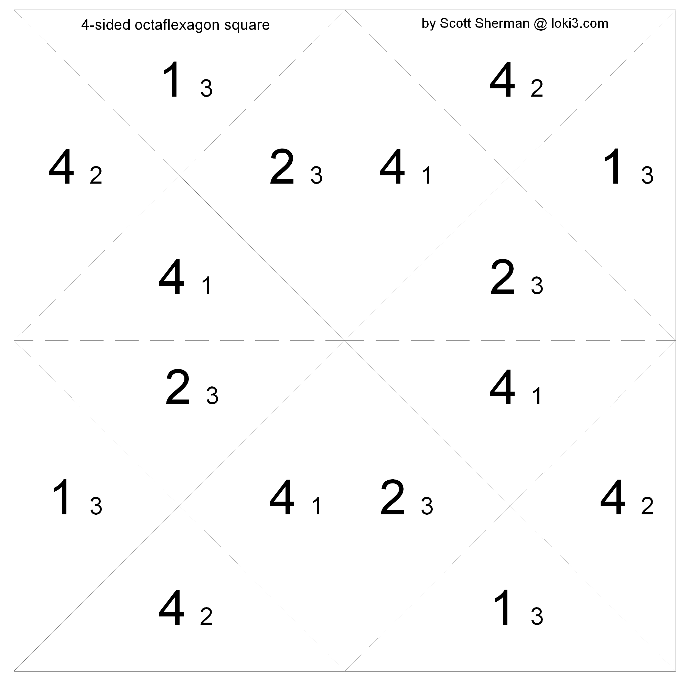
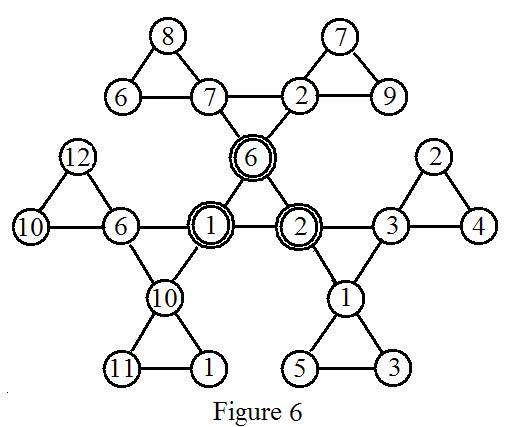
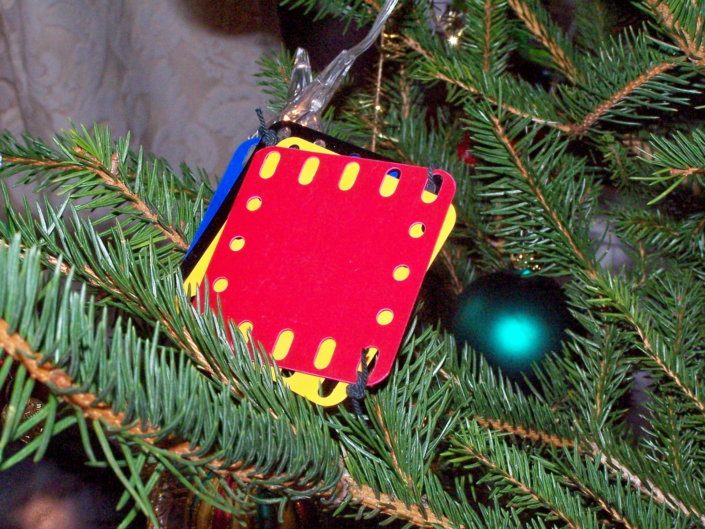
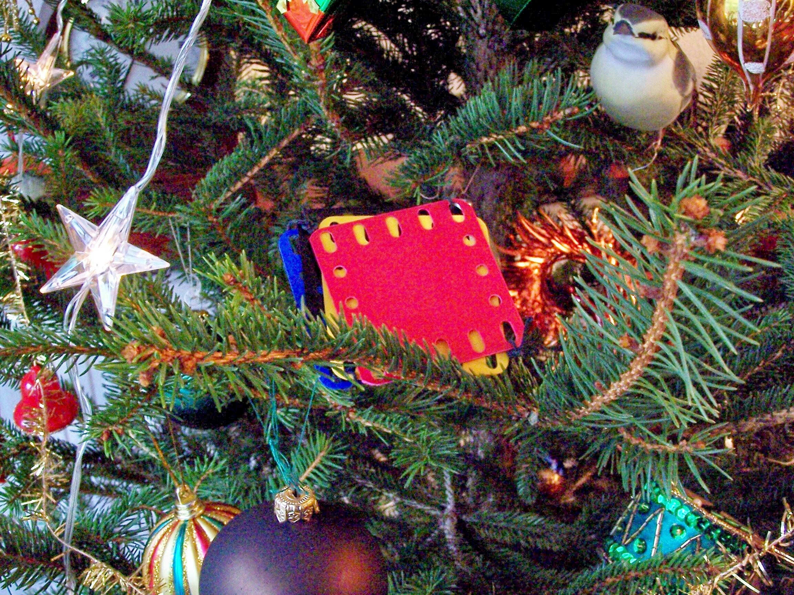

# Flexagon Lovers Newsgroup 2008

## pentaflexagon puzzle
January 6, 2008

### Scott Sherman

When I was first trying out the triangle pentaflexagon (5 triangles per face) all I could figure out to do with it was pocket flexes.  But unlike the hexaflexagon (and higher orders), you can't do multiple pocket flexes at once to get to new faces.  Thus I was always left with the same faces visible.

But more recently, as I was figuring out how the various flexes applied across the different triangle flexagons, I realized other flexes were possible on some pentaflexagons.  Both the slot flex and pyramid shuffle can be used to bring you back to a pentagon with the leaves rearranged.  It turns out to be a tricky puzzle to figure out how to combine these two flexes to achieve certain goals.  So I've posted a new triangle pentaflexagon with the challenge of going from having sides 1 and 2 visible to having all of sides 3 and 4 visible.

You can find this puzzle at http://loki3.com/flex/penta.html#8sides

Happy New Year!

### Les Pook

The 8-faced pentaflexagon is intriguing. The curved edges make the
slot flex much easier. The slot flex and pyramid shuffle are vaguely
reminiscent of the V-flex. I've tried some experiments, and there are
similar possibilities with the heptaflexagon version. I've been
thinking about s generic name for flexagons, such as the 8-faced
pentaflexagon, in which multiple pocket flexes are possible. My
suggestion is 'bundled flexagons'.


----
## use of a flexagon sighting
January 17, 2008

### Kathy Knapp

The video is a Christian evangelism tool, but a good use of a flexagon.

http://www.simplysharejesus.com/

### Juergen Koeller

please have a look at http://www.mathematische-basteleien.de/magiccube.htm.

Jürgen Köller (a flexagon lover)

### Scott Sherman

Nice site, Jürgen.  It's interesting to see how you make one of those.  Some of the links are interesting as well. http://www.faltwerk.de/formen/faltwerk-formen.html, for example, has nice animations of a selection of hinged 3D shapes like the "magic cube".  And the Yashimoto Cube is an intriguing variation as well.

Another set of hinged 3D shapes I like are kaleidocycles.  Jürgen has a good page for that as well - http://www.mathematische-basteleien.de/kaleidocycles.htm.


----
## triangle star flexagons
February 2, 2008

### Scott Sherman

I’ve posted another interesting set of triangle flexagons.  These form stars and can use the same flex you use for flexagons made from pentagons, hexagons and so forth.  I particularly like the 6-pointed star dodecaflexagon, which has lots of fascinating flexes (just like the isosceles triangle and right triangle dodecaflexagons do).  You can find the star dodecaflexagon at http://loki3.com/flex/dodeca.html, where I’ve got pictures of some of the possible flexes (the other dodecaflexagons are worthwhile also).  You can get to the other triangle star flexagons from http://loki3.com/flex/triangles.html.


----
## [Origami] might be of interest
February 6, 2008

### Kathy Knapp

I received this through the origami list, and WOW, I can't wait to try it!

http://workshopnotes.blogspot.com/


----
## On Scott's Wonderful Discoveries
February 6, 2008

### Ann Schwartz

```
The time has come, the walrus said,
To talk of many things,
Of shoes and ships and sealing wax,
And flexagons and kings...
```

(OK, I took some poetic license with that last line.)

First of all, my congratulations to Scott/Loki, for his truly magnificent and exciting flexagon discoveries and his very organized and clear Web site. Also to Robin Moseley, for his excellent Web site and artistry.

I have been making some flexagon discoveries that are starting to overlap Scott's, and I guess it's time to share...

**The Marvelous 8-gon**

Scott has described and provided a template for the square flexagon made from a straight strip and composed of 8 triangles per face. This flexagon was also discovered by various people independently. David Mitchell has templates for the 4-faced 8-gon made from a non-striaght template. A nice description of the 8-gon also appears in Build Your Own Polyhedra by Peter Hilton and Jean Pedersen. I have obtained permission from the publisher, Pearson, to post the sections on this flexagon on the Web. You'll find it at http://www.eighthsquare.com/8-gon.html. Here  Pedersen and Hilton call it both the tetra-octa-flexagon and the 8-gon is very easy and describe how to flex it. I believe what they call the "Reverse-Pass- Through Flex" is extremely important in flexagon development. I actually made 8-gons years ago, and never knew my pieces had more faces hidden in the folds--because I had no idea that this flex was possible.
	If you increase the length of  the strip, you can get more faces for your 8-gon. I doubled the strip featured in Build Your Own Polyhedra and produced a square flexagon with 12 faces--really fun. Lots of pinch flexes one after the other--flex along the  creases that run from the midpoints on the sides (not the diagonals). And all the states are planar. I think this flexagon is so ignored, and so fascinating, and because of its right angles, so easy to fold. For all you teachers out there, please consider introducing this to your students. And Scott, I actually wrote and posted my introductory notes to the Pedersen/Hilton piece before your silver flexagon posting, so please forgive the omission of any reference to your site.

**Other Silver flexagons**

Like Scott, I've also made a six-sided silver flexagon. Only mine has 12 triangles, not 6.  It definitely mixes triangles from different faces like the dodeca, but I'm having trouble figuring out how many basic faces it has. I also made a kind of double 8-gon. This square within a square looks like Scott's template:



when it is folded up. Like the dodeca, it flexes into pinwheels and has toggle triangles, the loose triangles I used to call "rogue triangles." I'm still analyzing these two silver flexagons. I have to keep pats of this supersquare held down with paper clips when not  in use; it's a bit unruly.

**Some more notes on the Dodeca**

This little rascal has more tricks up its sleeve. A chapter on this flexagon will appear in book called Homage to a Pied Puzzler, but it's possible that not all the new discoveries will make it into the book before publication. The pub date for the book keeps changing, but the publisher tells me that I'll be able to post the material on this site.
	Anyway, as I discussed in the articles on the eighthsquare. com, the dodecaflexagon can be flexed along three equidistant creases that run from the points of the hexagon to the center or along six creases at once. But it can also be flexed along four equidistant creases, if one does a reverse-pass- through flex. This will produce a surface with triangles from 3 different faces. You can get at least two different patterns. One of the interesting things, is that Robin's 4-faced and 5-faced dodecas can also be flexed this way. In fact, the next two maneuvers can also be performed on Robin's junior dodecas with varying degrees of success. Another discovery is that the 12-gon can be flexed from 3 creases that run from the midpoint of the sides of the hexagon to the center. This produces a shape change: a equilateral triangle composed on 6 triangles. AND the triangle flexes into another triangle (made of 6 bronze triangles). The dodeca also can also be flex into (more like opened into) a large parallogram made of 12 triangles. I believe Harold Macintosh also mentioned the parallelogram in an earlier message. Anyway, this parallelogram can be flexed to produce more parallelograms, all with symmetrical surfaces. Some surfaces display 5 of the 6 faces. The parallelogram can be flexed into a cup that shows, at last, the gray "hidden" triangles. The cup can then be manipulated into a hexagon that shows the gray triangles combining with other triangles to form a symmetrical pattern. But further flexing is very odd, since the basic structure of the flexagon has been changed, and open creases no longer appear where they "should".

I'll continue later with my triangle flexagons and version of the six-pointed star flexagon.

It's quite late in New York and the Giant fans have finally stopped yelling and carrying on.

### Les Pook

The net for the silver flexagon shown in Ann Schwartz' posting No. 443 'On Scott's Wonderful Discoveries and Then Some' can also be assembled as an untwisted band without the cut at the bottom left corner. A different face numbering scheme is needed. I don't know whether anyone else has spotted this. The dynamic properties are similar to those of the usual twisted version, so whether it is regarded as a distinct type is a matter of taste. If it is not regarded as distinct then there are two of these silver flexagons (eight triangles per face) with four faces. Similarly there are two with five faces, and 7 with 6 faces.


----
## help
February 7, 2008

### fishslapper64

Im new to flexagons and I put together the pentaflexagon from
flexagon.net and first off I thought there was a typo in the
directions, but I endned up with all one color on top when assembled.
But the problem is I can only get it to flex 3 faces all with the
same color, should there be more? and should the colors combine???
I,m getting frustrated.

### Robin Moseley

With the standard pinch flex, the pentaflexagon model on my website will only produce solid colors of A's, B's, C's, D's or E's.  There are 5 sides and one has to keep pinching the same diagonal crease until it will not flex further and then move to the adjacent crease and flex until it will not flex anymore and repeat until all sides of the hexaflexagon are revealed.  It is possible to mix up the colors on the sides by non-standard flexing like the V-Flex.  This is not that easy to do and will many times result in a tangled mess.  But that is the fun of it after all.

Don't get frustrated, keep folding and flexing!


----
## help
March 14, 2008

### bohanyu97

Hello people,

this is my first message. I am stuck on the tetra-, penta- and hexa-
12gon.

### Scott Sherman

Hi Bohan,

"Stuck" as in having difficulties or as in you can't stop playing with them?  Are you having problems folding them or flexing them?

I've got descriptions of some of the flexes you can do on the 12gon at http://www.loki3.com/flex/dodeca.html#right as well as directions for making some of them.  Robin Moseley has patterns for making these, including directions, at http://www.flexagon.net/index.php?option=com_content&task=view&id=16&Itemid=30.  Ann Swartz has a description of her original explorations at http://www.eighthsquare.com/12-gon.html.  I assume you've looked at one or more of these pages already, but perhaps there's something in one of them that will help.

If not, feel free to ask questions.

### bohanyu97

''Stuck'' as in can't make them.

thanks for your help


----
## 4-8 gon
March 15, 2008

### bohanyu97

Can anyone send me the template and instructions to make the tetra-octaflexagon?

### Scott Sherman

The term "octaflexagon" has been used for a couple different kinds of flexagons.

One type is made from octagons.  See information from Harold V. McIntosh's site for an example - http://delta.cs.cinvestav.mx/~mcintosh/comun/flexagon/node9.html.  I've also seen these called "octagon flexagons", e.g. in Les Pook's book Flexagons Inside Out.  Les's book has patterns for a couple different ones.

Another type, paralleling the naming of hexaflexagon and dodecaflexagon, has 8 triangles per side.  These can be made from different kinds of triangles, leading to shapes such as an octagon, square or star.  I've got several templates at http://loki3.com/flex/octa.html, including a 4-sided square and star.  I've also seen this square variety referred to simply as a "silver flexagon" because it's made from 45-45-90 triangles, which are called "silver" triangles in origami.  However, this is slightly ambiguous since you can actually make flexagons with 4 or 8 triangles per side out of silver triangles.  Silver octaflexagons are fun to explore because of the large variety of flexes and the ability to mix up the faces.

### bohanyu97

Thanks for you help!

### Ann Schwartz

Another place for directions on making the most simple "silver"
flexagon, the 4-faced square flexagon composed of isoceles right
triangles, is http://www.eighthsquare.com/8-gon.html.

There you'll find a very comprehensive discussion and step-by-step
directions on the 8-gon reprinted from a book called Build Your Own
Polyhedra by Peter Hilton and Jean Pederson. By the way, if you
double the pattern they give for the 4-faced flexagon, you get one
with 12 faces. I made one from adding maching tape and it's very cool.

Jean Pederson is a mathematics professor at Santa Clara University
(CA). Peter Hilton is a professor emeritus at Oxford U. at
Binghamton. He worked at Bletchley Park during World War II, helping
to break the German codes at the tender age of eighteen.

### Harold McIntosh

Oxford is in England, Binghamton is in New York State. Are
there some duplicates, or did he just move after retirement?

> (even though Pearson forced us to put annoying copyright
> lines on the bottom of every page).

Someone should tell Mr. Leaming that one copyright notice
is sufficient; indeed, work is implicitly copyright even
without the notice. Should someone intend to violate the
copyright, even having a notice between every line would
not be a deterrent. What if he spills coffee on his manu-
script? Are the coffee stains copyright too??

More to the point, Figure 1.14 is a newspaper knot, more
commonly known as the sheep and goats puzzle. Figure 1.15
is a haploid bregdoid; the surprising thing is that it is
stable. But put two of them back to back and you've got a
bregdoid, with all its symmetries and folding options
(opening pockets, diagonal folding into a tubulator, etc.).

Bregdoids constitute the minimal member of their class
that can be installed in a plane, but adding multiples
of four squares gives additional instances - tetrahedral
corner (3 x 4), another plane figure (4 x 4), and so on.

### bohanyu97

Thanks for your help, but i can't find the instructions to make it. Which part is it on?

### Ann Schwartz

On "Binghamton" ...I took that information, "Oxford University At
Binghamton" from Hilton's home page. Contact him directly about
possible spelling errors? :-)

Yup, the copyright notices Pearson insisted on was very
annoying...Who' s Mr. Leaming?

### Robin Moseley

I first folded the flexatube and newspaper knot a long time ago from directions in a now long out of print origami book.  It is interesting that that these are related to flexagons.  Do I  understand it right that both the flexatube and bregdoids have 4 sided symmetries?  The bregdoids have more and more complex braiding, but have a base 4 sided structure to the flexatube?  But are there other objects that have symmetries of 5, 6, 7 etc with this tubular structure and are they also considered bregdoids?  I am not sure exactly how to relate these to flexagons, but there are obvious similarities.

### Harold McIntosh

Quoting Ann Schwartz <annschwartz101@ yahoo.com>:

> On "Binghamton" ...I took that information, "Oxford
> University At Binghamton" from Hilton's home page.
> Contact him directly about possible spelling errors?

Well, you can see how little I know about things which
I should know more about. Hilton`s home page is rather
uninformative, but Google, and Wikipedia in particular,
is more informative. You see, I have a degree from
Cornell and know a little about New York State. but
that was in the early 1950's. So I was unaware that he
had taught at Cornell's math department years later, or
that the monstrous New York educational system had grown
to encompass a multitude of local schools. It was also
not unheard of for English (and other) professors to
emigrate to the United States; I think even Arthur Stone
held a position at Rochester.

Hilton's involvement with flexagons is something I need
to read more about.

### Ann Schwartz

Hi Bohan,

Go here: http://www.eighthsquare.com/8-gon.html, then
scroll down, the instructions start on what is page 69
from the book. Email me directly if you still can't
find it.

### Harold McIntosh

Quoting "Robin C. Moseley" <moseley@flexagon. net>:

> I first folded the flexatube and newspaper knot a long
> time ago from directions in a now long out of print
> origami book. It is interesting that that these are
> related to flexagons. Do I understand it right that both
> the flexatube and bregdoids have 4 sided symmetries?

Yes. It is the underlying square shapw that can put
two parallel hinges on opposite sides of the square,
in contrast to other figures which lack that movement.
Presumably something similar could work with hexagons or
other evengons. An extra feature arises from the inter-
mediate position as a hollow cube. By introducing some
diagonal folds, it can be turned inside out permitting
additional positions for the figure. But note that those
additional folds also change what would be considered
the primitive polygon on whivh the figure is based.

> The bregdoids have more and more complex braiding, but
> have a base 4 sided structure to the flexatube? But
> are there other objects that have symmetries of 5, 6,
> 7 etc with this tubular structure and are they also
> considered bregdoids?

I haven't tried to make any, but it seems possible.

> I am not sure exactly how to relate these to flexagons,
> but there are obvious similarities.

The newspaper knot is directly analogous to Stone's
construction with equilateral triangles. Bregdoids were
kind of different, but this discussion of 8-thingies may
make a connection. I've got to dig out my copy of that
book (I'm pretty sure I have one) and try to figure out
how I missed the connection, supposing they show one.

An interesting detail about bregdoids - flexing them
seems to shift the two strands relative to one another.
You notice this if there is an asymmetric design or
coloring on the square faces.

### Harold McIntosh

Quoting Ann Schwartz <annschwartz101@ yahoo.com>:

> Yup, the copyright notices Pearson insisted on was very
> annoying...Who' s Mr. Leaming?

A figment of my imagination, given that I read "Pearson
Learning" as "Pearson Leaming." Nevertheless I assume that
they have a real representative with an acrual name who
gave you those instructions. Google and Dogpile are such
nice aids to armchair researching; This Pearson Learning
seems to be in competition with Negroponte and his OCPL
(sic - one child per laptop!) to capture children's
education and bemusement.

Nevertheless, "Build your own Polyhedra" was published,
both in hardcover and paperback, by Addison-Wesley so I
suppose they own the copyright, unless it has reverted to
the authors and they have passed it to someone else. But
both B&N and Amazon list it as "out of print" with some
references to secondhand booksellers. Maybe you can find
copies on e-Bay. I'd have to check my library, but I
think I bought a copy a while ago. Apparently published
in 1994. I need to check out the similarity of those
8-thingies and bregdoids.

As for Mr. Leaming, my personal philosophy is that I
will make an effort to buy a book if it is in print and
available for sale. Otherwise I wouldn't feel badly about
making a copy if I could find one somewhere. Supposing of
course that I needed or wanted it. No point in being a
pack-rat.

As a further comment, in the academic world it is far
more important to preserve the author's name on a copy
(and date) than to think about sending money. The latter
follows indirectly from being cited and being regarded
as an authority. Leave it to Disney and the RIAA to chase
after mere money.

Which brings up the question, Is Pearson Learning selling
copies (or downloads via e-books) of this book?

### Ann Schwartz

Build Your Own Polyhedra is available through Amazon, and Jean
Pedersen tells me that she and Peter Hilton are working on a new book.

### Frank Bernhart

I think even Arthur Stone held a position at Rochester.

YES, both he and his wife were at University of Rochester.

My impression (as a mathematician living in Rochester at the time) was that he worked in abstract fields far removed from the tangible flexagon.  That is NOT a negative review, of course.


----
## Hexaflexagon Construction Procedure
March 31, 2008

I wrote up a Hexaflexagon Construction Procedure based on the 1962
papers of Antony S. Conrad and Daniel K. Hartline with color coded
diagrams, examples, and no theoretical discussion, just the procedure.
It is on the www.flexagon. net website under the Hexaflexagon menu tab.
Here is the link:

http://www.flexagon.net/index.php?option=com_content&task=view&id=31&Itemid=36

People might like this procedure if they just want to know how to
build any hexaflexagon with any number of sides. I tried to make this
procedure easy to follow without all the mathematical discussion that
can be confusing when all you want to do is make hexaflexagons.

Please let me know if anyone tries to use this, and if they have
comments for making it better.

### Les Pook

Robin

I like it. The instructions are easy to follow, but I have a couple
of comments. Firstly, a hexaflexagon is a twisted band so exists as
an enantiomorphic pair. Hence there are always two solutions. Which
is obtained depends on exactly what is done. I suggest adding a note
about this, and instructions on how to convert a hexaflexagon into
its enantiomorph. I first cane across this about 40 years ago when
trying Pamela Liebeck's method (The construction of flexagons.
Mathematical Gazette, 1964, 48, 397-402.). Secondly, the inside
triangles must not form a loop, and this should be pointed out. The
inside triangles form what I call flexagon diagrams in my book.

### bohanyu97

Great, very easy to understand!

### Robin Moseley

Thanks for the comments Les.

Good point about inside loops, I have added a rule concerning the arrangement of the mapping triangles to the article.  I am familiar with the enantiomorphic pairs of flexagons and will come up with a note about that for the article as well.  Thanks for pointing that out.  I had tried a few patterns once for folding a single frieze into the enantiomorphic pairs, but never posted them on the website.

One thing I find quite interesting is to take a flexagon with a larger number of sides, like my zodiac 12 sided hexaflexagon, and explore all the different ways to fold it up and the various patterns that are created in the process.  One will find triangles, hexagons, hexagon rings, etc.  Since I have marked the zodiac hexaflexagon so that it can be folded into four different flexagons, there are quite a number of ways to fold it up.  This is just as interesting as flexing the completed models.

### Robin Moseley

I believe this question of enantiomorphs as it relates to the Conrad and Hartline method for Hexaflexagon construction has an easy answer.  If one takes and swaps the two number rows of the face table (the top row becomes the bottom and the bottom the top) the enantiomorph of the flexagon can be constructed.   This translation causes the flexagon to twist in the opposite direction.    Of course one can take a flexagon and instead of folding the adjacent pairs of like faces together, fold them apart and the enantiomorph will be formed, but the faces will have mixed patterns which actually can be rather interesting. I recommend trying this with flexagons just to see what turns up.  Comments on this are welcome as there may be more to this than I see.


----
## OctaHexaFlexagon Maps & Frieze patterns
April 13, 2008

### Robin Moseley

I posted detailed maps and frieze patterns for flexagons of 8 faces
and under on www.flexagon.net. Click on the Hexaflexagon pull down
menu for links to the web pages. For the 8 faced Hexaflexagons, I
included face numbering on the frieze patterns to make it easy to
build them. (4 of the 8 faced maps have not been posted, but 8 of the
12 are posted).

One of the 8 faced Hexaflexagon maps is particularly interesting.
Check out OctaHexaFlexagon variation VIII. I designed a frieze for
this flexagon that can be cut from a large hexagon, which is sectioned
into 24 triangles, and then is divided into three identical parts.
These three parts can then be assembled into a twisted frieze which
flattens into a ring of three hexagons. The geometric symmetries for
this model are intriguing.


----
## Eight Faced Hexaflexagons
April 18, 2008

### Robin Moseley

I finished posting all the 8 faced hexaflexagon maps and face numbered
frieze patterns. They can be found as a link from the hexaflexagon
menu drop down on www.flexagon. net. I mentioned in my last posting a
rather interesting map that can be cut from a hexagon partitioned into
three identical units. There are two maps that will generate this
facinating frieze pattern and I have posted diagrams for both of them.
There are 12 maps and 7 distinct frieze patterns. Three of the
friezes have unique maps and 4 have multiple maps. One of the frieze
patterns can be generated by three different maps. What I have
labeled, variation 7, is also a rather cool looking frieze pattern of
three interlocking zigzag units. I also posted a map and frieze
pattern for the straight strip nonahexaflexagon.


----
## Russian Flexagon article
May 6, 2008

### Robin Moseley

For those interested in flexagons made from squares, I was just sent a
scan of a ~1970 article from the journal, Nauka i Zhizn (Science and
Life, Russian: &#1053;&#1072; &#1091;&#1082;&#1072; &#1080; &#1078;&#1080; &#1079;&#1085;&#1100; ). This was sent to me by a researcher at
MIT, Dmitry Vasilyev, who first discovered flexagons through this
paper. The article has a diagram of a flexagon similar to one in Les
Pook's book, "Flexagons Inside Out", but then has some additional
frieze patterns including one with squares arranged in a ring. I have
never seen these patterns before and they may be a new branch to the
flexagon zoo. I posted this interesting article on www.flexagon. net,
under a new top menu item called "Articles". There is also a website
link on the right column under "What's New". The paper is in Russian,
but has good diagrams for constructing the models discussed in the
article.

### bohanyu97

How do you make the flexagon on page 2?

### Les Pook

I made it as follows. Make the net as shown in the sketches (Fig 1),
with the cross slit in the centre. Enter the numbers on the left hand
sketch. Turn the net over left to right and enter the numbers on the
right hand sketch. The flexagon can be assembled without cutting and
rejoining but this is tricky without detailed instructions (I know very
little Russian so it would take me some time to translate the text). I
cheated be cutting the net at the top between the 2 and the 6 on the
left hand sketch. Then folded like numbered pairs of leaves together in
the order 6, 5, 4 and 3, and rejoined the ends. Faces numbers 1 and 2
were left visible. To completely traverse the flexagon requires box
flexes (Section 6.4 in my book). In my terminolgy the flexagon is a
square flexagon with one complete cycle, two incomplete cycles and two
pairs of box position links. The other two flexagons in the article are
more complicated, with more box position links. I haven't analysed them
in detail. Finding all the faces is a challenge. A complication is
that numbers 6 and 9 aren't adequately distinguished on the nets.

### Robin Moseley

I cannot read Russian, but these diagrams are fairly good in the article.  Notice that there are dots by the numbers placed in different corners.  These dots uniquely identify each number (like the four 2s).  So, if you follow the diagrams from 1 -5 aligning the numbers exactly as in the article, it should work.  I have not yet had time to construct these, but maybe this weekend.  The person that gave me the article also said the diagrams were sufficient to make the flexagons without reading the text.   But, it is a puzzle, one may have to stare at it a while before it comes together!

### Robin Moseley

These directions work great!  I was able to make the flexagon in just a few minutes by cutting between the 2 and 6 first.  I also folded another one without cutting and carefully following the 3D diagram.  It is more challenging, but works.


----
## New book on flexagons
May 20, 2008

### Les Pook

I am writing a new book on flexagons, and have an agreement with Springer for its publication in their 'Solid Mechanics and its Applications' series. A brief description of the book is below. The bibliogarphy includes references to Flexagon Lovers Group postings and to Members' websites.

A flexagon is a motion structure that has the appearance of a ring of hinged polygons. It can be flexed to display different pairs of faces, usually in cyclic order.  Flexagons can be appreciated as toys or puzzles, as a recreational mathematics topic, and as the subject of serious mathematical study. Workable paper models of flexagons are easy to make and entertaining to manipulate. The mathematics of flexagons is complex, and how a flexagon works is not immediately obvious on examination of a paper model. Recent geometric analysis, included in the book, has improved theoretical understanding of flexagons, especially relationships between different types. The profusely illustrated book is arranged in a logical order appropriate for a textbook on the geometry of flexagons, It is written so that it can be enjoyed at both the recreational mathematics level, and at the serious mathematics level. However, the only prerequisite is some knowledge of elementary geometry, including properties of polygons. A feature of the book is a compendium of over 100 nets for making paper models of some of the more interesting flexagons, chosen to complement the text. These are accurately drawn and reproduced at half full size. Many of the nets have not previously been published. Instructions for assembling and manipulating the flexagons are included.

### Scott Sherman

Cool, I was wondering how your latest book was coming along.  Can you give us any estimates on when it will be out?  Looking forward to it.

### Les Pook

Timescales are vague at present. I hope that it will be out early
next year

### Robin Moseley

Great! I look forward to seeing this new book. I will be happy to
advertise on flexagon.net when it is getting close to publication.
100 nets will keep us all busy for a year.


----
## what is the name of this flexagon and where can I find it again??
July 13, 2008

### Kathy Knapp

I have had this flexagon for several years. When assembled, is not flat, ever.  When looked at on edge it can look like a bow tie.  When flexed, there are four faces.  The opening through which it is flexed, is "y" shaped. Each section has what looks like two equilateral triangles base to base, and then tip to tip.  I have unglued it and its shape is over all a rectangle, single sided.  The base is a straight edge, with half of equlateral triangles base to base and tip to tip, for three sets.  The say "glue here" on each of the pairs.

On the short right hand side, the edge is straight.  On the short left hand side, there are two tabs that say "Glue here".  The top edge is not flat, but zig zagged, with three sets of the equilateral triangles.   There are four parallel rows of the equilateral triangle, the second and fourth rows have two complete sets and two half sets of the double triangles.  The third row is three complete sets, again, like the first row.

I hope someone can understand what I just tried to say.  I just tried to make a scan of it, and hopefully I will be able to attach it.  If so, ignore the white spots,  and the stripedness is because when I printed it, my ink needed refilling.

I am teaching origami for two weeks, at the Jr. College, and will be doing a flexagon with them, and next year I will be doing an advanced class, and am working on putting some ideas into a folder, and I thought this would be good, but I tried to find where it came from, and haven't had any luck.

When, with your help, I find out what it is, and where it comes from, I will write the name on the finished flexagon.

So, in anticipation of one of you know what I am talking about, I say, thank you,

### Scott Sherman

What you've got there is called a kaleidocycle, which is a ring of tetrahedra rather than a collection of triangles.  And it looks like you found that model at http://sci-toys.com/scitoys/scitoys/mathematics/paper_ring.html.

Recently some friends bought me "M.C. Escher Kaleidocycles" by Doris Schatschneider and Wallace Walker, which has a variety of kaledocycles with clever Escher prints tiled on them.  Escher tilings would be pretty entertaining for hexaflexagons as well.

### Les Pook

This is one of the rotating rings of tetrahedra that Doris
Schattschneider calls 'kaleidocycles' . I don't know the source of
your example but there are differently decorated cut out examples in
the book 'M C Escher kaleidocycles' by Doris Schattschneider and
Wallace Walker. Stradbrooke, Diss: Tarquin Publications, 1983.
Pomegranate Books Inc 1987. It has also be published in French and
German by Taco, Berlin.

### Bohan Yu

That's called a klaeidocycle (spelt something like that)/ rotating tertahedrons.

### Juergen Koeller

please visit my page http://www.mathematische-basteleien.de/kaleidocycles.htm.

### Adrian Rossiter

It looks like a kaleidocycle

http://www1.ttcn.ne.jp/~a-nishi/kaleidocycle/z_ani_kaleido.html

This page might give you some more ideas for the class

http://www.mathematische-basteleien.de/kaleidocycles.htm

### Kathy Knapp

THANKS to all who answered.  As soon as I read the first one with the name Kaleidocycle, a light went off in some dark recess of my brain.

I have just spent well over an hour roaming around sites.  I do need to purchase the book by Schattschneider and Walker.

  I found a blank form like what I had.  That way the students can color to fit their own preference. I did find lots of wonderful information, that I have now bookmarked.  Perhaps I will find what I originally did have, and if not, I now know that it is a rotating ring of six tetrahedron.

Again, I thank you all.


----
## A Hooke's Joint Flexagon
August 29, 2008

### Les Pook

[Attached](Hooke.pdf) is a file describing a Hooke's joint flexagon. The file has also been uploaded to the Member's Section of the website. The Hooke's joint flexagon is the same as one of the hybrid flexahedrons described by D. Engel, except that the leaves are a different shape. The leaf shape hs been chosen so that the flexagon is rather like a point flexagon. However, the two degrees of freedom of a  Hooke’s joint differ from those of point hinges. Hence, the dynamic properties of Hooke’s joint flexagons differ significantly from those of point flexagons.

### Scott Sherman

That's an intriguing hinge.  Once you figure out how to make it, the model works quite nicely.  I immediately started thinking about interesting patterns and puzzles you could put on it.  You could probably also increase the size of the square hinges to 1/3 the overall width to make one without a triangular hole when you flex - I'll have to try that.

Is it possible to make one of these that flexes in a pattern other than a simple cycle?  Maybe something like a hexahexaflexagon? It looks like having the hinges at 90 degree angles makes for the best flexagon, but I tried other options anyway.  You can make one with three hinges with an overall hexagon shape but, as you'd expect, it can only flex a couple times and doesn't cycle.  Maybe there's a way to pile more than one hinge in the same stack to get more complex behavior?

### Les Pook

I don't think it's possible to construct Hooke's joint flexagons that will traverse more than one cycle. The reason is that from a mechanical engineeering viewpoint paper models of Hooke's joints can't be stacked. However, there are Hooke's joint flexagons with more complicated outlines and longer cycles. These have shape changing properties. One is described by Engel in his article, which is [attached](ENGEL.pdf).


----
## sighting
September 8, 2008

### Kathy Knapp

I just watched most of a commercial from Target (I missed the beginning).  The images were unfolded as if from the 8cube flexagon (whose name I don't recall).

### Jeff Rutzky

It's called a flexicube. I make them out of folded/ROBO- cut paper with
pictures.


----
## dodecaflexagon videos
October 26, 2008

### Scott Sherman

Awhile back I posted descriptions and pictures of some of the flexes you can perform on different versions of the triangle dodecaflexagon.  I finally got around to posting videos, which give you a much better feel for how they work.

Isosceles dodecaflexagon - http://www.youtube.com/watch?v=LsaEhpDgWd8
...includes pinch flex, tuck flex, pyramid shuffle, pocket flex, slot flex

Bronze dodecaflexagon - http://www.youtube.com/watch?v=dVu7eQ75tnM
...includes pinch flex, silver tetra flex, single flap flex

Star dodecaflexagon - http://www.youtube.com/watch?v=k43niP5iWdg
...includes pivot flex, pinch pivot flex

I have more details on each of those flexagons at http://loki3.com/flex/dodeca.html

Enjoy!

### Robin Moseley

Nice videos!  These videos really helped me see how each of these flexes work and especially the flow that Scott has created for each of the flexes.  I was surprised to see how many variations there were and how interesting they all are.  Thanks for posting these Scott!

### Les Pook

These videos are very useful. They give a clear idea of what is going
on. I've added the posting to the references in my forthcoming book.

### Bruce McLean

Thank you Scott for your post. I have sent it to everyone that I know.

The details on our site are a little sketchy, but we would like to announce that we have an algorithm for counting the mathematical faces of all regular 3-n-hexaflexagons when the V-flex and the pinch flex are used. The applets only work up to 3n=12, the dodecahexaflexagon because we only used the integer data types in the java code. Initial faces do not allow for translations so that the trihexaflexagon only has 1 initial face, but mathematical faces means what it always has meant and includes translations. |S(n)| is the number of symmetrical faces and is only multiplied by 3n to get mathematical faces, where as the rest of the intial faces are multiplied by 9n. The following is a summary of our results.

```
3n       |Initial Faces| - |S(n)|     |S(n)|                    Number of Mathematical Faces
3                 0                     1                                   3
6                189                    3                                  3420
9                100,683               15                               2,718,576
12              59,077,431             91                             2,126,788,644
```

http://math.georgiasouthern.edu/~bmclean/flex/index.html


----
## Hexa-dodeca-flexagon?
October 30, 2008

### Bohan Yu

In Ann Schwartz's article about dodecaflexagons: http://www.eighthsquare.com/12-gon.html
The template, is that a hexa dodeca flexagon?

### Scott Sherman

Yes.  A flexagon with 12 triangles per face has been called a dodecaflexagon or 12-gon.  And when it has 6 sides, it's a hexa-dodecaflexagon.  (I think a lot of what people like about flexagons is all the fun names.)  I generally qualify it further as a bronze dodecaflexagon because it's made from what origamists refer to as a "bronze" triangle - 30-60-90.  This is to differentiate it from dodecaflexagons made from other types of triangles.

One thing to note, as Ann mentioned somewhere on one of her pages, is that you can make that version with less paper, since some of the triangles fold together and don't actually appear when flexing.  Robin Moseley has the "optimal" version of the same hexa-dodecaflexagon at http://www.flexagon.net/index.php?option=com_content&task=view&id=27&Itemid=33.  Looks to me like Map I corresponds to the same one Ann describes, though hers is intriguing since she folds it from a straight strip of triangles.  But there are several other strips listed there that create slightly different 6 sided dodecaflexagons.


----
## Flexagon videos
November 2, 2008

### Les Pook

There are some more flexagon videos on YouTube, mostly hexaflexagons, including some nicely decorated examples.


----
## v-flex results
October 30, 2008

### Scott Sherman

Interesting results, Bruce.  It's impressive how many extra combinations there are when you add in the v-flex.  Is your technique specifically for the 3n hexaflexagons made from straight strips, or does it generalize beyond that?

Some time soon I'd like to do a video of some of the other flexes you can do on the hexaflexagon.  Words & static pictures only go so far in explaining some of these.  I had read about the v-flex, but didn't actually understand how to do it till Robin Moseley posted a video showing it.

One other interesting point I should make is that you can undo a v-flex using a tuck flex - http://loki3.com/flex/flex/tuck.html.  This works even on a simple 4-sided hexaflexagon.  After you do a single v-flex, each side will have four triangles of one color and two of a second color.  On one of those sides, fold it in half splitting the colors symmetrically and do a tuck flex.  This will take you back to the configuration where both sides are a single color.  And if you don't know what I'm talking about, wait for the movie ;).

### Bruce McLean

As you know regular flexagons of order 3n are made from straight strips of paper that contain 9n triangles. When my students helped me count the one of order 9, I was sure that no one would be interested unless we could generalize it and regular ones were the first step. So, I do not know if it generalizes or not. Preprints are almost ready and should be available by next month if someone wants to try.


----
## Sangaku Hexaflexagon
November 14, 2008

### Robin Moseley

I posted a hexaflexagon with face patterns from Sangaku Japanese Temple
Geometry problems. You can find this on the right column of the
www.flexagon. ,net home page. Many of these problems have six sided
symmetry and are a perfect match to the hexaflexagon. The problems can
be solved from any of the flexed sides. (that is using the normal pinch
flex). Some of the problems with other symmetries would look very nice
on Scott's menagerie of flexagons. Sangaku geometric problems are found
throughout Japan painted on the walls of temples. There is a new book
out called "Sacred Mathematics" by Fukagawa Hidetoshi and Tony Rothman.
Rothman has photos of some of these on his website,
http://www.physics.princeton.edu/~trothman/sangaku.html. There are many
websites that go into the mathematical analysis of the problems, some
easy and others extremely difficult.

I believe if the Samurai knew about flexagons, they might have created
Sangaku flexagons and left them in the temples as well.


----
## hexaflexagon video
November 13, 2008

### Scott Sherman

I've posted a video of some of the flexes you can perform on a hexaflexagon at http://www.youtube.com/watch?v=tGQ_I4_ N3sE.  I picked a 5-sided hexaflexagon because that's the fewest sides some of these flexes can be done on.  But there's still plenty left to explore.  Try combinations of these flexes on a 12-sided hexaflexagon for example.

Flexes in the video:

* Pinch flex.  This is the normal flex, of course.  I call this particular series of pinch flexes the "braid traversal" because it's the quickest way to see all the sides of a "braided" hexaflexagon.  See http://loki3.com/flex/braids.html for the first few braided hexaflexagons.

* Pocket flex.  Use several pocket flexes to replicate what you could do with a series of pinch flexes.

* Slot flex.  This mixes up the sides.

* V-flex and tuck flex.  Interestingly, a tuck flex can be used to restore the sides after mixing them up using a v-flex.

* Pyramid shuffle.  First I show how to undo a single pyramid shuffle, then I show how a series of pyramid shuffles can be used to change just one side.

See http://loki3.com/flex/flex/index. html for more details on each of the flexes.  Enjoy!

### Robin Moseley

Fascinating video!  When I first read about the v-flex and tried to figure it out from text descriptions found on the Internet, I almost gave up.  Scot's video makes learning these at least ten times easier.  This video brings new life to the classic flexagons!  Thanks for putting this together Scott.  I like the table enumerating the various triangle flexes as well.

### discombobyoulater

I am trying to construct the five-faced braided hexaflexagon but am having some trouble
understanding the diagram. Part of the difficulty is that some of the small numbers have
become unreadable in the diagram. Referring to the diagram in the left column, second row
(among the 12 diagrams in the bottom half of that page), starting at the leftmost triangle, I
see large numbers 4,3,0,2,3,4, 3,0,2,3. I see small numbers ?,3,?,?,4,0, 2,1,1,4. I assume the
missing small numbers must be 0, 2 and 3 so there will be a pair of each small number. But
which is which?

### Scott Sherman

Ah, it looks like I forgot to mention on that page that you'll get a large version of the strip if you click on the small picture.  The numbers should be very clear at that point and you can easily print a copy to cut out and fold.  Sorry about that.  I'll have to edit that page.


----
## Scott's videos, etc.
November 8, 2008

### Ann Schwartz

Scott, these are really fantastic as is your site and the new flexagons on your site.

A flex you call the pinch pivot looks like what Pedersen and Hilton call the reverse pass-
through in BUILD YOUR OWN POLYHEDRA. It's basically a manipulation in which you start
to do a pinch flex, stopping when you have a 3-dimensional, star-shaped object. Then
you pull down triangles on every ray of the star, and then open up to a new face.

Les, congratulations on your upcoming book. On the subject of publishing, there will be a
chapter on the dodecaflexagon, in a book titled HOMAGE TO A PIED PUZZLER, published
by A K Peters, and edited by Ed Pegg, Jr. Supposedly, the book will be out next month. A
public thank you to Robin Moseley who donated fifty folded dodecas to add to my fifty for
the publisher's press kits. The last time I spoke to the sub-rights dept. of Peters, their
representative told me that I would be about to post my chapter on this site. We'll see...

On using the straight strip template shown on Eighthsquare. com (and the upcoming
book)...there is flex that finally reveals the hidden triangles (grey in my template). The flex
produces a large parallelogram composed of 12 bronze triangles. All the grey triangles can
be exposed this way. That template can also be used to produce other flexagons, but I
think I already said that in a pervious post.

### Scott Sherman

Thanks Ann.  I think I'm going to have to get that Pedersen and Hilton book - you've mentioned several interesting items from it.  What type of flexagon does the reverse pass-through work on?

Looking forward to Homage to a Pied Puzzler as well.

### Ann Schwartz

On BUILD YOUR OWN POLYHEDRA: Some other members of this user group have reported
that the book is very hard to find now; I think it is out of print. I did, however, post all the
pages on flexagons in the book on my sister's site, Eighthsquare. com. Authors Pedersen
and Hilton demonstrate what they call the "reverse pass-through" on the 8-gon, the
square flexagon composed of "silver" triangles. But you can do the reverse pass-through
on the dodecaflexagon, too.

A odd personal note on this square flexagon. I figured out how to fold up this up forty
years ago (yes, it's been that long). But I thought it was a pretty tame thing--I only found
three faces, and didn't realize that you could make make versions of the flexagon with
many more faces. Well, this past weekend, I was going through some things, and found
the 8-gon I made way back when... with the three visible faces all decorated. Well, I did
the reverse pass-through, and exposed the side that had been hiding all these years--
blank and a little yellowed with age...

Just looked at your amazing new video...

### Les Pook

Ann

I've ordered a copy of 'Homage to a Pied Puzzler' and look forward to
reading your chapter, and seeing how your analysis compares with some
of my findings. Once I've read it I'll add the book to the references
in my forthcoming book. The manuscript is due at the publishers by
the end of the year but at the present rate of progress I'm not going
to make it. The problem is that I keep making new discoveries,
especially on the relationships between different types of flexagon.

Geometric Folding Algorithms: Linkages, Origami, Polyhedra by E J
Demaine and J O'Rourke, Cambridge University Press, 2007, includes a
lot of theory on folded paper structures. Flexagons are not
mentioned, but some of the material is relevant. The book is very
well written, and easy to follow for readers without much
mathematical background.

Scott

Your recent videos are very welcome. The editor of my book has
commented that links to videos of flexagons would improve the book,
so I've added references to your videos.

I've includeded extensive analysis of point flexagons. They are
surpringly tricky to analyse. Have you any plans to make videos of
point flexagons?

### Scott Sherman

Ah right, I had forgotten you had posted that chapter.  (BTW, it looks like Amazon has a few used copies of that book for sale.)

So I looked at http://www.eighthsquare.com/8-gon.html again and my take on the pass-through and reverse pass-through is that they're variations of the pinch flex.  On a hexaflexagon, with 6 60-60-60 triangles per face, every pinch flex gives you a flat hexagon (6 * 60 = 360).  But with other triangle flexagons, you don't always end up with something flat after you do a pinch flex.  When you have 8 45-45-90 triangles, for example,  2/3rds of the time you'll have 8 45 degree angles meeting in the middle, so it lies flat (8 * 45 = 360).  But 1/3rd of the time you have 8 90 degree angles, giving you something that's a little harder to work with (8 * 90 = 720).  Their pass-through flex allows you to pass-through this flower-like state and back to a flat flexagon.  For the reverse pass-through, you do a pinch flex to the position that doesn't lie flat, then you reverse all the mountain and valley folds, then you finish by doing another pinch flex to bring you back to a flat flexagon.

The pivot flex requires one of the angles to be larger than 90 degrees, as with the star triangle flexagons.  This seems to be more akin to the flex you use on flexagons made out of pentagons, hexagons and up.  See http://delta.cs.cinvestav.mx/~mcintosh/comun/pentags/pentags.html or Les Pook's "Flexagons Inside Out" for examples.

### Bruce McLean

Ann Schwartz had talked about being able to view one face six different ways on the nonahexaflexagon. We have decided to use the dodecahexaflexagon as a representative of all regular hexaflexagons of order 3n. Even though Tuckerman taught us how to create the traverse, we had never seen the one of order 12 and thought we would share it. Because of Ann’s comments we plan to include the following.

============ ========= =======

If we would have colored the 12 faces with 12 distinct colors, then all of the faces with the same number

in the traverse would be the same color. They are different mathematical faces because the uppermost

triangular regions have been rotated plus or minus 120 degrees, placing the pats into different pat-classes.

Faces 1, 2, and 6 appear three different times in the traverse and will look different each time they appear.

An artist could thus have three different pictures each appearing 6 different ways if you look at the flexagon from the

bottom as well. In our count of the number of faces, we never turn the flexagon upside down.



Thanks Ann,

### Scott Sherman

It's also interesting to note that the simplest hexaflexagon that shows this behavior is the 7-sided braid - http://www.loki3.com/flex/braids.html.  In a braided hexaflexagon, you can consider one side the "primary" side (in my numbering, that's side 0).  As you traverse through it, you can find states where each secondary side is opposite the primary side.  With my numbering of the 7-sided braid, this means you can get to 0/1, 0/2, 0/3, 0/4, 0/5 and 0/6.  The primary side will be arranged differently in each of these 6 cases.  I take advantage of this basic idea for my pyramid flexagon maze (though I just used 4 of the states).  It seems like you could do a really nice Escher-style tiling that would use this fact.  Maybe Robin Mosely can find another beautiful Sagaku problem that would apply here :).


----
## point flexagons
November 14, 2008

### Les Pook

Scott

Your recent videos are very welcome. The editor of my book has
commented that links to videos of flexagons would improve the book,
so I've added references to your videos.

I've includeded extensive analysis of point flexagons. They are
surpringly tricky to analyse. Have you any plans to make videos of
point flexagons?

### Scott Sherman

Yes, it's surprising how complex even simple paper folding is.  In one of Martin Gardner's columns, he discussed postage stamp folding.  Start with a line of n postage stamps (or a straight line of squares, hinged at the edges).  How many ways can you fold them into a stack?  I think this may still be an unsolved problem in general, but the beginning of this sequence can be found at http://www.research.att.com/~njas/sequences/A001011.  Point flexagons feel a bit like adding an extra dimension to this problem.

I hadn't actually thought of doing a point flexagon video.  They're a bit less...um, photogenic than their cousins.  But I suppose there were several interesting results we discussed previously that are easier to understand through video than words.

Which raises the question of how best to number (or color) one for illustrative purposes.  Originally I numbered them to make folding them similar to folding an edge flexagon, where you folded together copies of numbers.  This meant that the top and bottom of the stack always had the same number.  Well, until we started talking about multiple foldings, interleaf flexes and 4-flexes, which would mix up these numberings.  So I switched to simply giving each leaf a unique number and talking about a particular ordering of leaves in the stack.  And Les, I seem to remember that you went for multiple numberings per leaf side, so you could keep track of which set of orderings you were traversing.  I'd have to think about how to decorate a point flexagon in such a way that it makes for an interesting video...


----
## Tetra Tetraflexagon
November 24, 2008

### Cristina

Hello all!

I've been trying to create a Tetra Tetraflexagon model in excel so I
can use it in my technology class with 1st grades, but I haven't
succeeded. Does anybody have a premade model we can use to fill up
with text or images?


----
## A Photogenic Point Flexagon
December 7, 2008

### Les Pook

Scott Sherman has, rightly, pointed out in Posting 512 that point flexagons are not particularly photogenic. This can be remedied by using a different method of construction. My suggestion is to make them from Meccano plastic sheets, with point hinges approximated by cord loops, as described in the attached file. I have uploaded the file to the Members Section.

### Scott Sherman

That definitely helps.  Giving thickness to the faces, making them a solid color and having holes in the faces all help make the structure more visible.  And since a point flexagon is mostly just a stack of polygons, the structure is the interesting part.  Colored poster board with holes punched in it would probably work as well and would allow for arbitrary polygons.

My only question (since I haven't tried it yet) is how well it holds its form as you flex it.  When I tried string for hinges, I found that it was a little harder to flex.  One nice thing about using paper hinges with a bit of width is that it helps the hinges stay nested properly.


----
## Meccano point flexagons
December 18, 2008

### Les Pook

The type of cord used to assemble point flexagons made from Meccano plastic sheets is critical. Ordinary string is too thick, too stiff,  and doesn't knot neatly enough. The Meccano cord I used is similar to thread used for leather work. It is very flexible and knots well. I used reef knots for ease of adjustment. The loops could be made neater by applying glue to the knots and trimming off the loose ends. The loop size is critical for satisfactory flexing. If properly adjusted the point flexagons hold their shape well, and the loops don't allow much twisting. The vertices of the polygons must be radiused. The attachments show a Meccano point flexagon on our Christmas tree. The leaves are pushed out of position as much as possible, partly to show the different colours.




Another possible material is thin sheets of painted plywood. I hope to try this sometime.

Season's Greetings everyone


----
## Happy Holidays to All Flexagon Lovers
December 24, 2008

### Ann Schwartz

May your holidays be merry and bright...and like Les Pook's, decorated with a flexagon or
two.

Our group is now 97 members strong; I'm sure that we'll be break the one hundred mark in
2009.

Good luck and good flexing to every one in the coming year.
